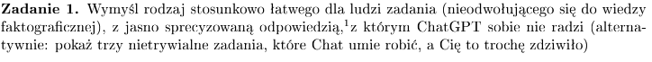
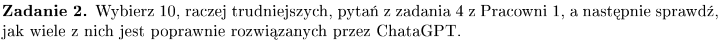
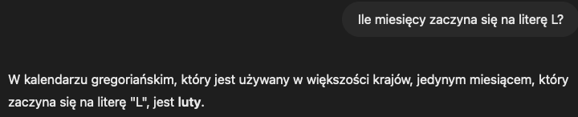
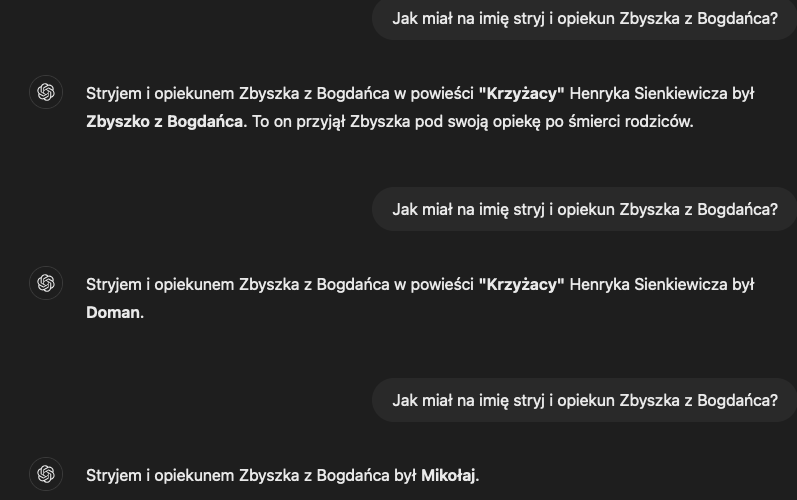
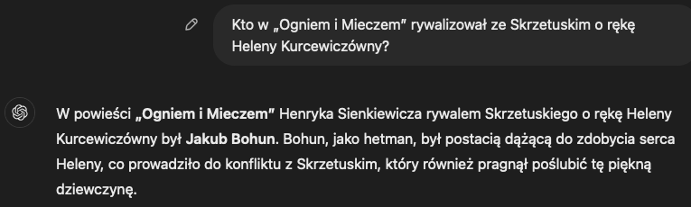
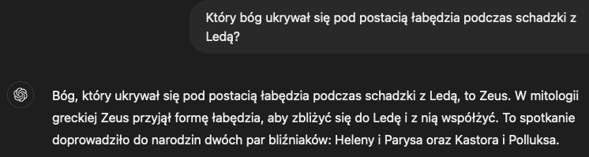
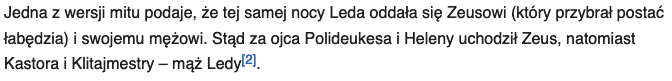
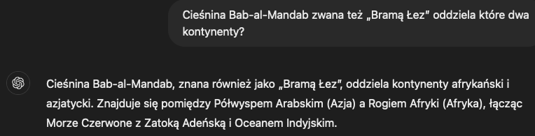
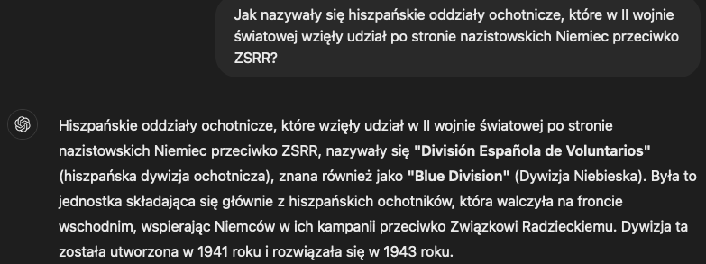
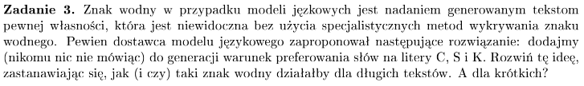

# zadanie 1


## zadanie
Policzenie liter w słowie
```
Count me amount of 'i' in the word 'iiiiiiiiiiiiiiiiiiiiiiiiiiiii'. (29 i) -> odp 27 (27 jest znacznie bardziej popularne od 29)
Count me amount of 'i' in the word 'iiiiiiiiiiiiiiiiiiiiiiiiiiiiii'. (30 i) -> odp 30

Reverse me word wefjnelfcsalkmsalkmsdalkm -> mkladslkmaskmlsaceflnejfw
    correct ->                               mkladsmklasmklascflenjfew

```

# zadanie 2


### Złych było:


XD

pół na pół, bo faktycznie z Zeusem


XD, Horacy, a Oda to Mickiewicz


### Dobrych było:






# zadanie 3



https://www.unscramblerer.com/scrabble-twl-dictionary-statistics/

C, S, K są dość popularne w języku angielskim:

C: 9.23% słów zaczyna się na C
S: 11.12%
K: 1.08%

Perplexity - jak nie znany jest tekst dla LLM

Low probability, high perplexity i vice versa

Burstiness - jak bardzo zdania są złożone, np jak człowiek używa trudnych słów to pojawiają się przez chwilę często i potem prawie wcale

Dodawanie znaku wodnego można by było rozwiązać w następujący sposób:

- przewidywanie = decoding 
Greedy decoding:
- jeśli PPB kolejnego słowa rozkłada się w miarę równomiernie wśród dużej liczby słów wtedy wybieramy raczje słowa zaczynające się od C,S,K
- jeśli mamy jakieś słowo, które nie zaczyna się od C,S,K ale ma bardzo wysokie PPB, wtedy je wykorzystamy

Obecne podejście:
- blacklistujemy niektóre słowa, tak żeby LLM nie mógł ich wybierać
- seed do blacklistowania to ostatnie słowo
- potem wykrywanie to po prostu przejście po słowach i sprawdzenie blacklistowanych słów

## Dla długich tekstów:
Czy by działało (greedy):
- w długim tekście możemy wymusić używanie w większej ilości słów na C,S,K i będzie to widoczne (szczególnie jak zacznie być dużo słów na K)
Jak by działało:
- teksty mogłyby być bardzo przewidywalne i 'nudne', cały czas używalibyśmy w miarę podobnych sformułowań i słów

## Dla krótkich tekstów:
Czy by działało (greedy):
- dla berdzo krótkich tekstów prawdopodobnie kiespko, bo mielibyśmy bardzo małą próbkę tych słów
Jak by działało:
- moglibyśmy otrzymać nie całkiem naturalne sformułowania


