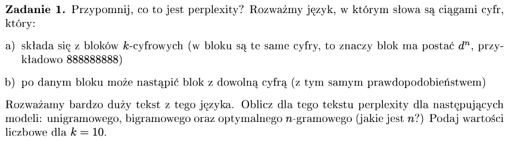
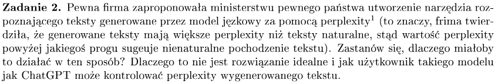
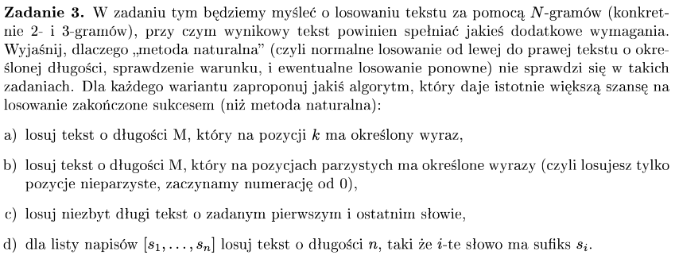
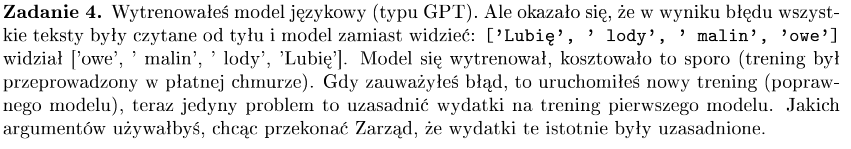
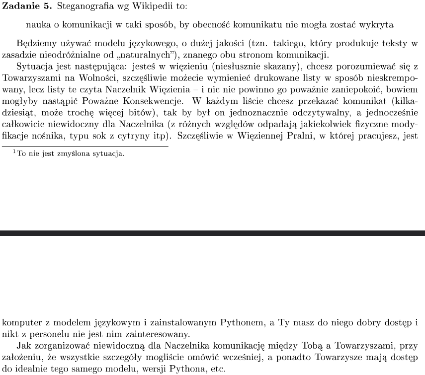
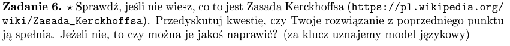
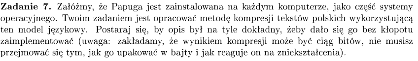
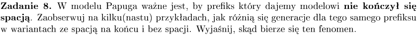
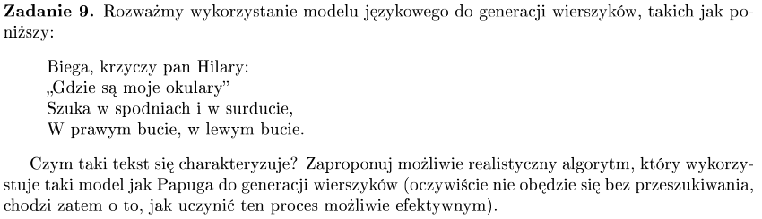
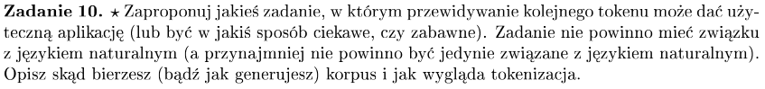

# zadanie 1


- **encoder** - dostaje tekst i generuje stałej długości wektor odpowiedzi dla tekstu, np BERT -> dobry do sentiment analisis, tylko rozumieją tekst, nie produkują go
- **encoder - decoder** - dostaje tekst, encoding generuje embeding dla niego, wrzuca ten embeding do decodera, decoder produkuje tekst 1 token na raz, korzystając z embedingu i wygenerowanych już tokenów - Machine Translation, BART, albo image captioning - produkujemy embeding dla zdjęcia i potem decoder robi tekst

- **decoder** - mamy sam dekoder, generujący tekst, promptujemy tekstem


- perplexity - ile LLM ma średnio wyborów w dobieraniu kolejnego tokenu na podstawie kontekstu,
średni, ważony współczynnik rozgałęzienia języka
- perplexity to PPB testowego (nie widzianego w trakcie treningu) zbioru znormalizowane przez liczbę słów


- minimalizacja Perplexity to maksymalizacja PPB

- chcemy mieć większe PPB dla bedziej gramatycznych tekstów, częściej występujących

Dla ```k = 10```
- token to pojedynczy blok
- tekst składa się z bloków postaci d^10
np 8888888888 9999999999 …

- po danym bloku może wystąpić blok z dowolną cyfrą, z tym samym PPB

Język składa się z bloków k-cyfrowych, bloki są d^n np 8888888

* <b>model unigramowy</b>, PPB każdego kolejnego tokenu jest niezależne od występujących już tokenów


#### Perplexity:
$$
PP(w_1 … w_N) =(P(w_1)\cdot P(w_2) \cdot … \cdot P(w_N))^{-\frac{1}{N}} = \\
((\frac{1}{10} \cdot \frac{1}{10} \cdot … \cdot \frac{1}{10})^{N})^{-\frac{1}{N}} = (\frac{1}{10})^{-1} = 10

$$

* <b>model bigramowy</b>, PPB kolejnego tokenu zależy od jedneko tokenu poprzedniego, ale u nas skoro po każdym bloku może występować blok z dowolną cyfrą z tym samym PPB to nie ma to znaczenia
$$
PP(w_1 … w_N) =(P(w_1 | <s>)\cdot P(w_2|w_1) \cdot … \cdot P(w_N|w_{n-1})\cdot P(</s>|W_N))^{-\frac{1}{N}} = \\
((\frac{1}{10} \cdot \frac{1}{10} \cdot … \cdot \frac{1}{10})^{N})^{-\frac{1}{N}} = (\frac{1}{10})^{-1} = 10
$$

* <b>model n-gramowy</b>, PPB następnego tokenu jest obliczane pod warunkien prefiksu długości n-1, w naszym zadaniu kolejne bloki cyfr występują z tym samym PPB, zatem dowolnie długi prefiks nie ma znaczenia

### Jak tokenem jest blok to nie ma nic ciekawego, lepiej zrobić dla tokenu
- dla tokenu = jednej cyfrze to ma znaczenie

- Bigramowy 2.96
k = 10
- wiemy że poprzednia była 8, ale przedłużamy w 9/10 przypadków (nie wiadomo gdzie w ciągu jesteśmy) oraz wybieramy nowy ciąg 
8 888888888l

9/10 przedłużamy w jednym przypadku l->8
1/10 losujemy nową cyfrę l->!=8

P(8|1) = 0 * 9/10 + 1/10 * 1/10

# zadanie 2


Kilka faktów:
- wysokie perplexity - dużo niespodziewanych wyrażeń i słów
- niskie perplexity - dość powtarzające się wyrażenia, proste i krótkie zdania
- dobry LLM powinien charakteryzować się niskim perplexity, podobnie jak większość ludzkich tekstów w internecie
- nieskie perplexity oznacza proste zdania, powtarzające się wyrazy itp

### Teksty generowane - większe perplexity, czemu?
- np poprzez samplowanie możemy uzyskać więcej niespodziewanych słów
- teksty o wysokim perplexity mogą się zdawać niegramatyczne i mniej naturalne
- często modele były trenowane tak, aby miały większe perplexity, żeby zaskakiwały odbiorcę

### Czemu nie jest to rozwiązanie idealne?
- możemy sterować perplexity np poprzez prompt (make a text dull and repetative) i temperaturą (ustawić na niską wartość)
- możemy mieć sporo false positive, szczególnie, jak ktoś ma bardzo 'odważny' styl pisania

# zadanie 3


- mamy modele 2,3 gramowe
- wyjaśnić czemu generowanie od lewej do prawej tekstu o określonej długości, sprawdzenie warunku i ewentualny ponowny los nie zadziała
- zaproponować inną metodę losowania

#### a) losuj tekst o długości M, który na pozycji k ma określony wyraz

Problem 2,3-gramowy:
- jeśli idziemy od lewej do prawej, sprawdzamy warunek i losujemy ponownie może potencjalnie nigdy się nie skończyć / trwać bardzo długo bo PPB na ten określony wyraz może być bardzo niskie

M - dł w wyrazach
k - indeks wyrazu
Rozwiązanie 2,3-gramowe:
- możemy generować od k-tej pozycji w prawo (M-k wyrazów) i od k-tej pozycji w lewo (k-1 wyrazów), w efekcie będziemy mieli spełniony najtrudnieszy warunek, czyli 'k' na odpowiedniej pozycji
- generowanie w lewo można tą generajcę zrobić

#### b) losuj tekst o długości M, który na pozycjach parzystych ma określone wyrazy (czyli losujesz tylko pozycje nieparzyste, zaczynamy numerację od 0)
Problem 2,3-gramowy:
- zaczniemy losowanie od czegoś sensownego (0 wyraz), ale potem kolejny parzysty może już być źle wylosowany, trzeba powtórzyć, i tak dla każdego parzystego potem, nie mamy gwarancji że uda się 'wysamplować' odpowiednie parzyste wyrazy

Rozwiązanie 2,3-gramowe:
- dla pozycji parzystych i, i+2
    - dla 'i' losujemy naszym modelem jedno kolejne słowo
    - dla pozycji 'i+2' bierzemy to kolejne słowo, jako poprzednik i losujemy słowo i+1
    - z tych losować wybieramy słowo które się pokrywa i ma największą sumę PPB

- albo iterujemy się po możliwych rozwiązaniach i patrzymy na kolejne słowo

#### c) losuj niezbyt długi tekst o zadanym pierwszym i ostatnim słowie
Problem 2,3-gramowy:
- jak zaczniemy od pierwszego słowa, nie mamy gwarancji że uda się z sensownym PPB wylosować poprawnie ostatnie słowo (może ono mieć jakieś bardzo małe PPB)

Rozwiązanie 2,3-gramowe:

- znowu losujemy od lewej i prawej jednocześnie, jak losowania się spotkają na pozycji 'l' to wybieramy słowo, które się pokrywa w losowaniach i ma największe możliwe PPB

#### d) dla listy napisów [s1, …, sn] losuj tekst o długości n, taki że i-te słowo ma sufiks si
Problem 2,3-gramowy:
- dostanie teksu to długości 'n' spełniającego te warunki jest zbyt mało PPB, czyli twałoby zbyt długo
Rozwiązanie 2,3-gramowe:
dla 3-gramowego:
- rozwiązaniem byłoby zastosowanie backtracingu
    - dla s1 szukamy pasującego prefiksu p1
    - jak go znajdziemy, to próbujemy wyszukać prefiksu dla s2, uwzględniając wylosowane p1 oraz dane s1, jak się nie uda, to się cofamy z wyborem p1 i wybieramy jakiś inny prefiks
    - idziemy z tym backtracingiem coraz dalej, w razie problemów się cofamy i losujemy inne prefiksy
dla 2-gramowego:
- idziemy po prostu po kolei i generujemy pasujące prefiksy uwzględniając kolejne sufiksy
__s1_s2_s3_s4_…
- najpierw wygenerujemy dla s1, no a potem wiedząć że potem musi wystąpić s1 wrzucimy dl LLM s1 i spróbujemy wygenerować p2

# zadanie 4


- utworzyliśmy model, który może być sensowny do analizy tekstów palindromicznych, albo innych wzorców
- prawdopodobnie dobrze rozumie dzięki temu teksty w języku hebrajskim, arabskim i perskim
- umożliwienie Bidirectional (dwustronnego) LSTM (Long Short-Term Memory) [jak dotrenujemy ten drugi model] - możemy zapamiętać zależności między poprzedzającymi wyrazami a następującymi (wykorzystywane np w analizie sentymentu, tłumaczeniach, klasyfukacji tekstów) - BERT np ocenia kontekst słowa w zdaniu na podstawie zdania przed wyrazem i po nim

# zadanie 5


- chcemy przekazać komunikat, tak by nie był wykryty
- nie kompresujemy tekstu
- przekazać informację za pomocą kilkudziesięciu bitów

Pomysły:
- napisanie tekstu w których występują osoby, których pierwsze litery imion to litery z wiadomości (takie średnie podejście, nie zawsze słowa mają sens, ponadto trudno imiona wpleść w tekst, chyba że występują na raz obok siebie np Szymon, Zosia i Yevann -> SZY)
- napisanie tekstu, w którym każde zdanie zaczyna się od kolejnej litery z wiadomości
- wziąć litery z wiadomości, przekonwertować je na liczby, potem wziąć ustalony prefiks i kazać modelowi go dokończyć, biorąc za każdym razem token o indeksie = ASCII Code kolejnej litery z wiadomości (można to zaszyfrować)
- przekonwertować wiadomość, znak po znaku, na zapis binarny, potem wziąć prefiks i kazać go dokończyć modelowi, za każdym razem biorąc 0 albo 1 token, w zależności zapisu binarnego znaku (można jeszcze zanim przekonwertujemy na binarkę zaszyfrować sam napis)

# zadanie 6


- Zasada ta mówi, że system kryptograficzny powinien być bezpieczny nawet wtedy, gdy wszystkie szczegóły jego działania – oprócz klucza – są znane.

- pierwsze 2 pomysły nie spełniają tej zasady
- 3,4 pomysł spełnia, jeśli zaszyfrujemy nasz napis a potem będziemy wybierać tokeny

# zadanie 7


- przetrzymywać stokenizowany tekst?

- bierzemy tekst, który mamy skompresować
- dzielimy go na odpowiedniej wielkości kawałki, żeby zmieściły się do kontekstu
- modyfikujemy parametry papugiGPT
    - temperatura -> nie ma znaczenia, bo lista PPB jest deterministyczna
    - bez samplowania
    - max_new_tokens = 1
    - top_k=0
    - top_p=1

- chcemy żeby papuga starała się de facto skopiować nasz input

### Algorytm
- mamy jakiś input_text, compressed, generated_text [ile już inputu przerobiliśmy]
- uruchamiamy funkcję generującą (na generated_text (na początku pusty)) i generujemy token po tokenie
- sprawdzamy czy wygenerowany token pasuje do konkretnego tokenu z input_text
    [to sprawdzenie odbywa się w ten sposób, że sprawdzamy czy to co już żeśmy utworzyli + nowy token wygląda tak samo jak fragment inputu + nowy token]
    - jak pasuje to nie zapisujemy go tylko zapamiętujemy, że dobrze go zgadliśmy i dodajemy do jakiegoś countera dobrze zgadniętych tokenów, dopisujemy dobrze zgadnięty token do generated_text
    - jak jest inny, to zapisujemy liczbę dobrze zgadniętych do compressed - |counter|, a następnie zapisujemy ten nasz token nieodgadnięty, dopisujemy fragment input_text do generated_text [czyli fragmentu już przerobionego]
- powtarzamy generowania do momentu gdy generated_text != input_text

Dekompresja
- idziemy po skompresowanym tekście i wywołujemy generujemy token albo wklejmay zapisany tam token

# zadanie 8


Ten fenomen bierze się stąd, że tokeny rozpoczynające jakieś sensowniejsze słowa zaczynają się od spacji, natomiast tokeny który kończą słowa nie mają spacji z przodu. Zatem, jak dodany spację na końcu prompta to największe PPB będą miały tokeny bez spacji z przodu, czyli tokeny kończące słowa. Bez spacji na końcu największe PPB będą miały tokeny rozpoczynające słowa.

```
Input:
 Wczoraj wieczorem postanowiłem 
 ----------------------------------------------------------------------------------------------------
[',', ' sprawdzić', ' zrobić', ' się', ' odwiedzić', ' wybrać', ' wrócić', ' w', ' sobie', ' że']
Output: no space ----------------------------------------------------------------------------------------------------
Wczoraj wieczorem postanowiłem, że nie będę się już więcej rozpisywał na temat tego, co się dzieje w moim życiu. Nie będę się rozpisywał na temat tego, co się dzieje w moim życiu. Nie będę się rozpisywał na temat tego, co się

['owy', 'łowy', 'owia', 'owemu', 'ściu', 'łka', 'ść', '........', 'łę', '\xad']
Output: space ----------------------------------------------------------------------------------------------------
Wczoraj wieczorem postanowiłem owy wpis poświęcić na coś innego. W końcu nie od dziś wiadomo, że w życiu nie ma przypadków.
W tym roku postanowiłem, że będę się starał, aby w moim życiu nie było przypadków. I tak oto w tym roku postanowiłem, że będę
```

# zadanie 9



### Czym się charakterysuje
- podobna liczba tokenów w każdym wierszu
- każdy wiersz zakończony \n
- każda linia zaczyna się wielką literą
- zdania występują w regularnych grupach tj zbiorach, zakończonych jakimś wspólnym sufiksem

### Algorytm
- Input: fragment poeazji, np Tuwima
- Ustawiania modelu:
    - bawimy się temperaturą, rożne wartości
    - max_new_tokens = # tokenów w poprzedniej linii + 1
    - do_sample = True
    - top_k = 50
    - top_p = teź się bawimy

1. Generujemy kilkukrotnie, np 10 razy, wiersze z różnymi konfiguracjami, zapisujemy wyniki
2. Przechodzimy po wynikach, jeśli przedostatni token jest złączony bez spacji z ostatnim i ostatni nie jest znakiem interpunkcyjnym, odcinamy od rozwiązania ostatnie tokeny, dopóki nie dojdziemy do spacji
3. Jeśli poprzednie dwa wiersze kończyły się tym samym 3-literowym sufiksem
    - to akceptujemy dowolne rozwiązanie, którego liczba tokenów jest podobna do poprzedniego wiersza (+/- 1)
    - jeśli nie były takie same, to akceptujemy tylko rozwiązanie zakończone 3-literowym sufiksem, takim samym jak wiersz wyżej,
        - jak takiego nie ma, akceptujemy najlpeszy pod względem ilości tokenów wiersz
4. Ostatecznie doklejamy do wiersza, jeśli nie było, \n i wrzucamy do kontekstu
5. Powtarzamy 1-4.

Jak zwiększyć efektywność?
- możemy zliczać sylaby a nie tokeny

# zadanie 10


Język składa się z liter N, S, E, W, oraz czynnika POS(x,y) -> wyznaczającego pozycję pisaka
Każda z liter reprezentuje krok w jedną ze stron świata (do góry, w dół, w prawo, w lewo w układzie kartezjańskim)
Na podstawie tych kroków możemy wygenerować jakiś obrazek
- kilka liter następujących po sobie oznaczamy N^k
- LLM byłby nakarmiony ciągami takich słów, które tworzą jakieś sensowne rysunki,
np rysunek konia, dłoni itp
- nasz LLM na podstawie naszego prompta (rozpoczynającego rysunek) miałby za zadanie go dokończyć, dla naszego początku rysunku wybierałby jakieś najbardziej PPB kolejne tokeny
- poprzez przewidywanie kolejnego tokenu można by było tworzyć jakieś ciekawe dokończenia naszego wzorca
- tokenami są bloki liter N,S,E,W^k (różnej długości zlepki tych liter) oraz POS(x,y)
