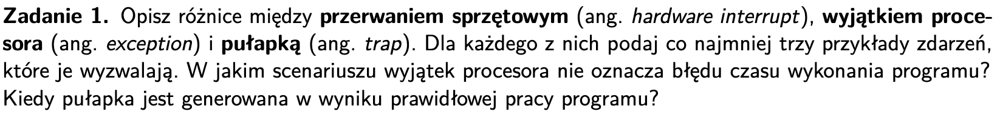
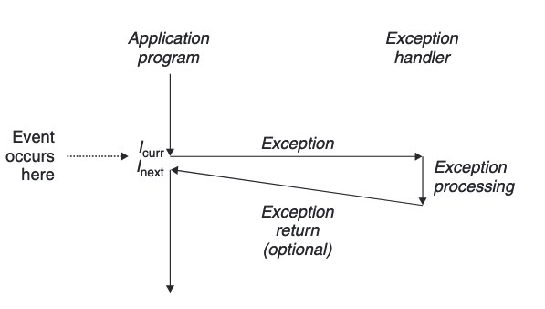
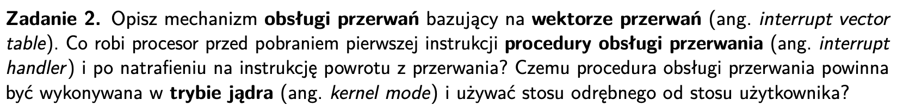
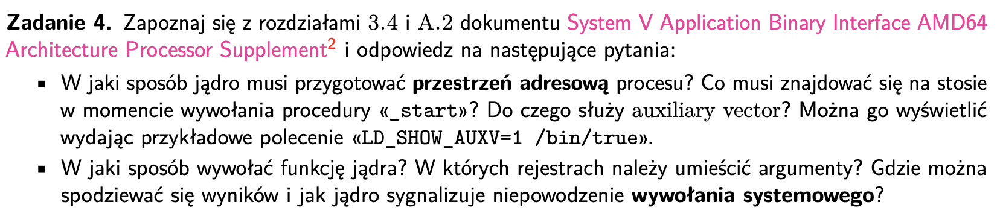

# zadanie 1

### Pojęcia
- przerwanie - nagła zmiana w przebiegu programu spowodowana zmianą stanu procesora

System wie dokąd ma skoczyć z exception na podstawie exception table

- przerwanie sprzętowe (hardware interrupt) - przerwanie spowodowane nie przez jedną z instrukcji, tylko przez sygnał z urządzeń I/O, niezależnych od procesora

- wyjątek procesora (exception) - przerwanie spowodowane przez nieprawidłowe warunki wykonania instrukcji

- pułapki (traps) - intencjonalne wyjątki spowodowane przez wywołanie konkretnej instrukcji

### Różnice
| class | cause | async/sync | zachowanie |
|----------|----------|----------|----------|
| hardware interrupt   | sygnał z urządzeń I/O   | async   | powrót do kolejnej instrukcji |
| trap    | wykonanie intrukcji z kodu  | sync   | powrót do kolejej instrukcji   |
| exception    | nieprawidłowe warunki wykonania instrukcji   | sync | przerwanie wykonania albo powrót do aktualnej instrukcji |

### Przykłady
<b>Przerwanie sprzętowe</b>:
- sygnał zegara systemowego, generowany co przedział czasu, a używany do planowania zadań i zarządzania czasem procesora
- przerwanie klawiatury - ^C
- przerwanie dyskowe - koniec odczytu/zapisu

<b>Pułapka</b>:
(te wyjątki są niezbędne do komunikacji program-kernel)
- (read) - odczyt pliku
- (write) - zapis pliku
- (fork) - stworzenie nowego procesu
- (execve) - załadowanie programu
- (exit) - zakończenie obecnego procesu

<b>Wyjątek procesora</b>:
- dzielenie przez 0
- segmentation fault - naruszenie ochrony pamięci, próba uzyskania dostępu do chronionego obszaru pamięci
- niedozwolona instrukcja - jesteśmy w trybie użytkownika i nie mamy uprawnień

### Pytania
Wyjątek procesora nie przerywa programu, jeśli np mamy <i>page fault exception</i> - ma to miejsce gdy program odnosi się do adresu wirtualnego, nieobecnego w pamięci fizycznej. Trzeba wówczas pobrać dane z dysku, handler tego excetption pobiera dane i wraca do instrukcji, która wywołała wyjątek.

// adres wirtualny nie jest w pamięci fizycznej

Pułapka jest generowana np gdy chcemy coś zapisać do pliku wywołana jest wówczas procedura <i>syscall n</i> realizująca dane polecenie.

// syscall umożliwia przejście między <i>user mode</i> a <i>kernel mode</i>

Skąd GDB wie że ma się zatrzymać w konkretnym miejscu -> jest konkretna instrukcja

GDB - też jest syscall dla samego gdb

API do obsługi systemowych rzeczy - syscall

# zadanie 2

### Pojęcia
- obsługa przerwań - jak hardware i software współpracują realizując przerwania

- wektor przerwań (interrupt vector table) - tabelka, gdzie każdy rekord k zawiera adres do kodu procedury obsługi przerwania

- procedura obsługi przerwania (interrupt handler) - kod z systemu operacyjnego, który obsługuje zdarzenie z danego exception, po zrealizowaniu go przekazuje kontrolę albo instrukcji realizującej exception, albo kolejnej, albo abortuje program

- tryb jądra - tryb pracy procesora, w którym wykonywany kod ma pełny zasób do sprzętu i zasobów systemu

Fault - wracamy do wywołującej instrukcji

Abort - już nie wracamy

### Mechanizm obsługi przerwań
1. Każdy exception ma przyznany <i>exception number</i>.
2. Przy uruchamianiu komputera SO alokuje tabelkę skoków (jump table),
<b>(interrupt vector table)</b> gdzie rekord k zawiera adres do handlera dla exception k.
3. W trakcie runtime'u, gdy pojawi się exception procesor sprawdza jaki ma numer i sprawdza adres handlera w <b>interrupt vector table</b>.
4. Po odnalezieniu adresu przekazuje tam sterowanie i rozpoczyna wykonywanie procedury.

### Co robi procesor przed pierwszą instrukcją obsługi przerwania
1. Wrzuca na stos adres powrotu do procedury/adres następnej procedury
2. Wrzuca też część stanu procesora na stos, który będzie mu potrzeny przy dalszej realizacji programu (np rejestry, flagi)
3. Procesor przechodzi w kernel mode (jeśli jest taka potrzeba) wrzuca wówczas także na stos kernela potrzebne dane

Po tym jak handler przetworzy cały event:
1. Wraca do przerwanego programu, korzystając ze specjalnej instrukcji <i>return from interrupt</i>.

2. Przywraca stan rejestrów i flag na podstawie stosu.

3. Jeśli przerwany program był w <i>user mode</i> procesor zmienia stan na <i>user mode</i> z<i>kernel mode</i>.

4. Przywraca kontrolę przerwanemu programowi.

### Czemu tryb jądra
1. Potrzebne są wszystkie zasoby systemu, bez nich nie da się obsłużyć wielu wątków, np dostęp do plików jest potrzebny
2. Szybciej jest w trybie jądra???
3. Tryb jądra gwarantuje, że inne programy nie mogą ingerować w obsługę wyjątku.

### Czemu stos odręby od użytkownika
1. Nie chcemy żeby dane z programu mieszały się z danymi w handlerze, może to prowadzić do błędów
2. Chcemy mieć możliwość wyrzucenia wyjątku, nawet jak standardowy stos się wywali.
3. Uniemożliwiamy atak, który minipuluje standardowym stosem.

# zadanie 3

Pliki ELF -> format pliku dla plików obiektowych, wykonywalnych, dla bibliotek dzielonych. Jak wygląda plik, gotowy do uruchomienia w systemie.

### Pojęcia
Sekcja:
- bardziej szczegółowa zawartość pliku, to tu są faktyczne zmienne i funkcje etc.
- fragment segmentu

- segment - spójny blok pamięci o tych samych uprawnieniach, któryna załadować

Segment:
- używany podczas ładowania i wykonywania programu
- może zawierać kilka sekcji
- reprezentuje blok pamięci załadowywany podczas programu

Nagłówki programu:
- jak program powinien być załadowany do pamięci.
- typ segmentu (np. load, dynamic, interp), ile tych segmentów
- adres wirtualny, pod którym segment powinien być załadowany.
- offset segmentu w pliku.
- rozmiar segmentu w pliku i w pamięci.
- flagi (np. readable, writable, executable)

Składowe pliku:
- ELF header -> info a architekturze
- program headers -> info o segmentach, rozmiary, offsety, typy (LOAD, DYNAMIC itp)
- sekcje -> kod wykonywalny, zmienne globalne i statyczne
- section headers table - info o innych sekcjach i ich adresach

### Skąd SO wie gdzie umieścić segmenty programu i gdzie jest jego pierwsza instrukcja
- O pierwszej instrukcji wie z nagłówka pliku ELF
- Program headers zawierają adresy wirtualne, do których należy załadować poszczególne segmenty

# zadanie 4

### Jak jądro przygotowuje przestrzeń adresową procesu

Przygotowuje argumenty programu, zmienne środowiskowe, auxillary vector, wskaźniki.

### Do czego służy auxillary vector?
Przetrzymuje on różne struktury z informacjami o procesie, uid procesu, np bit który się pali jak program nie jest w formacie elf, przydatne przy linkowaniu dynamicznym

### Jak wywołać funkcję jądra 

Jest specjalna instrukcja - syscall, trzeba wrzucić numer syscalla, argumenty w rejestrach, rax, i pozostałych głównych. Wynik w rax, syscall z błędem, w rax mamy liczbę ujmną

### Pojęcia
- przestrzeń adresowa - zbiór adresów w pamięci, które procesor może wykorzystać w trakcie działania programu

### W jaki sposób jądro musi przygotować przestrzeń adresową
Musi zainicjować stos procesu, umieszczając na nim 

# zadanie 5

### Znaczenie
volatile - mówi kompilatorowi, że nie może on stosować żadnych optymalizacji na danej zmiennej bo może się ona zmieniać w sposób, o którym kompilator nie ma pojęcia

<b>W szczególności kompilator będzie odczytywał dane ze zmiennej za każdym razem zaglądając do pamięci, zamiast trzymać ją w rejestrze</b>

### Scenariusze

1. Mamy jakąś sprzętową zmienną, która jest zmieniana poza programem, a chcemy żeby program miał cały czas jej najnowszą wersję danych, które się w niej znajdują. Np mamy rejestr sprzętowy, ciągle się zmieniający.

2. Mamy aplikację wielowątkową i chcemy żeby każdy wątek miał dostęp do najnowszych danych ze zmiennej globalnej. Chcemy uniknąć zapisywania nieprawidłowych danych.

# zadanie 6

# zadanie 7

### Pojęcia
wywołanie systemowe - syscall - wywołanie używane przez program, gdy chce mieć dostęp do konkretnej usługi systemu

1. program się wykonuje
2. potrzebuje coś zapisać w pliku
3. wywołuje syscall
4. uruchamiana jest pułapka
5. exception handler wykonuje wywołanie funkcji systemowej
6. potem wracamy do instrukcji, która wywołała syscall

### Do czego służy wywołanie systemowe SYS_brk
Alokuje przestrzeń pamięci dla danego procesu, potem pamięć dla procesu można zwiększać. Zwiększa wielkość sterty w pamięci procesu

### Która funkcja odpala brk
Robi to opendir

# zadanie 8
standardowe I/O - plik o deskryptorze 0
