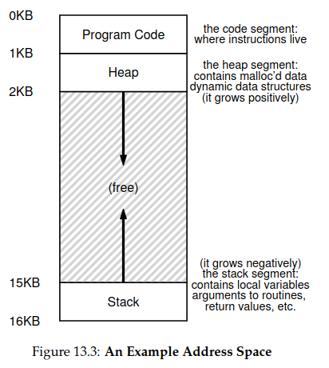

# zadanie 1


### Pojęcia
(fork) -> tworzy nowy proces

- rodzic-dziecko - procesy są tworzone przez strukturę drzewiastą, z jednego procesu powstaje inny który jest kopią rodzica (nie dokładną kopią), z tą różnicą że nie ma metody startowej <b>main</b>

- identyfikator procesu - id danego procesu, który umożliwia jego łatwą identyfikację, gdy chcemy go np zatrzymać

- signal - sygnały dla innych prcesów, defaultowo zakańczają program, działają trochę jak przerwania, sposób na komunikowanie się procesów, inny sosób to przekazywanie bajtów między procesami używając <b>pipes</b>

- identyfikator grupy procesów - PID całej grupy, grupa procesów to rodzic i pozostali przodkowie procesu, rodzeństwo, dzieci i pozostali potomkowie

- właścieciel procesu - użytkownik, tworzący procesy, te procesy mają takie same dostępy jak dany użytkownik, czyli np jak użytkownik może tylko czytać z pliku, proces także

- wyjątek jądra - wyjątek spowodowany zdarzeniem sprzętowym albo kłopotem z operacją, obsługa takiego wyjątku wymusza przejście do <i>kernel mode</i>

- hierarchia procesów - który powstał z którego, przy uruchamianiu komputera mamy proces <i>init</i>, który jest korzeniem wszystkich procesów

### Analiza wydruku
``` 
właściciel procesu                PID rodzica, grupy
USER         PID    PPID    PGID     TID PRI STAT WCHAN  CMD
root           1       0       1       1  19 Ss   -      /sbin/init splash
root           2       0       0       2  19 S    -      [kthreadd]
root           3       2       0       3  19 S    -      [pool_workqueue_release
root           4       2       0       4  39 I<   -      [kworker/R-rcu_g]

```

### Kto jest rodzicem procesu <i>init</i>
Init nie ma rodzica, jest nawyższym w hierarchi procesem.

### Co jest wyjątkiem jądra
WCHAN name of the kernel function in which the process
is sleeping, a "-" if the process is running, or
a "*" if the process is multi-threaded and ps is
not displaying threads.

- JAKIEŚ NIEPUSTE pole w wchan, czeka na reakcję jądra


### Znaczenie znaków z kolumny STAT
```
           D    uninterruptible sleep (usually IO)
           R    running or runnable (on run queue)
           S    interruptible sleep (waiting for an event to complete)
           T    stopped by job control signal
           t    stopped by debugger during the tracing
           W    paging (not valid since the 2.6.xx kernel)
           X    dead (should never be seen)
           Z    defunct ("zombie") process, terminated but not reaped by its parent

  For BSD formats and when the stat keyword is used, additional characters may be displayed:

          <    high-priority (not nice to other users)
          N    low-priority (nice to other users)
          L    has pages locked into memory (for real-time and custom IO)
          s    is a session leader
          l    is multi-threaded (using CLONE_THREAD, like NPTL pthreads do)
          +    is in the foreground process group
```

### Które z zadań to wątki
- polecenie ```pstree -T``` schowa nam wątki
```
systemd─┬─ModemManager───2*[{ModemManager}] <- 2*[] == wątki
        ├─NetworkManager───2*[{NetworkManager}]
        ├─accounts-daemon───2*[{accounts-daemon}]
```

# zadanie 2


Fork zwraca wartość 0 w dziecku oraz wartość == swojemu PID w rodzicu, można wtedy poznać, który proces to dziecko, a który to rodzic. (p2.c)

### Pojęcia
- sierota - proces, który stracił rodzica, SO zmienia Parent PID takiego procesu na proces <i>init</i>

- zombie - proces się zakończył, rodzic procesu też, ale rodzic go nie pogrzebał staje się procesem zombie (rodzic nie wywołał wait na procesie), procesy w stanie <b>zombie</b> są zabijane przez proces <b>init</b>

- stany procesu
    - running - proces jest na procesorze i jest wykonywany
    - ready - proces jest gotowy do działania, ale SO go nie wywołał
    - blocked - proces realizuje jakieś zadanie, które sprawia, że jakieś inne wydarzenie musi się zrealizować, np I/O na dysku, proces może zwolnić procesor, bo jest zablokowany przez I/O na dysk
    - stopped - proces zostaje zawieszony i nie będzie zrealizowany, dopóki nie przyjdzie sygnał
    - terminated - proces pernamentnie zakończony

### Dlaczego proces nie może pogrzebać sam siebie
- nie może tego zrobić, bo jak się już zakończył to nie jest uruchomiony, czyli nie ma możliwości pogrzebania samego siebie
- nie zna swoejgo PID, PID jest przekazywane do rodzica
- znikęła by wtedy komunikacja rodzic dziecko, rodzic nie wiedziałby, że dziecko się zakończyło i zepsułaby się hierarchia

### Co by się stało gdyby ```waitpid``` mógł czekać na zmianę stanu dowolnego procesu?

(a) dziecko czeka na zmianę stanu rodzica - zaburzona jest hirarcia procesów 

-> wiemy że rodzic czeka aż dziecko się skończy, jak dziecko też będzie czekało to nikt się nigdy nie skończy

-> jeśli rodzic miałby zginąć wcześniej, żeby dziecko mogło go posprzątać to mielibyśmy potencjalnie bardzo dużo <b>zombie</b>

(b) wiele procesów czeka na zmianę jednego procesu

-> nie wiadomo, który miałby pierwszy dostać info o zakończeniu procesu, wyścigi

-> duplikacja danych, musilibyśmy jakoś wszystkim procesom dać znać że jakiś się skończył

# zadanie 3


```
main(argc, argv, envp) [counter, argumenty, środowisko]
```

### Pojęcia
- argumenty programu - opcje, z którymi program jest wywołany

- zmienne środowiskowe - trzymane w tablicy typu <i>name = value</i>, przekazują informacje typie terminala, katologu domowym, w którym jest program


### Do czego służy proc(5)
Program umożliwiający podgląd struktur danych, trzymanaych w jądrze.

```
proces - szymonm    76965    8400    4694   76965  19 Sl   do_pol /snap/firefox/5014/usr/lib/firefox/firefox -conten
```

Polecenie ```ls -l /proc/pid``` na pid ```ps -eo user,pid,ppid,pgid,tid,pri,stat,wchan,cmd```

- argumenty programu
```cat /proc/77325/cmdline```:
```
/snap/firefox/5014/usr/lib/firefox/firefox-contentproc-isForBrowser-prefsLen37373-prefMapSize259825-jsInitLen234840-parentBuildID20240924195713-greomni/snap/firefox/5014/usr/lib/firefox/omni.ja-appomni/snap/firefox/5014/usr/lib/firefox/browser/omni.ja-appDir/snap/firefox/5014/usr/lib/firefox/browser{c8003e6e-1505-4d14-a9cd-3e5a130c8f2e}8400true251tab
```

- zmienne środowiskowe ```cat /proc/77325/environ```


### Wyjaśnienie pojęć
```manual do pojęć - /proc/[pid]/status```

``` cat /proc/[pid]/status```
| Uid | Gid | Groups | VmPeak | VmSize | VmRSS | Threads | voluntary_ctxt_switches | nonvoluntary_ctxt_switches |
|-----|-----|--------|--------|--------|-------|---------|-------------------------|----------------------------|
| ID użytkownika, używane do przyznawania konkrentych uprawnień, np każda aplikacja może być konkrentym userem (tak jest na androidzie)| ID grupy do której należy użytkownik i która ma konkretne uprawnienia, główna grupa do której należy użytkownik| pozostałe grupy, do których należy user, poza grupą główną, dzięki temu user może mieć uprawienia z różnych grup   |  Peak virtual memory size. Maksymalna ilość pamięci zużyta przez proces od jego uruchomienia | Virtual memory size. Pamięć używana w tym momencie (zaalokowana w tym momencie)  | Ilość pamięci fizycznej, używanej przez proces (RAM)  | Liczba wątków używanych w procesie       | Ile razy ten proces dobrowolnie oddał CPU, np jak było I/O to nie musi już zużywać CPU                | Ile razy jądro wyrzuciło proces z CPU, robiąc miejsce dla innego                         |

# zadanie 4




### Pojęcia

X-serwer - system do komunikacji między komputerem a programami, ich okienkami itp

(pmap -> mapuje adresy wirtualne)

- wirtualizacja pamięci - SO mówi programowi, że ten jest na jakimś adresie wirtualnym, ale w rzeczywistości to on sam dla niego oblicza miejsce w pamięci fizycznej (zamykamy program w takim Matrixie, nie chcemy też żeby się o nim dowiedział - wirtualizacja pamięci)

- stos - gdzie program jest jeżeli chodzi o wywoływane funkcje, zmienne lokalne, argumenty do funckji, wartości zwracane

- sterta - dynamicznie zaalokowana, zarządzana przez użytkownika pamięć, gdy korzystaliśmy z malloc np

- segmenty programu - bloki pamięci używane przez proces, fragmenty pliku wykonywalnego, załadowanego do pamięci

- pamięć anonimowa - segment pamięci, który jest alokowany tylko w trakcie wykonywania programu, niemające odwzorowania w pamięci (np stos, sterta)

- pliki odwzorowane w pamięć - (memory-mapped files) - pliki, które do procesu zostały załadowane z konkretnego miejsca na dysku, istnieją też poza procesem


Szukamy czegoś z x11:
```
szymonm     4986    4419    4937    4986  19 Sl   do_pol /usr/libexec/ibus-x11 --kill-daemon
```

### Przykłady zasobów pamięciowych
| Stos       | Sterta    | Segmenty programu | Pamięć anonimowa | Pliki odwzorowane w pamięci |
|-----------|-----------|-------------------|------------------|----------------------------|
| ```00007ffcbfba2000    132K rw---   [ stack ]``` | ```-```| ```000077d45fded000      8K r---- ld-linux-x86-64.so.2```  | ```00007ffcbfbd4000     16K r----   [ anon ]```      | ```000077d45cdf7000     12K r-x-- libogg.so.0.8.5```

