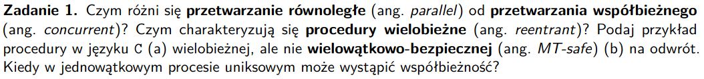

### Pojęcia
- przetwarzenie równoległe (parallel) - możemy to osiągnąć, jak mamy wiele procesorów, które przetwarzają dane w tym samym czasie, procesor nie tworzy iluzji równolełości

- przetwarzanie współbieżne (concurrent) - mamy przełączanie kontekstu między różnymi wątkami realizowane
przez jeden procesor, który dzieli nam kwanty swojego czasu na kawałki, tak naprawdę to wykonujemy zadania sekwencyjnie, ale procesor tworzy iluzję równoległości, poprzez wykonywanie kawałka jedneg zadania i przełączanie się na inne itd.

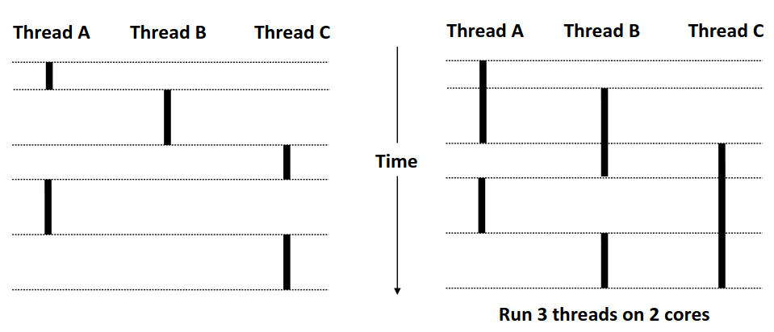

- procedury wielobieżne (reentrant) - to procedury, takie że jak zostanie przerwane ich wywołanie (np przyjdzie sygnał albo inny wątek ją wywoła) to może ich wykonanie być bezpiecznie przerwane i wezwane jeszcze raz (re-entered) bez zniszczenia lokalnego stanu wykonania procedury, **przerwanie procedury i wykonanie instancji tej procedury gdzieś indziej nie zmienia stanu przerwanej**

- wielowątkowo-bezpieczne procedury (MT-safe = thread-safe) - mogą być wywoływane przez wiele wątków jednocześnie, bez żadnych błędów, sensownie opytymalnie oraz **wywołanie funckji w jednym wątku nie zmienia jej w drugim**

- **funkcja może być reentrant i thread-safe albo tylko reentrant, albo tylko thread-safe albo żadne z wymienionych**

### Czym charakteryzują się procedury wielobieżne?
- nie niszczymy rezultatów poprzedniego wykonania
- nie mają statycznych ani globalnych zmiennych, które mogłby zostać zmienione przez inne wywołania, trzymamy dane na stosie
- nie może modyfikować swojego kodu
- nie może wykonywać procedur niewielobieżnych

**jak funkcja jest reentrant dla wielu wątków to jest thread-safe, ale nie gwarantuje to że jest bezpieczna dla sygnałów - nie musi być async-signal safe**
### 

### Procedury w C

#### wielobieżna, ale nie wielowątkowo-bezpieczna
```C
int tmp;
int add5(int a){
    tmp = a;
    return a + 5;
}
```
- nie jest wielowątkowo-bezpieczna, bo mamy wyścigi o zmienną tmp
#### wielobieżna i wielowątkowo-bezpieczna
```C
int add5(int a){
    return a + 5;
}
```

#### nie-wielobieżna i wielowątkowo-bezpieczna
- printf jest wielowątkowo-bezpieczny, ale wykorzystuje sefamfory, czyli nie jest wielobieżny

### Kiedy w jednowątkowym procesie uniksowym może wystąpić współbieżność?
- współprogramy, generatory, przerywamy w jakimś momencie i przeskakujemy gdziześ indziej, przeplatamy nasz program innym programem

# zadanie 2
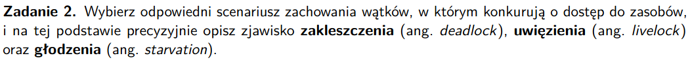

### Pojęcia
- zakleszczenie (deadlock) - proces A potrzebuje zasobu procesu B do dalszego działania, a proces B potrzebuje zasobu A, w efekcie żaden nie może się ruszyć
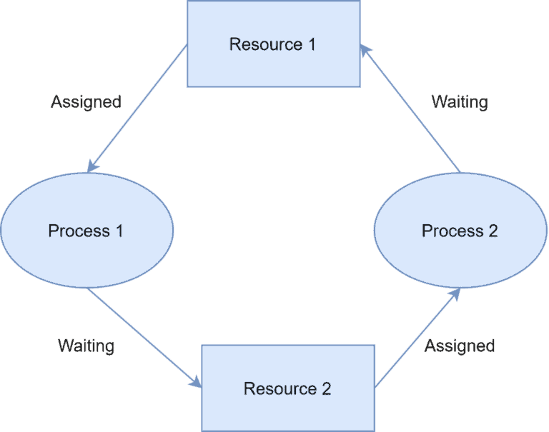

np printf w signal handler i printf w programie, signal handler będzie chciał, żeby program przerwany odblokował plik dla printa (żeby on mógł printować), a program przerwany będzie mógł odblokować tylko jak do niego wrócimy, a wrócimy tylko jak handler się skończy
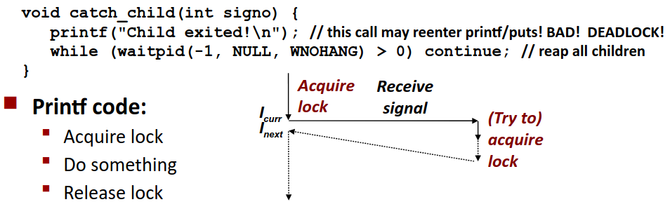

- uwięzienie (livelock) - wątki cały czas zmieniają stan w odpowiedzi na działania innych wątków, ale żaden wątek nie robi postępów w realizacji swojego zadania

- wątek A zakłada lock'a na wątek B i jednocześmie wątek B zakłada lock'a na wątek A, w efekcie żaden nie może założyć lock'a na drugiego no i potem powtarzają zakładanie i tak w kółko
- przykład z życia - ustępowanie w windzie gdy osoba A chce ustąpić miejsca B, a B, A, efekt -> obie osoby machają rękami, nikt nie wchodzi do windy

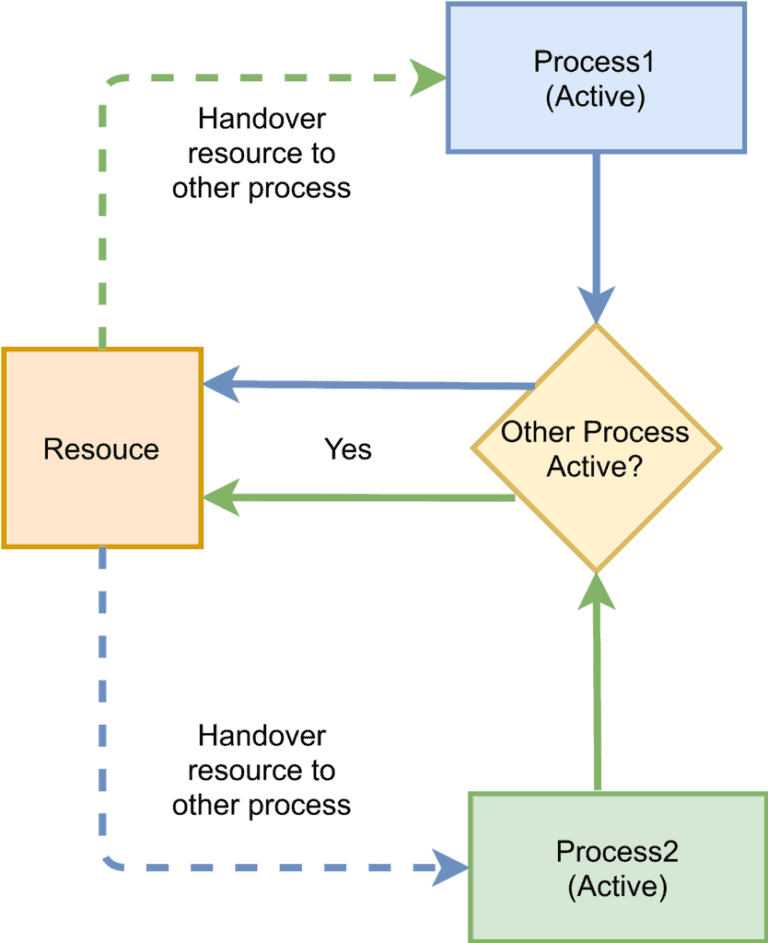

- głodzenie (starvation) - proces jest gotowy do odpalenia (ma wszystkie zasoby), ale nie dostaje czasu na procesorze i w efekcie się nie wykonuje, może też występować
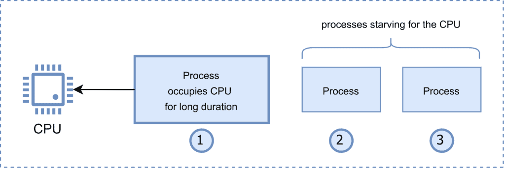

- np mamy deadlock/livelock na wątku obecnie obsługiwanym przez procesor, w efekcie inne wątki nie mogą z niego skorzystać, wtedy mamy głodzenie

- mamy 3 wątki które ze sobą konkurują, 2 postępują i nie pozwalają 3 na dostanie się do działania, np z bazy mogą czytać wszystkie wątki, a zapisywać może tylko jeden, może się zdarzyć, że ktoś będzie chciał  pisać, ale nie może bo cały czas ktoś czyta, wtedy głodzimy tego co pisze

# zadanie 3
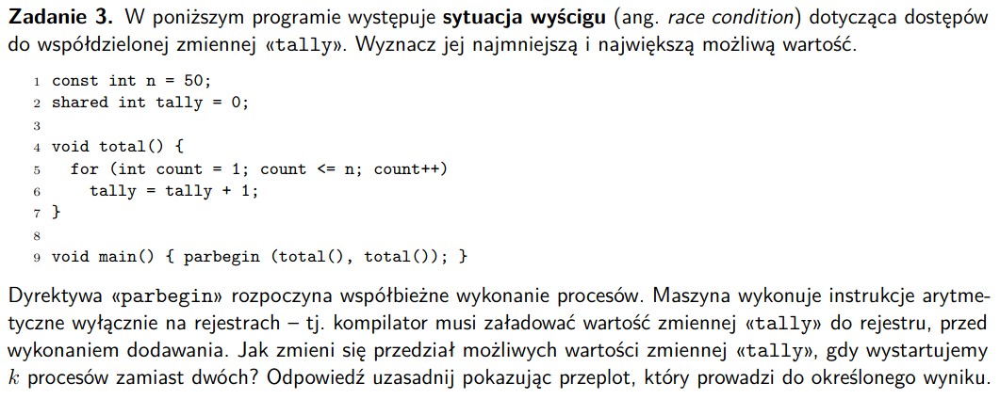

### Pojęcia
- sytuacja wyścigu (race condition) - wątki walczą o dostęp do zasobu, co skutkuje tym, że wynik działanie funkcji zależy od tego który wątek rozpoczął swoje działanie jako pierwszy -> program staje się niedeterministyczny

### Przeploty
**k = 2** -- poprawić, powinno być [2;100]
- minimalna=2 -> przeplot na zmianę wątek T1, T2, mimo podwójnej iteracji wartość rośnie tylko o 1

```
1.mov tully %tmp
2.add %tmp  1
3.mov %tmp  tully
```

| T1         | T2         |
|------------|------------|
| 1. eax = 0 | 2. eax = 0 |
| 3. eax = 1 | 4. eax = 1 |
| 5. tully = eax  | 6. tully = eax   |
| ...        | ...        |
| 97. eax = 50 | 98. eax = 50 |
| 99. tully = eax| 100. tully = eax   |

- maksymalna=100 -> przeplot z głodzeniem jednego z wątków -> pętla nie przesuwa się w ogóle w T2, dopiero zaczyna jak T1 już skończy korzystać zzasobu

| T1         | T2         |
|------------|------------|
| 1. eax = 0 | 51. eax = tully(T1) = 50 |
| 2. eax = 1 | 4. eax = 51 |
| 3. tully = eax  | 6. tully = eax   |
| ...        | ...        |
| 49. eax = 50 | 98. eax = 100 |
| 50. tully = eax| 100. tully = eax   |

**dla dowolnego k**
- wartość minimalna dalej 50, bo wciąż przełączając context na CPU możemy nawet robiąc k * 50 iteracji zwiększać tully o 1
- wartość maksymalna = k*50, głodzimy wątki po kolei i robimy context switch (zmianę stosu na inny wątek), dopiero po skończeniu konkretnego wątku

# zadanie 4
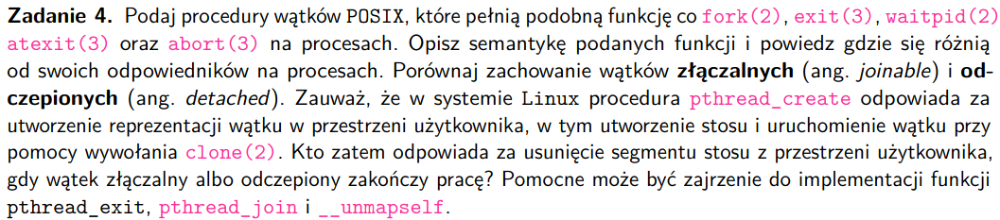

### Odpowiedniki wątkowe znanych funkcji + semantyka
#### 1. fork(2) 'tworzymy wątek'
```C
int pthread_create( 
    pthread_t * thread,
    const pthread_attr_t * attr,
    void * (*start_routine)(void*),
    void * arg
);
```

**ARGUMENTY**
- thread - struktura przechowująca dane umożliwiające interakcję z wątkiem
- attr - atrybuty wątku: wielkość stosu, określanie priorytetu wątku itp (uzupałniamy strukturę wywołaniem pthread_attr_init()), najczęściej NULL
- start_routine - pointer na funkcję, na której wątek ma się uruchomić
- arg - argument, który przekażemy do funkcji, od której wątek rozpoczyna działanie (argument do start_routine)

- możemy w przeciwieństwie do fork() zrobić 2 rodzaje wątków, detached i joinable

#### 1. waitpid(2)  'czekamy na zakończenie wątku'
```C
int pthread_join(
    pthread_t thread,
    void **value_ptr);
```

**ARGUMENTY**
- thread - struktura, opisująca na jaki wątek mamy czekać - ten wątek musi być joinable
- value_ptr - wskaźnik na wskaźnik do tego co zwróci nam wątek - wrzuca tutaj to co zwróci pthread_exit

- możemy czekać z dowolnego wątku, a nie tylko z rodzica

#### 1. exit(3)

**WAŻNE: jak którykolwiek wątek zawoła 'exit' to cały proces się skończy (wszystkie pozostałe wątki z tego procesu także)**
- my chcemy wychodzić z jednego wątku
```C
void pthread_exit(void *rval_ptr);
```
**ARGUMENTY**
- rval_ptr - wskaźnik na wartość, którą chcemy zwrócić, tak by była dostępna dla innych wątków 'joinable' dla tego procesu

#### 1. atexit(3) - rejestruje funkcje, wołane przy exit(3) albo wyjściu z main, dla wątków chcemy mieć funkcję, które umożliwi podpięcie funkcji, gdy wątek się kończy
- są to funkcje typu *thread cleanup handlers*

```C
void pthread_cleanup_push(void (*rtn)(void *), void *arg);
void pthread_cleanup_pop(int execute);
```
- mamy push i pop, bo funkcje są dodawane na zasadzie stosu
- pthread_cleanup_push woła funkcję rtn z argumentem arg, gdy wątek:
    - robi pthread_exit()
    - odpowiada na requesta o cancel
    - wywołuje pthread_cleanup_pop dla execute != 0
    - jak execute == 0, funkcja cleanup nie jest wywoływana

- możemy anulować procedury, a aexit() nie możemy

#### 1. abort(3) - kończy proces sygnałem, w wątkach też chcemy mieć możliwość zamknięcia innego wątku,
mamy funkcję:
```C
int pthread_cancel(pthread_t tid);
```
- anulujemy inny wątek z tego procesu
- normalne zachowanie to takie, że wątek określony przez ```tid``` będzie się zachowywał jakby zawołał pththread_exit z flagą PTHREAD_CANCELED
- pthread robi tylko request o cancel, samo w sobie tego nie robi

- dla procesów abort musi zostać wykonany z tego konkretnego procesu

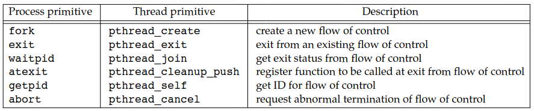

### Porównanie wątków złączalnych (joinable) i odczepionych (detached)

JOINABLE
- wątek połączony z innymi wątkami, łączymy go poprzez zawołanie pthread_join() (czekamy na wykonanie)
- możemy pobrać exit_status z wątków joinable
- zasoby wątku nie są zwalnianie dopóki inny wątek nie zawoła na danym wątku pthread_join() (wątek główny czeka na wykonanie wątków pobocznych)
- pthread_join wykonuje czyszczenie

DETACHED
- działają niezależnie
- nikt nie czeka na ich zakończenie
- nikt nie może pobrać ich exit_code
- jak się skończy zasoby są automatycznie zwalniane (przez jądro)
- użyteczne do jakiś zadań w tle, niepotrzebujących połączenia z innymi zadaniami
### Kto czyści segmenty odpowiadające stosom wątków z przestrzeni użytkownika
- detached - jądro, jak umiera wątek główny, jak exit na samym tym wątku to on sam sprząta
- joinable - wątek główny (procedura unmap i od razu exit, bo możemy z unmapować swój stos)

# zadanie 5
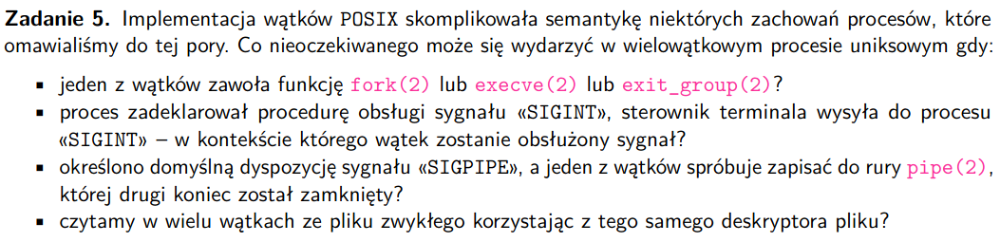


### Nieoczekiwane zachowania
- jeden z wątków zawoła funkcję fork(2) lub execve(2) lub exit_group(2)
- fork - tworzy się nowy proces, który dostaje przestrzeń adresową wątku i wszystkich innych zasobów dzielonych przez ten wątek


# zadanie 6
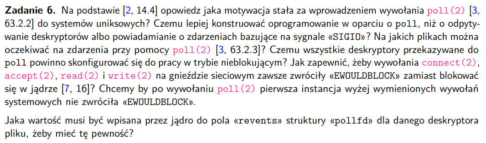

**o co chodzi?**
- Chcemy mieć I/O multiplexing, czyli możliwość obsługi wielu strumieni I/O na raz, korzystając z jednego wątku,
bez blokowania plików
- nie chcemy tego robić na różnych procesach (drogo)
- ani na różych wątkach (problemy z synchronizacją)
- budujemy listę deskryptorów, na których obserwacji nam zależy i mamy funkcję, która nie zrobi return dopóki któryś z deskryptorów nie będzie gotów na I/O

### Po co wprowadzono ```poll``` do systemów unixowych
```C
int poll(struct pollfd fdarray[], nfds_t nfds, int timeout);

struct pollfd {
    int fd; /* file descriptor to check, or <0 to ignore */
    short events; /* events of interest on fd, podajemy eventy za pomocą flag */
    short revents; /* events that occurred on fd, uzupełanine na retrun przez jądro */
};

nfds_t nfds // długość tej tablicy struct'ów
int timeout // t == -1 -> czekamy inf, t == 0 -> nie czekamy, t > 0 -> ile milisekund czekamy na to aż deskryptor pliku będzie gotowy na I/O
```

- mamy lepszy interfejs niż w przypadku select
- na każdym fd możemy powiedzieć co konkretnie nas interesuje, a nie jak w select zbiór, do którego należy fd definiuje nam co on może
- a ogólnie po to, żeby obsługiwać multiplexing, a nie posługiwać się sygnałami albo innymi procesami
- w select możemy obsłużyć max 64 deskryptory
- nie trzeba w poll tworzyć nowych masek cały czas jak w select

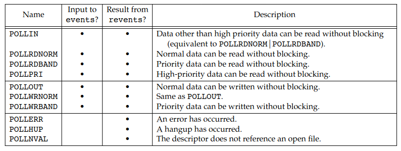

### Czemu lepiej używać poll, odpytywać deskryptory albo powiadamiać o zdarzeniach używająć SIGIO
- odpytywanie deskryptorów po kolei trwa potencjalnie bardzo długo, pewnie robilimbyśmy to w jakiejś pętli (pooling), co zabiera czas CPU
- wysyłanie sygnałów SIGIO ma tę wadę, że nie jest przenośne na inne urządzenia, poza tym mamy jeden sygnał w jednym procesie, więc jak mamy dużo deskryptorów plików, to nie wiadomo który sygnał jest od którego, a żeby to sprawdzić musimy przejść i tak po deskryptorach

### Na jakich plikach można oczekiwać na zdarzenia przy pomocy poll(2)?
- pliki zwykłe
- gniazda
- rury i FIFO
- terminale, pseudotermianal
- wszystko oprócz urządzeń blokowych i znakowych

### Czemu wszystkie deskryptory przekazywane do poll powinno skonfigurować się do pracy w trybie nieblokującym?
- zepsułoby to cały sens multiplexing'u, bo chcemy oczekiwać jak cokolwiek się pojawi na jakimkolwiek deskryptorze, jak, któryś deskryptor sprawi że będziemy musieli się na nim zatrzymać to przegapimy dane z pierwszego dostępnego deskryptora

###  Jak zapewnić, żeby wywołania connect(2), accept(2), read(2) i write(2) na gnieździe sieciowym zawsze zwróciły «EWOULDBLOCK» zamiast blokować się w jądrze?
- jak deskryptor pliku jest non-blocking a my chcemy zablokować, to zwracane jest EWOULDBLOCK (EAGAIN) do errno, np accept tak potrafi robić, też jak jest za mało miejsca na buforze gniazda to zwracamy ten kod błędu
- ustawić deskryptory plików na non-blocking
- nie chcemy być blokowani, bo jak sobie czytamy z fd i nagle nas zablokuje, bo przeczytaliśmy za dużo, to nie przeczytamy już nic z innych desktyptorów :(
- wywołujemy fcntl i ustawić sobie socekta
### Jaka wartość musi być wpisana przez jądro do pola «revents» struktury «pollfd» dla danego deskryptora pliku, aby pierwsza instancja wywołań connect(2), accept(2), read(2) i write(2) nie zwróciła EWOULDBLOCK?
- POLLIN - czytanie normalnych danych bez blokowania
- POLLOUT - wypisywanie normalnych danych bez blokowania

**poll() ma tą zaletę, że narzut na kolejne połączenie to tylko kolejny file descriptor, mały narzut, bo np jak każdy file descriptor to był osobny proces to musiałby mieć osobną przestrzeń adresową itd, więcej zasobów generalnieggb**
# zadanie 7
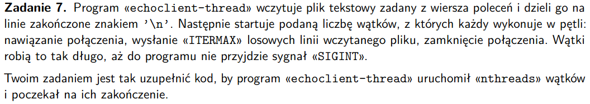

# zadanie 8
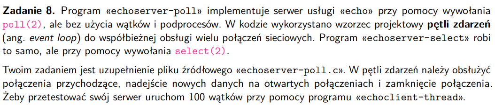

