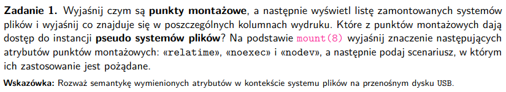
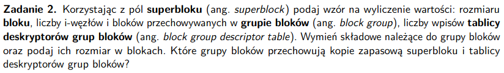
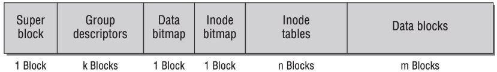
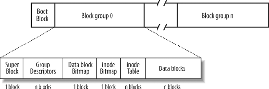
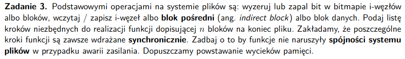
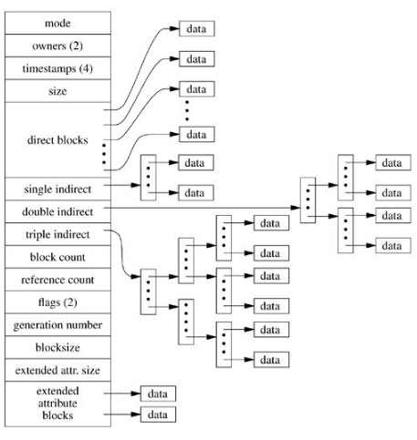
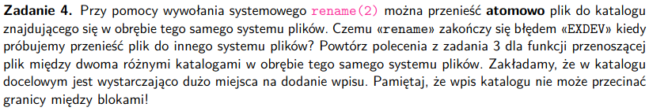
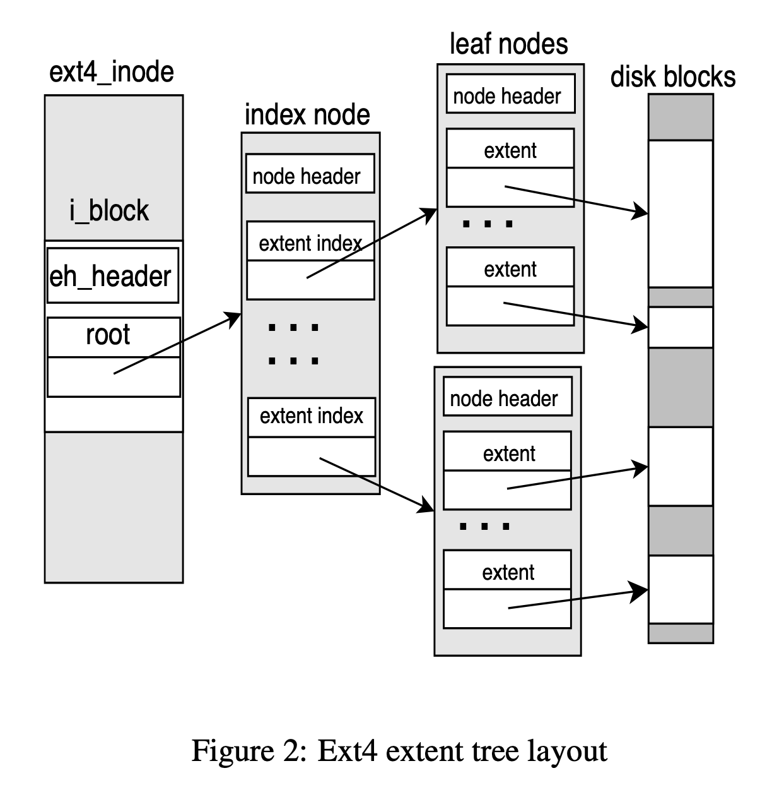
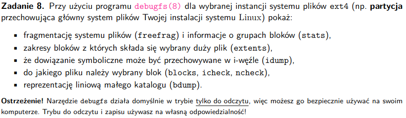
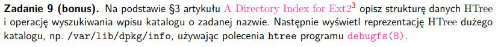

# zadanie 1



### Pojęcia
- punkty montażowe - mount points - miejsce w hierarchii katalogów, do którego podłączone są inne systemy plików lub urządzenia, umożliwia przechodzenie w jednej strukturze katalogów w systemie między różnymi systemami plików
- pseudo systemy plików - nie zawiera plików per se, tylko po prostu jakieś wirtualne encje, które system plików tworzy do ich reprezentacji, zawiera informacje o obecnie działającym systemie, to jest taki interfejs dla systemu plików

### Wyświetlanie listy zamontowanych systemów plików, objaśnienie kolumn
```
findmnt
```
TARGET - punkt montażowy
SOURCE - jakie urządzenie
FSTYPE - typ systemu plików
OPTIONS - opcje punktu montażowego

### Które punkty dają dostęp do instancji pseduo systemu plików
- /proc -> informacje o procesach
- /sys -> reprezentacja urządzeń fizycznych podłączonych do komputera
- /dev -> /dev/tty# oraz /dev/ttyS# - podłączone urządzenia, utworzone dynamicznie, dyski
### Opowieści o mount
- relatime - modyfikaje atime (zapis czasu ostatniego dostępu do pliku) będą tylko przy modyfikacji tego pliku (zbyt częste modyfikacje są kosztowne)

- noexec - wyłączamy możliwość uruchomienia plików wykonywalnych w konkretnym systemie plików, np nie chcemy żeby na dysku się jakieś dziwne programy uruchamiały

- nodev - nie będzie interpretował znakowych i blokowych urządzeń specjalnych, nie pozwala też na ich tworzenie czy używanie, nie, nie chcemy dać użytkownikowi możliwości modyfikacji jego uprawnień

### Kiedy pożądane jest ich stosowanie
- nodev - nie chcemy żeby w tym systemie plików dać możliwości dostępu do jakiś hardwareowych rzeczy urządzeniom znakowym i blokowym
- relatime - zwiększenie wydajności
- noexec - też bezpieczeństwo

# zadanie 2


### Pojęcia
- superblok (superblock) - przechowuje najwżniejsze właściwości systemu plików (rozmiar bloku, konfiguracje systemu plików, liczbę i-node'ów, bloków, wersję systemu plików itp.), jest to jakaś tabelka z danymi, odczytywany na samym początku
https://www.nongnu.org/ext2-doc/ext2.html#s-log-block-size
- blok - podstawowa jednostka pamięci, to co przehowuje dane użytkownika, albo wskaźniki na inne bloki (bloki pośrednie)

- i-node - metadane o obiekcie w systemie plików, każdy obiekt jest jednoznacznie określony przez i-node

- grupa bloków (block group) - podział logiczny dysku na kawałki, można zarządzać jakąś grupę, zmniejszamy fragmentację danych, podobne dane są obok siebie dzięki temu

- tablica deskryptorów grup bloków (block group descriptor table) - tablica deksryptorów grup bloków do definiowania parametrów wszystkich grup, lokalizacja bitmapy inode, tablicę inode, bitmapę bloku, liczbę wolnych bloków i inode'ów

### Wzory na wyliczenia danych na podstawie pól superbloku
- rozmiar bloku
```
s_log_block_size
block size = 1024 << s_log_block_size 32-bitowa wartość liczbowa
```

- liczba i-node'ów
```
s_inodes_per_group
(1024<<s_log_block_size)/s_inode_size
```

- liczba bloków w grupie bloków
```
s_blocks_per_group
```

- liczba wpisów tablicy deskryptorów grup bloków
- występuje po każdym superbloku, zawiera informacje opisuące każdą grupę bloków
```
s_blocks_count - zawiera wszystkie bloki: używane, wolne zarezerwowane  (ogólna liczba bloków w systemie)
s_blocks_count // s_blocks_per_group
```



### Wymień składowe należące do grupy bloków oraz podaj ich rozmiar w blokach.
schemat grupy bloków dla ext2



- tablica deskryptorów, rozmiar różni się w zależności od liczby grup bloków: s_blocks_count // s_blocks_per_group
- data block bitmap - bitmapa mówiąca, które bloki są zajęte
- inod bitmap - które inody są zajęte

### Które grupy bloków przechowują kopię zapasową superbloku i tablicy deskryptorów grup bloków?
grupy 0,1 i potęgi 3,5, 7

# zadanie 3


### Pojęcia
- blok pośredni (indirect block) - blok ze wskaźnikami na inne bloki pośrednie (double indirect block) albo na normalne bloki
- zapis synchroniczny - dane przechowywane przez system plików są cały czas synchronizowane z dyskiem
- spójność systemu plików - metadane jednoznacznie determinują nam kształt systemu plików, nie ma plików nieokreślonych w metadanych

### Funkcja dopisująca n bloków na koniec pliku
- znamy plik, czyli znamy inode
--- lepiej tak zrobić ---
1. znaleźć wolne bloki za pomocą bitmapy
1. zarezerwować bloki (zapalić bity w bitmapie)
1. zaktualizować tablicę i-node'ów (można zamienić kolejnością z następnym punktem) [w przypadku awarii prądu mamy tutaj memory leak]
1. zapisać dane do bloków
    - w przypadku, gdy mamy bloki pośrednie na każdym bloku musimy zapisać wskaźniki na kolejene poziomy, ale uwaga zapisujemy od liści w górę, z tego względu, że w momencie utraty zasilania nie chcemy mieć wskaźników na nieprawidłową pamięć, wolimy mieć memory leak
1. zaktualizować rozmiar pliku (aktualizujemy jego header, to się dzieje tylko w tym pliku, więc na spokojnie może być ostatnie)

1. wczytaj inode'a
1. znajdź wolny blok używając bitmapy
    1. jeśli jest wolny blok bezpośredni
        1. oznacz w bitmapie użycie tego bloku
            - zarezerwuj blok (zapal bity w bitmapie)
    1. wpp przejdź do bloków pośrednich
        1. zejdź do liścia
            1. jeśli brak miejsca w liściu dodaj nowy inidirect block
                1. oznacz go jako używany w bitmapie
                1. podepnij nowy liść
                1. jeśli za mało miejsca, przejdź do kolejnego typu bloków pośrednich
    1. dodaj blok pośredni do tablicy
    1. zapisz inode



# zadanie 4


### Pojęcia
- atomowo - plik zostanie przeniosony od razu, albo nic się z nim nie stanie, nie ma kroków pośrednich 

###  Czemu «rename» zakończy się błędem «EXDEV» kiedy próbujemy przenieść plik do innego systemu plików? 
- brak wspólnego zarządzania metadanymi
- operacja jest atomowa
- różnice w implemnetacjach systemu plików
### Algorytm na przeniesienie pliku między dwoma różnymi katalogami w obrębie tego samego systemu plików (katalog docelowy ma wystarczająco dużo miejsca) (trzeba zadbać o umieszczenie katalogu w tylko jednym bloku, a nie pomiędzy kilkoma)
1. upewnij się że katalog istnieje i użytkownik ma do niego dostępy
1. znajdź wolny wpis w katalogu docelowym
1. dodaj wpis do katalogu docelowego, wskazujący na i-node pliku przenoszonego
1. usuń katalog z pliku źródłowego
1. zaaktualizuj pole w naszym pliku, wskazujące na katalog nadrzędny, aby wskazywało na katalog docelowy
1. zapisz zmiany na dysku


# zadanie 5


1. lokalizujemy i-node pliku korzystając z katalogu, w którym się znajduje
1. zmniejszamy licznik odwołań o 1 w i-node pliku, jak osiągnie wartość 0, oznaczymy go jako nieużywany
1. system plików usuwa wpis katalogowy (usuwamy z folderu), wskazujący na plik
1. jak liczba odwołań wyniesie 0, bloki danych przeznaczone dla pliku zostaną oznaczone jako wolne

### Kiedy możliwe jest odkaskowanie
Jak nie napisaliśmy bloków danych i i-node'a pliku

### Kiedy plik rzeczywiście zostanie usunięty z dysku
- jak licznik dowiązań wyniesie 0 w i-node pliku
- jak żaden proces nie ma otwartego deskryptora do pliku, wtedy jego bloki mogą zostać zwolnione

# zadanie 6


- hard link - 
zwiększa liczbę linków w inode dodaje wpis do katalogu w postaci krotki (nazwa, inode), wiele wpisów z różnych katalogów wskazuje na ten sam i-node

- soft
- tworzy nowy wpis do katalogu, tworzy ścieżkę, do której należy przekierować algorytm rozwiązywania nazw, dla dowiązań symbolicznych krótszych niż 60 bajtów dane są przechowywane w i-węźle

### Jak utworzyć pętlę
```link -s . link```

Dowiązania twarde nie tworzą pętli, bo wskazują bezpośrednio na dane.

Dowiązanie symboliczne to po prostu plik ze ścieżką, więc one są wstanie zrobić pętlę.

### Kiedy jądro zwraca błąd ELOOP?
- jak liczba napotkanych dowiązań przekroczy 40

### Czemu nie można zrobić pętli dowiązaniem twardym?
- system plików jest grafem acyklicznym, więc dodanie krawędzi skierowanej tworzącej cykl przeczy tej definicji

# zadanie 7


### Pojęcia
- fragmentacja systemu plików - systuacja, gdy dane plików są ułożone na dysku w nieciągły sposób, co spowalnia dostęp do danych

- odroczony przydział bloków - buforujemy zapisywane dane (zapisujemy wszystkie żadania) i zapisuje je na dysku w momencie flush'a strony, żeby ograniczyć fragmentację

- zakresy - pozwala na ograniczenie rozmiaru metadanych przechowujących adresy bloków należących do danego pliku, używane w ext4, możemy przechowywać dane o dużych obszarach nie dla każdego bloku, tylko za pomocą małej krotki


### Czy po defragmentacji systemu plików ext4 liczba wolnych bloków może wzrosnąć?

- defragmentacja łączy rozproszone wolne fragmenty wolnego miejsca w większe ciągłe obszary, łatwiejsze do wykorzystania

- jeśli zakresy zastępują fragmentowane wskaźniki bloków, część przestrzeni zajmowanej przez metadane może zostać zwolniona

- dla dysków hdd bloki w różnych miejscach sprawiają że musimy się za dużo obracać

- alokujemy bloki, przy flush na zbuforowanych danych, robimy to tylka jak się wypełni odpowiednio

- extendy, podajemy zakresy bloków, zamiast tablicy numerów bloków mamy tablicę par (blok, długość)

- przy defragmentacji dostajemy jeden extend, więc wszyztkie bloki o defragmentacji znikają (nr bloku, długość), extend




### Algorytm defragmentacji
1. system plików analizuje fragmentację, lokalizując pliki rozproszone na różnych obszarach dysku
1. dla każdego rozproszonego pliku system plików przydziela ciągły obszar bloków
1. dane z fragmentowanych bloków są kopiowane do nowego, ciągłego obszaru
1. system plików aktualizuje i-nody (wskaźniki albo zakresy), aby odzwierciedlały nową lokalizację danych
1. bloki wcześniej zajmowane przez plik oznaczamy jako wolne


# zadanie 8

- puścić te polecenia po prostu
### fragmentację systemu plików (freefrag) i informacje o grupach bloków (stats),
### zakresy bloków z których składa się wybrany duży plik (extents),
### że dowiązanie symboliczne może być przechowywane w i-węźle (idump),
### do jakiego pliku należy wybrany blok (blocks, icheck, ncheck),
### reprezentację liniową małego katalogu (bdump)

# zadanie 9


- takie drzewo przedziałowe robimy

- w przypadku kolizji rozdzielmy przedział na powotórzonym elemencie, jak będzie kolizja kilka razy, to kilka razy rozdzielimy

- zyskujemy czas logarytmiczny, zamiast normalnie liniowego (wynikającego z linked listy, jak w starej implementacji ext2)
# zadanie 10

- księgowanie - dane nie są zapisane na dysk, w dzienniku zapisujemy wszelkie zmiany

- commmit - zapisujemy zmiany na dysku

- idempotentne - kilka razy wykonanie operacji nic nie zmienia, jak by nie były to moglibyśmy w nieskończoność zwiększać rozmiar pliku