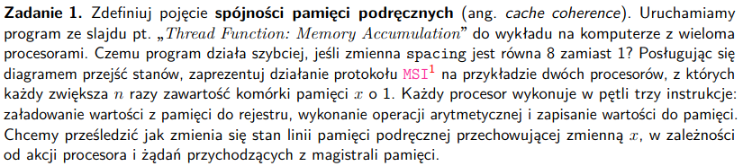
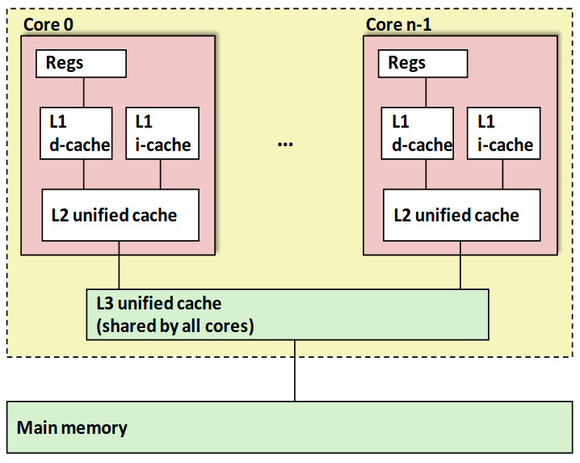
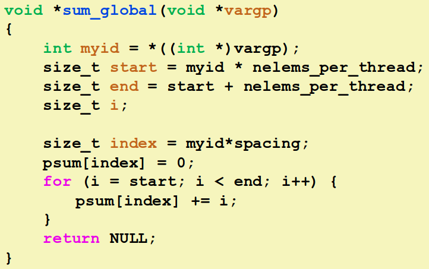
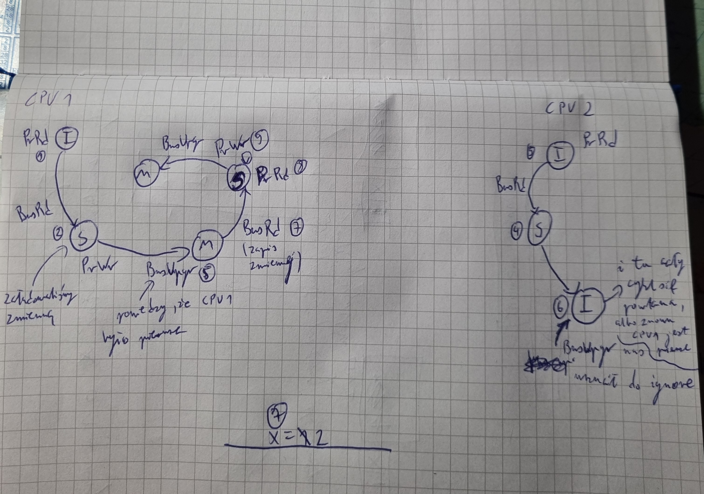
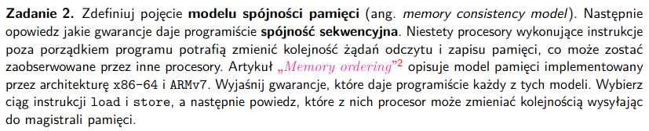
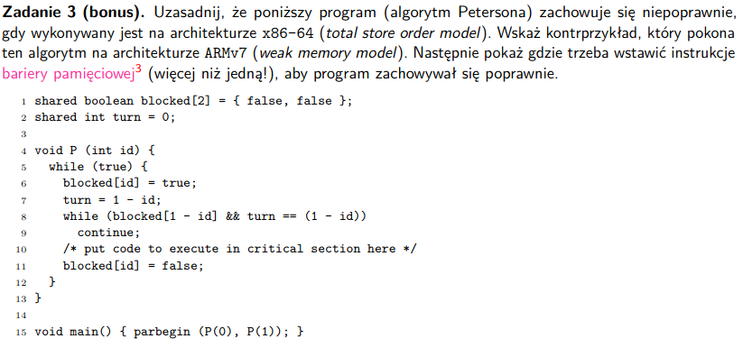
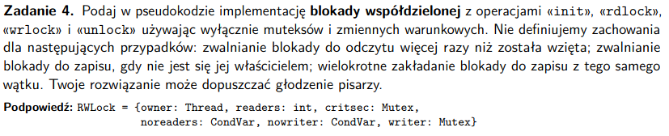
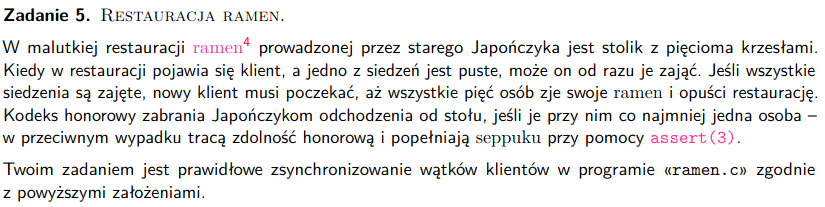

# zadanie 1


### Pojęcia
- spójność pamięci podręcznych - cache coherence - jeśli mamy kilka wątków sprzętowych (działają sobie na różnych procesorach) to każdy z nich ma swoje cache L1 i L2, dzielą tylko L3, chcemy mieć jakiś mechanizm zapisu, który sprawi, że gdy mamy tą samą zmienną w kilku różnych cache'ach i zostanie ona zmodyfikowana, to będziemy w stanie powiadomoć pozostałe wątki, że wartość ta uległa zmianie



### Uruchamiamy program ze slajdu pt. „Thread Function: Memory Accumulation” do wykładu na komputerze z wieloma procesorami. Czemu program działa szybciej, jeśli zmienna spacing jest równa 8 zamiast 1?



- spacing - odległość między elementami, do których będą składowane akumulatory z tablicy

- jest to spowodowane tym, że wtedy wątki nie będą dzieliły swojego cache'a, czyli nie będziemy tracić czasu na liczenie spójności, spacing powinien być równy długości wiersza z cache
- chcemy żeby każdy wątek miał tylko rzeczy ze swojej linii cache'u
- nie będziemy mieli tego zjawiska ping-ponga między wątkami

### Posługując się diagramem przejść stanów, zaprezentuj działanie protokołu MSI na przykładzie dwóch procesorów, z których każdy zwiększa n razy zawartość komórki pamięci x o 1. 

- MSI to protokół spójności cache
- każdy blok w cahce może mieć jedenen ze stanów:
    - Modified - blok został zmodyfikowany w cache, więc mamy niespójność z pamięcią, cache z blokiem w stanie M, ma obowiązek w momencie wyrzucania bloku zapisać te zmiany do pamięci
    - Shared - to jest blok read-only, cache może się go pozbyć, bez konieczności zapisu do pamięci
    - Invalid - blok nieobecny w danym cache albo blok nieprawidłowy, nasz obecny cache musi go pobrać z pamięci albo innego cache
- CPU zapewnia sobie wyłączność na cache u innych procesorów



# zadanie 2


### Pojęcia
- model spójności pamięci - memory consistency model - determinuje w jaki sposób sprzęt radzi sobie z równoległymi dostępami, mówi jakie zamiany kolejności akceptuje

- spójność sekwencyjna - jedna operacja na raz, w porządku obecnym w danym wątku, zatem mamy zgodność z poszczególnymi wątkami, ale jest między nimi wymieszanie
- czyli innymi słowo po kolei z każdego procesora zbieramy requesty do pamięci i wrzucamy je do wykonania, całą kontrolą zajmuje się 'Memory Controller'
- ten rodzaj spójności sprawia, że nie możemy zmieniać kolejności instrukcji na poszczególnych procesorach
- jak sobie weźmiemy przeploty z konkretnej sekwencji to będą po kolei

### Wyjaśnij gwarancje, które daje programiście każdy z tych modeli.
- patrzymy do tabelki na: https://en.wikipedia.org/wiki/Memory_ordering
#### ARMv7 - bardzo liberalne podejście, nie możemy zakładać żadnej określonej kolejności bez założonych barier
#### x86-64 - nie akceptuje prawie żadnych zmian, poza stores <-> po loadach, no i zmiany w konkretnych instruckacj (zmiany kodu) mogą się zdarzyć


### Wybierz ciąg instrukcji load i store, a następnie powiedz, które z nich procesor może zmieniać kolejnością wysyłając do magistrali pamięci.
```
L1: r1 = load(x)
L2: r2 = load(y)
S1: store(x, 5)
L3: r3 = load(*z) // pobieramy wskaźnik i potem z niego bierzemy informacje
L4: r4 = load(r3) 
S2: store(y, 7)
S3: store(y, 8)
```
- x86-64 - możemy wrzucić S1 pod L4, ale same LOAD muszą pozostać w określonej kolejności
- ARMv7 - wszystko możemy wymieszać, poza L3 i L4, bo to jest dependent loads, którego nie można zamienić, wniosek => programowanie na ARMv7 jest okropne, bo wszędzie trzeba używać barier

# zadanie 3

x86-64
- możemy przejść po while, bo nie zauważymy przerwania
ARMv7

- dodać bariery
- po while


# zadanie 4


- blokada współdzielona - blokada, która umożliwia kilku wątkom blokowanie zasobu, ale tylko do odczytu

```C
RWLock = {
    owner: Thread, 
    readers: int,
    critsec: Mutex,
    noreaders: CondVar,
    nowriter: CondVar,
    writer: Mutex
            }

procedure init(rwlock):
    rwlock.owner = null
    rwlock.readers = 0
    rwlock.critsec = new Mutex()
    rwlock.noreaders = new CondVar()
    rwlock.nowriter = new CondVar()
    rwlock.writer = new Mutex()

procedure rdlock(rwlock):
    lock(rwlock.critsec)

    // czekamy dopóki właściciel nie zniknie
    while (rwlock.owner != null):
        // czekamy na sygnał nowriters 
        wait(rwlock.nowriters, rwlock,critsec)
    
    rwlock.readers++;
    
    lock(rwlock.critsec)

procedure wrlock(rwlock):
    // blokowanie dla innych pisarzy
    lock(rwlock.critsec)
    lock(rwlock.writer)

    // czekamy dopóki nikt nie będzie czytał
    while (rwlock.readers > 0):
        wait(rwlock.noreaders, rwlock,critsec)
    
    rwlock.owner = current_thread;
    
    lock(rwlock.writer)
    unlock(rwlock.critsec)

procedure unlock(rwlock):
    lock(rwlock.critsec)

    if rwlock.owner == current_lock:
        rwlock.owner = null
        broadcast(rwlock.nowriter) // wznowienie odczytujących wątków
        unlock(rwlock.writer)
    else:
        rwlock.readers--
        if rwlock.readers == 0:
            signal(rwlock.noreaders)
    
    unlock(rwlock.critsec)

```


# zadanie 5


