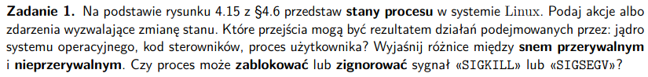
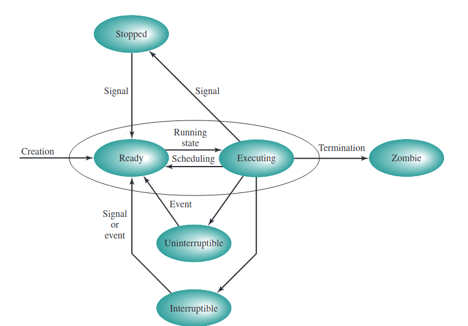
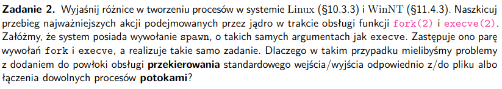
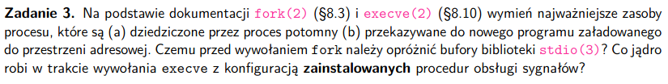
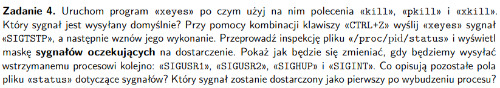
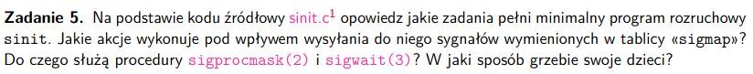
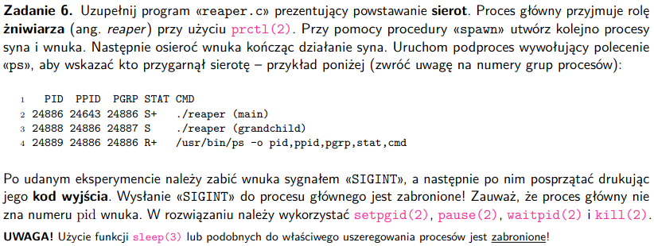
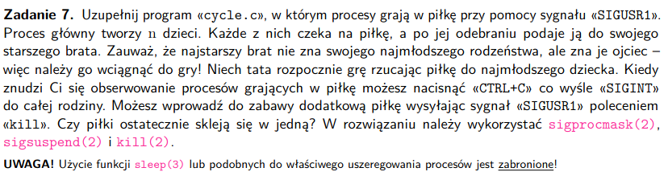

# zadanie 1


### Pojęcia
- stany procesu - na jakim etapie wykonywania jest proces (executing, ready, suspended, stopped, zombie)

- sen przerywany (interruptible) - rodzaj zablokowania, ze względu oczekiwanie na zasoby/koniec I/O albo sygnał

- sen nieprzerywany - rodzaj zablokowania, w którym proces czeka na zdarzenie po stronie sprzętu, nie czeka na żadne sygnały

- blokowanie sygnału - ustawiamy bit zablokowania w sygnale i czekamy na sygnał **SIGCONT** - signal continue, zablokowany sygnał nie rozpocznie się bez SIGCONT, zablokowane sygnały nie kolejkują się (zablokwane sygnały tego samego typu)

- ignorowanie sygnału - po porstu nic się nie dzieje jak sygnał przyjdzie



### Stany procesu:
- **running** - wykonuje się albo jest gotowy do wykonania
- **interruptible** - zablokowany, czeka na zdarzenie, wymaga sprawdzenia czy przyszły sygnały, kosztowne potencjalnie
- **uninterruptible** - zablokowany, czeka na sprzyjające warunki hardwer'u, nie oczekuje żadnych sygnałów, optymalizacja względem interruptible
- **stopped** - działanie procesu wstrzymane, uruchomi się tylko jak inny proces wyrazi na to zgodę
- **zombie** - proces zabity, ale dalej zużywa zasoby (ma strukturę w tabeli procesów) - np gdy rodzic go nie posprząta

### Akcje i zdarzenia wyzwalające zmienę stanu
1. running - uruchomienie programu
2. interruptible - wywołanie sleep(), oczekuje na sygnały
3. uninterruptible - I/O na dysk, nie oczekuje sygnałów
4. stopped - ctrl+z wpisane, czekamy na wznowienie, przyjdzie sygnał
5. zombie - usunięcie rodzica przed posprzątaniem po dziecku

### Opis przejść
#### Przejścia wywołane przez jądro - 
1. 
running state/scheduling - to jądro wybiera który proces będzie uruchomiony

2. termination - procesy sprzętają dane po sobie, za zarządzanie procesami odpowiada jądro

3. executing -> uniterruptible/interruptible -> ready - znowu jądro zarządza nam procesem, np odpalany jest jakiś proces w procesie

#### Przejścia wywołane procesem użytkownika:
- executing -> stopped -> ready - użytkownik zatrzymuje proces - ctrl+z
#### Przejście wywołane kodem sterowników
- executing -> uninterruptible/interruptible -> ready - np jakiś sterownik dostępu do dysku się uruchamia

### Czy proces może zignorować albo zablokować SIGKILL lub SIGSEGV?
- gdy pojawia się sygnał kernel go rozwiązuje
- SIGKILL - no nie może go zignorować ani zablokować, bo chcemy dać jądru systemu pełną władzę nad procesami, żeby mógł je zabijać kiedy zechce
- SIGSEGV - sygnał, gdy proces obsługuje nie prawidłową referencję do adresu w pamięci - jego też nie możemy zignorować, ani zablokować, bo jest to niebezpieczne pod względem zarządzania pamięcią

# zadanie 2


# zadanie 3


### Pojęcia
- 'zainstalowane' procesy obsługi sygnałów - handlery do obsługi danego sygnału w kodzie, jak jakiś konkrenty sygnał przyjdzie

### instrukcja fork(2)
- uruchomiona raz, zwraca 2 razy, w dziecku zwraca 0, w rodzicu PID dziecka

### Najważniejsze zasoby procesu

#### Fork()
- dostaje kopię pamięci, sterty i stosu (kopia dla dziecka), rodzic i dziecko nie dzielą się pamięcią

Obecnie nie kopiuje się data, heap, stack w całości, mamy za to COW - *copy on write* - pamięć dzielona dziecko-rodzi, ma ustawiony protection przez jądro na read-only (jeśli dziecko, albo rodzic próbują się dostać do zasobu, wtedy jest on kopiowany do obu - tylko ta strona)

#### (a) dziedziczone przez proces potomny
```
• deskryptory otwartych plików
•Real user ID, real group ID, effective user ID, and effective group ID
• Supplementary group IDs
• Process group ID
• Session ID
• Controlling terminal
• The set-user-ID and set-group-ID flags
• Current working directory
• Root directory
• File mode creation mask
• Signal mask and dispositions
• The close-on-exec flag for any open file descriptors
• Environment
• Attached shared memory segments
• Memory mappings
• Resource limits
```

#### (b) przekazywane do nowego programu załadowanego do przestrzeni adresowej
```
• kopia sterty, stosu, danych (COW)
• wartości rejestrów procesora
• deskryptory plików
• wyzerowane czasy użycia CPU
• alarmy też się resetują, tak samo jak oczekujące sygnały

```
#### Exec()
- poprzedni proces jest całkowicie zastępowany przez nowy program i nowy jest wykonywany w swoim nowym main'ie

- PID się nie zmienia, bo nie zaczynamy nowego procesu

- exec po prostu zastępuje - text, data, heap, segmenty stack'a w procesie nowymi danymi

#### (a) dziedziczone przez proces potomny
```
• Process ID and parent process ID
• Real user ID and real group ID
• Supplementary group IDs
• Process group ID
• Session ID
• Controlling terminal
• Time left until alarm clock
• Current working directory
• Root directory
• File mode creation mask
• File locks
• Process signal mask
• Pending signals
• Resource limits
• Values for tms_utime, tms_stime, tms_cutime, and tms_cstime
```

#### (b) przekazywane do nowego programu załadowanego do przestrzeni adresowej
```
• nowy stack (fragmenty stacka)
• nowa sterta
• nowy text i data
• argumenty dla wywoływanego programu
• zmienne środowiskowe (czasem są kopiowane)
• deskryptory plików (zależy od flagi)
```

### Czemu przed wywołaniem *fork* trzeba opróżnić bufory biblioteki *stdio*?
- nie mamy zazwyczaj pewności, który proces się szybciej skończy parent czy child


Jak puścimy program playground/fork.c to dostaniemy:
```
a write to stdout
before fork
pid = 312092, glob = 7, var = 89
pid = 312091, glob = 6, var = 88
```
Jak przekierujemy output do pliku dostaniemy:
```
a write to stdout
before fork
pid = 312213, glob = 7, var = 89
before fork
pid = 312212, glob = 6, var = 88
```

- ten program opiera się na tym, że deskrytptory są przekazywane przez referencję

- stdout jest buforowane, bufor jest czyszczony po znaku nowego wiersza, jednak jak wrzucimy output do pliku bufor nie jest czyszczony, co sprawia, że oba procesy doklejają dane do aktualnego miejsca w którym się zatrzymaliśmy w pliku

Generalnie trzeba opróżnić bufory bo:
- jak tego nie zrobimy potencjalnie możemy wydrukować wszystkie stringi z procesów kilkukrotnie
- może to powodować dziwne zachowania w produkcji outputu, dostaniemy np fragmenty spoza forka w outputcie dla procesów.
- jeśli w bufferze coś jest to w procesie potomnym też to będzie, oba procesy coś wypiszą albo coś przeczytają

[można pokazać co się stanie z programem, jak usuniemy \n z printów]

### Co jądro robi w trakcie wywołania *execve* z konfiguracją zainstalowanych procedur obsługi sygnałów?
[zmianą tych konfuguracji zajmuje się jądro]
- konfguracja jest resetowana do wartości domyślnych, jak się coś zmieniło
- ignorowane sygnały dalej są ignorowane
- maski sygnałów (które są blokowane) są przekazane do potomnego programu

# zadanie 4


### Pojęcia

- maska sygnałów - ciąg bitów w danym procesie określający których sygnałów coś dotyczy, np które są zablokowane, albo które są oczekujące

- sygnały oczekujące - sygnały, których wykonanie jest zakolejkowane (kolejkujemy tylko po jednym sygnale danego typu)

### Polecenia kill, pkill i xkill
```
SIGTERM 'Used to request that a process terminate gracefully'
SIGKILL 'Sent to kill a process (cannot be caught or ignored)' - zabija bez czyszczenia

pgrep xeyes -> PID
kill [PID] -> SIGTERM defaultowo

pkill xeyes -> pgrep + kill  -> SIGTERM defaultowo

xkill -> wspaniałe narzędzie, wymusza na X serwerze zabicie połączeń z klientami (zabija okna), bez wskazanego id daje nam kursor do wyboru, przez to że wymusza zamknięcie okna niekoniecznie zabije proces (częśc procesów bez X serwera faktycznie się kończy) -> SIGKILL defaulotwo
```

### Wysyłanie SIGSTP i wznawianie procesu
```
ctrl+z <- SIGSTP
fg <- przenosi proces zatrzymany w dle na pierwszy plan i uruchamia to co wstrzymaliśmy
```

### Maska sygnałów oczekujących na dostarczenie
```
xeyes - uruchamiamy xeyes
pgrep xeyes - pid procesu
cat cat /proc/[pid]/status
```

#### Maski sygnałów oczekujących na dostarczenie
SIGUSR1 - customowy sygnał
```
1. 
xeyes
ctrl+z
SigQ:	1/63198
SigPnd:	0000000000000000
ShdPnd:	0000000000000000
SigBlk:	0000000000000000
SigIgn:	0000000000000000
SigCgt:	0000000000000000

2. wysyłamy sygnał
kill -SIGUSR1 337647

SigQ:	1/63198
SigPnd:	0000000000000000
ShdPnd:	0000000000000200
SigBlk:	0000000000000000
SigIgn:	0000000000000000
SigCgt:	0000000000000000

kill -SIGUSR2 337647

SigQ:	2/63198
SigPnd:	0000000000000000
ShdPnd:	0000000000000a00
SigBlk:	0000000000000000
SigIgn:	0000000000000000
SigCgt:	0000000000000000

kill -SIGHUP 337647 - nie ma połączenia z terminalem

SigQ:	3/63198
SigPnd:	0000000000000000
ShdPnd:	0000000000000a01
SigBlk:	0000000000000000
SigIgn:	0000000000000000
SigCgt:	0000000000000000

kill -SIGINT 337647

SigQ:	4/63198
SigPnd:	0000000000000000
ShdPnd:	0000000000000a03
SigBlk:	0000000000000000
SigIgn:	0000000000000000
SigCgt:	0000000000000000

Maska:
000000000000000000000000000101000000011

- aby odczytać, które sygnały wysłaliśmy patrzymy który bit jest zapalony od lewej (zapalony bit oznacza konretny indeks sygnału)

101000000011 -> sygnał nr 1, 2, 10, 12

 SIGHUP           1 
 SIGINT           2
 SIGUSR1         10
 SIGUSR2         12
```

### Co opisują pola?
SigQ - liczba sygnałów w kolejce (tylko liczna a nie ich kolejka)

SigPnd - sygnały pending dla całego procesu

ShdPnd - sygnały pending dla konkretnego wątku

SigBlk - zablokowane sygnały (blokowanie sygnału - zapobiegamy dostarczeniu sygnału do procesu dopóki tego sygnału nie odblokujemy)

SigIgn - zignorowane sygnały

SigCgt - sygnały, które proces może złapać

### Który proces zostanie dostarczony pierwszy?
SIGHUP -> czyli ten który ma pierwszy zapalony bit od prawej

# zadanie 5


### Czym jest sinit - suckless init

spawn - fork + exec -> chcemy otworzyć nowy proces i tam wykonać program

- init SO, z 3 sygnałami
SIGUSR1: wyłącza komouter
SIGINT: restartuje komputer (ctrl+alt+delete)
SIGCHILD: grzebie wszystkie dzieci

### Cel programu + akcje

Inicjalizacja i zarządzanie *user space*. Daje użytkownikowi możliwość wyłączenia/restartu, wyczyszczenia procesów

### sigprocmask()
(set to zbiór sygnałów, nasza maska z sygnałami)
- bierze set obecnych sygnałów i w zależności od argumetu:
    - SIG_BLOCK - unia set i set dostarczonego w argumencie
    - SIG_UNBLOCK - odblokowuje sygnały w set'cie
    - SET_SETMASK - ustawia zablokowane sygnały na argument set

### sigwait()
- wstrzymuje działanie procesu, dopóki któryś z sygnałów w set'cie nie będzie pending, żeby stał się pending musiał być zablokowany przez *sigprocmask()*. Potem funkcja akceptuje sygnał, usuwa go z pending, zwraca numer sygnału.

### W jaki sposób grzebie dzieci procesu?
- co 30s wysyłany jest SIGALARM, który jest zmapowany do sigreap, w sigreap mamy waitpid(-1, NULL, WNOHANG) - grzebiemy wszystko co się da (-1), WNOHANG - jak nie ma co grzebać, to wyjdź, NULL, nie zapisujemy statusu

# zadanie 6


### Pojęcia
- sierota - proces bez rodzica (rodzic został zabity)
- żniwiarz - program usuwający procesy zombie (te które straciły rodzica i których rodzice nie pogrzebali)

- prctl() - wywoływane z argumentem co ma zrobić dany proces albo wątek

- waitpid(0, NULL, 0) -> czekamy na zakończenie przynajmniej jednego dziecka z grupy

- setpgrp(pid_t pid, pid_t pgid); - ustawia ustawia pgid procesu pid na pid (pgid - pid grupy staje się pid)

- pause() - proces wywołujący pause() jest uśpiony, dopóki nie przyjdzie sygnał kończący proces albo uruchamiający
funkcję łapiącą sygnał

# zadanie 7
