# zadanie 1
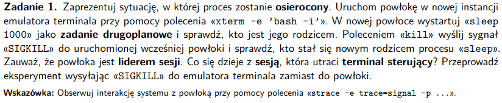

### Pojęcia
- proces osieroczony - proces, którego rodzic się zakończy, jest podpinany do procesu *init*

- zadanie drugoplanowe - proces wykonywany w tle, tzn nie ma on np dostępu do pobierania inputu z terminala, oprócz tego wszelkie akcje (np ctrl+c) dotyczą tylko pierwszoplanowego procesu

- sesja - kilka grup procesów podłączonych do tego samego terminala sterującego, albo inaczej (jeden użytkownik siedzący przed terminalem), właściwy terminal czasem się pokazuje przy uruchamianiu systemu (konsola na cały ekran), reszta to emulatory

- terminal sterujący - urządzenie (zasów pliko-podobny), służący jako interfejs procesom pierwszoplanowym podłączonym do sesji, należy do co najwyżej jednej sesji

- lider sesji - proces inicjalizujący i zarządzający sesją, z reguły proces powłoki

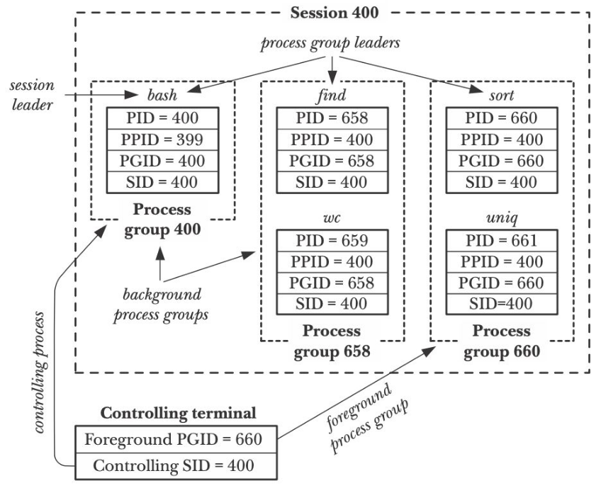

### Polecenia
```
2 terminale otworzyć
- do powłoki uruchamiającej xterm podpinamy strace

echo $$ -> PID powłoki

sudo strace -e trace=signal -p [PID] -o stracezad1.txt (robimy to w innym terminalu niż xterm)
- w osobnym do strace terminalu

xterm -e 'bash -i'

// w nowym oknie
sleep 1000 & -> postaniemy PID procesu [390220]

ps -ef | grep sleep -> PID grupy i rodzica [390]

kill -SIGKILL [PID] (zabijamy rodzica sleep, terminal uruchamiający xterm znika)

// w innym terminalu
ps -ef | grep sleep -> możemy dostać rodzica

// kto jest rodzicem?
ps -p [PID] -> powłoka

// co się stanie jak wyślemy SIGKILL do emulatora terminala zamiast do powłoki
tty -> info o terminalu
ps -ef | grep [TERMINAL]
strace -p [PID terminala] -e signal kill -SIGKILL [PID terminala]
w ogóle nie widzi procesu terminala
```

# zadanie 2
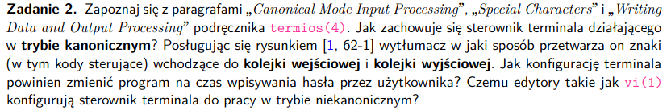

### Pojęcia
- tryb kanoniczny - normalny tryb pracy terminala, input do terminala
jest procesowany jako linie, kontroler terminala zwraca jedną linię na jeden odczyt;
tzn że dopóki nie wciśniemy ENTER można modyfikować input

- w trybie niekanoniczym - rezygnujemy ze wspierania polceń typu ctrl+d itd., bo
mogą być używane do czegoś innego, np vi używa ctrl+d do przesuwania okna

- urządzenia terminala (zasoby plikopodobne) są kontrolowane przez sterownik terminala
w jądrze, każde urządzenie ma kolejkę wejściową i wyjściową

- kolejka wejścowa - struktura danych, przechowująca znaki z wejścia

- kolejka wyjściowa - stuktura danych, przechowująca dane z wyjścia

### Pytania

1. Jak zachowuje się sterownik terminala w trybie kanonicznym + rysunek
- input jest procesowany w liniach (\n albo EOF albo EOL (end of line))
- read się nie zakończy, dopóki nie wpiszemy całej linii, albo nie przyjdzie sygnał
- jak przekroczymy maksymalną długość bufora to system odpowiednio zareaguje
- ERASE i KILL (kody sterujące dla erase i kill) - kiedy przyją odpowiednie znaki
- ERASE - usuwa ostatni znak
- KILL - usuwa całą linię 
- ERASE i KILL nie są wrzucane do input queue

2. Przetwarzanie znaków i kodów sterujących

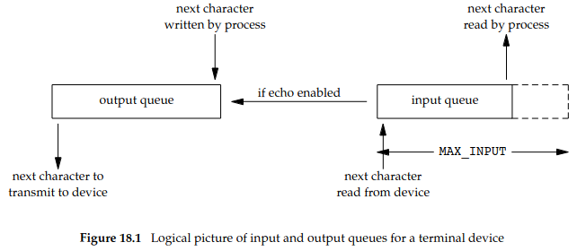

- przetwarzamy znak po znaku, kody sterujące mogą wywołać sygnały albo modyfikować output
np ctrl+W wykasowanie linii

3. jaką konfugurację trzeba zmienić podczas wpisywania hasła?
- echo -> ```stty -echo``` - wyłączyć echo

4. czemu edytory nie używają trybu kanonicznego
- chcemy mieć możliwość używania znaków sterujących w inny sposób niż w terminalu
- np chcemy robić bez problemu entery

# zadanie 3
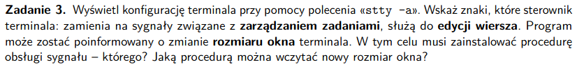

### Pojęcia

- zarządzanie zadaniami - to co możemy zrobić z zadaniem, wstrzymać, terminować

- edycja wiersza - zmiana wpisanego przez nas input'u

- rozmiar okna - wielkość termianala w kolumnach i wierszach

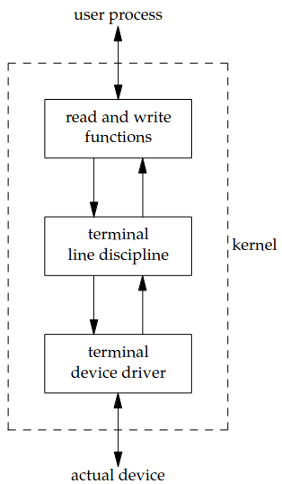

(mamy moduł terminal line discipline, który zajmuje się tworzeniem połączenia między input, output, a sterownikiem)

### Znaki, które strownik terminala zmienia na sygnały:
```
intr = ^C; quit = ^\;  kill = ^U;  start = ^Q; stop = ^S; susp = ^Z;
```
### Znaki do edycji wiersza
```
rprnt = ^R; werase = ^W; lnext = ^V; discard = ^O; erase = ^?; eof = ^D;
eol = <undef>; eol2 = <undef>; swtch = <undef>; ^V umożliwia wprowadzanie do terminala znaków sterujących
```
### Procedura obsługi którego sygnału umożliwia zmianę rozmiaru okna?
- SIGWINCH - za każdym razem, gdy zmienia się rozmiar okna ten sygnał jest wysyłany do
zadania pierwszoplanowego i TTY przerysowuje terminal
```
echo $$ -> [PID] terminala
sudo strace -p [PID terminala] -e signal
```

### Jakim poleceniem można wczytać nowy rozmiar okna (Ubuntu)
--geometry=GEOMETRY
           Set the window size as COLSxROWS+X+Y. For example, 80x24 or
           80x24+200+200.

```
gnome-terminal --geometry=100x10 -> otworzy nam się okno o podanych rozmiarach
```
# zadanie 4
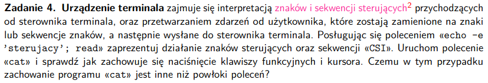

- urządzenie terminala - zasób pliko - podobny będący interfejsem do komunikacji między
użytkownikiem a systemem operacyjnym


- sterownik terminala - wysyła do urządzenia terminala znaki i sekwencje sterujące,
od urządzenia terminala dostaje znaki lub sekwencje znaków, które mają zostać wykorzystane

- znaki sterujące - specjalne znaki pozwalające na wykonywanie określonych działań w terminalu
(control code), pojedynczy znak poprzedzony \

- sekwencje sterujące CSI - wszelkie sekwencje, również obsługiwane przez terminal, zapoczątkowane przez  - \033[


Polecenia:
```
tty
echo -e 'sekwencja/sygnał'; read

przykłady znaków
echo -e 'hello\nworld'; read
- albo też tak może być ^Z

przykłady sekwencji
echo -e '\033[31mhello\aworld'; read (sekwencje zawsze się zaczynają od \033)
echo -e '\033[36mhello\tworld'; read
echo -e "\033[1;34mPogrubiony niebieski tekst\033[0m"
```

### Uruchamianie cat oprócz echo
Co dostaniemy po naciśnięciu kalwiszy funkcyjnych i kursora:
```
^[OP^[OQ^[OS^[[15~^[[17~^[[18~^[[19~^[[20~^[[21~^[[24~^[[24~^[^[[A^[[B^[[C^[[D
kody klawiszy
```

### Skąd wynika różnica międzyzachowaniem 'cat' a normalnym zachowaniem powłoki
Jeli uruchomimy ```cat``` bez żadnego pliku włącza się i on w trybie niekanonicznym terminala,
to znaczy, że nie traktuje linii jako input (możemy na spokojnie robić entery itd.) oprócz tego nie traktuje dużej części
poleceń jako coś faktycznego. Np klawisze funkcyjne i kursory wpisują swoje konretne kody. 
Takiego ```cat``` można zabić ^D (end of file) albo ^C

# zadanie 5
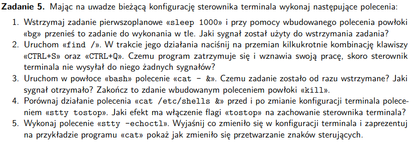


### Pytania
1. Jaki sygnał został użyty do wstrzymania zadania? - SIGTSTP (zatrzymuje + sprząta)
```
sleep 1000

- odpalamy w innym terminalu

ps -eo user,pid,ppid,cmd | grep sleep

sudo strace -e trace=signal -p [PID sleep] -o sig.txt
- bawimy się sleep
```

```
sleep 1000
ctrl+z -> wstrzymujemy ten proces
jobs -> polecenie do podglądu zadań na danym terminalu
bg
```

2. Czemu program się zatrzymuje i wznawia, skoro sterownik terminala nie
wysłał do niego żadnych sygnałów?
```
ps -eo user,pid,ppid,cmd | grep find
sudo strace -e trace=signal -p 421631 -o przekonajmysie.txt
```

- faktycznie sterownik terminala nie wysyła żadnych sygnałów:
```
--- stopped by SIGTSTP ---
--- SIGCONT {si_signo=SIGCONT, si_code=SI_USER, si_pid=410501, si_uid=1000} ---
--- SIGINT {si_signo=SIGINT, si_code=SI_KERNEL} ---
+++ killed by SIGINT +++
```
TTY wysyła na ^C SIGINT do procesu w tle
Sygnały typu *stop flow* (^S) i *start flow* (^Q) kontrolują explicite operacje I/O 
na terminalu -> (przełączają proces pierwszoplanowy na 'interruptible sleep')
**My kontrolujemy I/O terminalu a nie robimy coś z procesem**

3. Uruchamianie ```cat - &``` (cat - redirect output, wyświetlanie plików, ale 
z flagą - to wczytywanie ze **standardowego wejścia**)

- Czemu zadanie zostało od razu wstrzymane?
    - ponieważ polecenie cat - & mówi że dane będą wprowadzane z stdin, a w trybie kanonicznym
    procesy w tle nie mogą wprowadzać danych na stdin

- Jaki sygnał został wysłany?
    ```
    strace -e signal cat - &
    --- stopped by SIGTTIN ---
    ```
- Zakończenie zadania - ctrl+Z (to jest wbudowane w powłokę polecenie kill)

4. Porównanie poleceń ```cat /etc/shells &```

- wszystkie flagi są w ```man stty```

- tostop - zatrzymaj zadania w tle, które próbują zapisać coś do terminala
[-tostop (z - znaczy, że wyłączony)]

- co się dzieje ze sterownikiem terminala - zatrzymuje procesy z tła chcące wypisać coś na terminalu

- co się dzieje - proces jest natychmiast zatrzymany

5. Polecenie ```stty echoctl```

- *echoctl* to to samo co *ctlecho* - wypisuj 'control characters' w postaci '^c' 
**(domyślnie włączone)**

- Co się zmieniło:
    - już nie widać wpisywanych znaków sterujących postaci '^c', znaki sterujące są po prostu nie widoczne, jak je wpiszemy


# zadanie 6
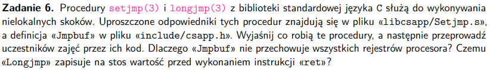


### Co robią te procedury

Używane do zrobienia *exception handling* w C.

- **setjmp** - uruchamiane przed longjmp, zapisuje dane z rejestrów (base pointer), stack pointer,
 to gdzie jest obecnie w kodzie (PC value) oraz maskę sygnałów, zwraca 0

- wołany raz, zwraca kilka razy

### Code walk through
```
_JB_RBX = 0
_JB_RBP = 1
_JB_R12 = 2
_JB_R13 = 3
_JB_R14 = 4
_JB_R15 = 5
_JB_RSP = 6
_JB_RIP = 7

        .text

        .globl Setjmp
        .type Setjmp,@function
// wszystko zapisujemy w odniesieniu do rdi, pierwszego argumentu funkcji
// modyfikujemy podany do wywołania funkcji bufor (pierwszy argument)
// Setjmp(jmp_buf buf)
Setjmp:
	movq    (%rsp),%r11 // zapisuje bajty przechowywane na szczycie stack'a (intruction pointer)
	movq    %rbx,(_JB_RBX * 8)(%rdi) // jest to ogólny rejestr i jest calee-saved (ten kto używa tego rejestru, po return musi naprawić ten rejestr)
	movq    %rbp,(_JB_RBP * 8)(%rdi) // baza ramki stosu, kopijemy adres do zmiennych lokalnych i parametrów funkcji (base pointer)
	movq    %r12,(_JB_R12 * 8)(%rdi)
	movq    %r13,(_JB_R13 * 8)(%rdi)
	movq    %r14,(_JB_R14 * 8)(%rdi)
	movq    %r15,(_JB_R15 * 8)(%rdi) // kopijemy dane z rejestrów
	movq    %rsp,(_JB_RSP * 8)(%rdi) // kopiujemy adres stosu
	movq    %r11,(_JB_RIP * 8)(%rdi) // zapisujemy instruction pointer
	xorl	%eax,%eax // czyścimy rejestr (chcemy zwrócić 0)
	ret
```

- **longjmp** - przywraca dane zapisane w momencie wywołania setjmp (stack pointer, PC value, base pointer) i przekazuje kontrolę
do miejsca wywołania setjmp, maska sygnałów jest przywracana (u nas nie ma maski sygnałów)

### Code walk thorough
```
_JB_RBX = 0
_JB_RBP = 1
_JB_R12 = 2
_JB_R13 = 3
_JB_R14 = 4
_JB_R15 = 5
_JB_RSP = 6
_JB_RIP = 7

// Longjmp(jmp_buf buf, int i) -> bufor z kontekstem (rdi) i jak 
// przywracamy te dane i przechodzimy ze sterowaniem do setjmp to zwrócimy
// podane i w agrumencie

// Longjmp może być wielokrotnie wywoływany, ale nigdy nic nie zwraca, bo przechodzi
// ze sterowaniem do procedury Setjmp, Longjmp modyfikuje jednak wartość zwracaną przez
// Setjmp (rejestr eax) i w ten sposób można robić różne działania dla różnych błędów

Longjmp:
	movq    (_JB_RBX * 8)(%rdi),%rbx // przywracamy kontekst z pierwszego argumentu funkcji (jmp_buf buf)
	movq    (_JB_RBP * 8)(%rdi),%rbp
	movq    (_JB_R12 * 8)(%rdi),%r12
	movq    (_JB_R13 * 8)(%rdi),%r13
	movq    (_JB_R14 * 8)(%rdi),%r14
	movq    (_JB_R15 * 8)(%rdi),%r15
	movq    (_JB_RSP * 8)(%rdi),%rsp
	movq    (_JB_RIP * 8)(%rdi),%r11
	movl	%esi,%eax // wrzucamy i jako wynik funkcji
	testl	%eax,%eax // robimy AND i ustawiamy flagę
	jnz	1f // jak nie ustawiliśmy flagi ZF, to skaczemy do label'a '1'
	incl	%eax // jak eax=0 to zwiększamy go o 1, żeby nie był 0
1:	movq	%r11,(%rsp) // przekazujemy sterowanie do zapisanego stosu
	ret
```

### Czemu Jpbbuf nie przechowuje wszystkich rejestrów procesora?
Nie musimy używać wszystkich, bo pamiętamy rbp i możemy odtworzyć z niego zmienne lokalne?

### Czemu Longjmp zapisuje na stos wartość, zanim wykona ret?
Robi to po to, aby przekazać sterowanie do procedury Setjmp(), to ona ma coś zwracać


# zadanie 7
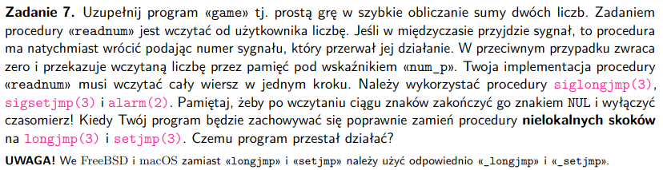

### Pojęcia
- nielokalne skoki - przekazywanie sterowania z jednej funkcji do z góry zdeterminowanej innej funkcji

### Czemu program przestał działać, bo zmienieniu na zwykłe nielokalne skoki?
- setjmp i longjmp nie mają dostępu do aktualnej maski synałów w programie, w przeciwieństwie do
sigsetjmp i siglongjmp, które zapisują w env aktualną maskę i to umożliwia odpowiednie zarządzanie obsługą sygnału

# zadanie 8
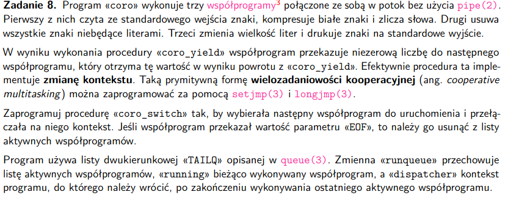