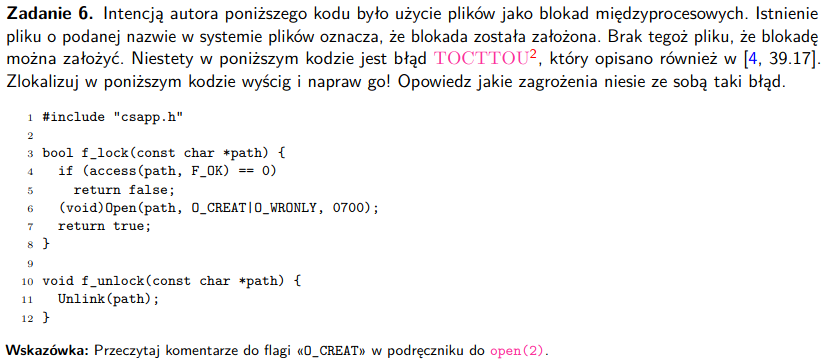

^D -> EOF -> terminal na to reaguje

### Jak działa procedura *tty_curpos* odczytująca pozycję kursora terminala?
- plik z1.terminal.c

### Do czego służy kod sterujący CPR z *terminal.h*
```
#define CPR() CSI "6n"              /* Cursor Position Report */
```
Jest to Device Status Report i przesyła pozycję kursora w postaci
sekwencji:
```
ESC[n;mR] -> n - rząd, m - kolumna
echo -e "\033[6n"
```

### Semantyka TCGETS, TCSETSW, TIOCINQ, TIOCSTI
- TSGETS

uruchamiamy:
       int ioctl(int fd, TCGETS, struct termios *argp);

ekwiwalent *tcgetattr(fd, argp)* - pobranie aktualnych atrybutów terminala o deskryptorze plików fd

- TCSETSW

uruchamiamy:
       int ioctl(int fd, TCSETSW, const struct termios *argp);

ekwiwalent *tcsetattr(fd, TCSADRAIN, argp)* - zakończenie output'u, ustawienie nowych atrybutów terminala o deskryptorze plików fd

- TIOCINQ
       int ioctl(int fd, TIOCINQ, int *argp);
    
    podaj liczbę bajtów w buforze wejściowym

- TIOCSTI
       int ioctl(int fd, TIOCSTI, const char *argp);

    przywróć dany bufor na kolejkę wejściową

### Flagi ECHO, ICANON, CREAD - wpływ na sterownik terminala
- ECHO - umożliwia echo na terminal
- ICANON - kanonizacja linii wejściowych (czy terminal jest w trybie kanonicznym)
- CREAD - czy dajemy możliwość inputu do terminala

# zadanie 2


### Pojęcia
- pseudoterminal - działa jak terminal dla używającej go aplikacji, ale nie jest prawdziwym terminalem


- proces user'a robi jakieś działania na 'slave'ie

### Polecenie *script(1)*
- tworzy transkrypt wszystkich znaków wpisywanych, wypisywanych przez terminal (zapisuje w pliku wszystkie dziłania)

- zapis do pliku jest możliwy, bo plik jest wrzucony w łańcuchu komunikacyjnym między terminalem, a podłączonym użytkownikiem


### Nagrywanie
```
script -T timing -c dash
- jakieś polecenia
ls -la
pwd
exit 42
scriptreplay -t timing
strace -f -y -e read,write -o script.log scriptreplay -t timing (flaga -y powie nam który to jest konretnie plik)

cat script.log
```

### Jak *script* używa pseudoterminala do komunikacji z programami działającymi pod kontrolę powłoki dash


- pseudoterminal - PTY

- użytkownik wprowadza znak po znaku do terminala, na końcu wproawadzamy znak końca linii
- te znaki są potem przekazywane do script, script przekazuje je do PTY master (file descriptor = 1, zapisuje na wyjście), który zajmuje się wykonaniem danego programu

- to co przekazaliśmy na master jest jednocześnie przekazywane do slave

### Pokazać, że przypisuje znaki zgodnie z ICRNL i ONLCR?
- ICRLN - mapuje CR (control character) do NL (new line), czyli znak który opowiada za uruchomienie polecenia, będzie to po zmapowaniu zwykła nowa linia, tak samo jak wciśmiemy ^M to przejdziemy do nowej linii i wykonamy polecenie (mapujemy cotrol character do nowej linii), zmienia na NL na CR na wejściu

- ONLCR - mapuje NL do CR-LN, czyli jeden znak /r do /r/n,
po wciśnięciu enter wykona nam się polecenie i przejdziemy do nowej linii, zmienia NL na CR na wyjściu
```
490654 write(1, "\r\n", 2)              = 2
```

# zadanie 3


### Pojęcia

- potok - kanał komunikacji utworzony przez kilka rur

- rura (pipe) - połączenie stdout(fd=1) z jednego procesu z stdin(fd=0) drugiego procesu - jednokierunkowy kanał komunikacji do procesów

- standardowe wyjście, (fd=1), wyrzucanie wyników po zakończonym programie

- openat() - tak jak open otwiera plik, ale ma jeszcze różne zachowania w zależności czy ścieżka jest absolute czy nie

- int dup2(int oldfd, int newfd); - alokuje nowy fd, który odnosie się do tego samego pliku co *oldfd*, *newfd* przekazujemy w argumencie funkcji (nową nową referencję)

- pipe() - tworzy rurę, argument pipefd jest używany do przekazania dwóch fd pipefd[0] - read end, pipefd[1] - writeend, kernel buforuje dane z write, żeby mogły być odczytane przez read, pipe2() pipe z flagami, jak flagi to 0, to zachowuje się tak samo jak pipe()

### Jak powłoka Łączy procesy rurami i wykonuje przekierowania stdout do pliku
```
strace -o pipeline.log -f dash
ps -ef | grep sh | wc -l > cnt -> bierzemy procesy, szukamy wszystkich z sh w cmd, zliczamy liczbę linii, wrzucamy ją do pliku
exit 42
cat cnt 
nano pipeline.log
```

alt+shift+3 linie w nano

dash ma PID = 500440

#### Łączenie rurami
- *dash*, proces główny tworzy rury
- z flagą 0 to to samo co zwykły pipe()
```
77 500440 pipe2([3, 4], 0)                 = 0

105 500440 pipe2( <unfinished ...>

107 500440 <... pipe2 resumed>[4, 5], 0)    = 0
```
#### dup2
- wywoływany przez zadania podpięte do *dash*
- mamy pipe i dup2, sklejamy odpowiednie fd ze sobą

```

132 500451 dup2(4, 1 <unfinished ...> -> wywołują procesy, nasze programy
187 500452 dup2(3, 0 <unfinished ...>
198 500452 dup2(5, 1 <unfinished ...>
208 500453 dup2(4, 0 <unfinished ...>
234 500453 dup2(3, 1 <unfinished ...>
```

#### Przekierowanie do pliku
```
500453 openat(AT_FDCWD, "cnt", O_WRONLY|O_CREAT|O_TRUNC, 0666 <unfinished ...>
500451 <... mmap resumed>)              = 0x79cf128d7000
500451 close(3)                         = 0
500453 <... openat resumed>)            = 3
500451 openat(AT_FDCWD, "/lib/x86_64-linux-gnu/libprocps.so.8", O_RDONLY|O_CLOEXEC <unfinished ...>
-> tworzymy plik cnt (ścieżka relatywna do obecnego katalogu (flaga AT_FDCWD))
- to polecenie wywoła jeden z procesów podpiętych bash
```

#### Close
- wykonywany wielokronie
- część wykonuje *dash*, część procesy
```
- wykonywany przez dash i procesy na dash
// close jest wykorzystywany wielokrotnie (w kolejności 3,4, 5 nie ma)
9 [potem też] 500440 close(3) 
84 500440 close(4)
```

#### Clone
- jest wykonywany przez *dash*, robimy go 3 razy, bo robimy 3 różne programy
```
79 500440 clone(child_stack=NULL, flags=CLONE_CHILD_CLEARTID|CLONE_CHILD_SETTID|SIGCHLD, child_tidptr=0x766799528a10) = 500451

114 500440 <... clone resumed>, child_tidptr=0x766799528a10) = 500452

152 500440 <... clone resumed>, child_tidptr=0x766799528a10) = 500453
```

#### Kiedy powłoka tworzy rury i kiedy są zamykane ich poszczególne końce
Powłoka tworzy rury na samym początku, w trakcie programu otwiera i zamyka poszczególne końce rury

# zadanie 4


       int setpgid(pid_t pid, pid_t pgid);


### Pytania

#### Kiedy powłoka tworzy nową grupę procesów, jak umieszcza tam procesy realizujące potok
```
500440 clone(child_stack=NULL, flags=CLONE_CHILD_CLEARTID|CLONE_CHILD_SETTID|SIGCHLD, child_tidptr=0x766799528a10) = 500451 -> to PID jest PID pierwszego procesu potomnego względem powłoki dash


80 500440 setpgid(500451, 500451 <unfinished ...> -> tworzymy grupę 500451

// powłoka wrzuca pozostałe procesy do grupy z pierwszego procesu

116 500440 setpgid(500452, 500451 <unfinished ...>

154 500440 setpgid(500453, 500451 <unfinished ...>

// aby zobaczyć który proces to jest co, szukamy execv i patrzymy co jest wykonywane 
```

#### Dlaczego robimy setpgid() w powłoce jak i w procesie potomnym?
```
int setpgid(pid_t pid, pid_t pgid);
```
- jeśli pid = 0 pid rodzica jest zmieniane na pgid
- jeśli pgid = 0 pgid PGID procesu o PID=pid staje się taki sam jak pid

- wymagane jest aby wszytkie procesy (polecenia i potoki) muszą być w tej samej grupie (które są na jednej *job* w terminalu)

- jest tak dlatego, że po *fork()* to kto się wykona pierwszy nie jest deterministyczne, np child może wykonać exec zanim parent mu zmieni id, albo child może nie zdążyć zmienić swojego id zanim rodzic przyśle mu jakiś sygnał, aby uniknąć wyścigów zmieniamy w dziecku i rodzicu zaraz po *fork()*

#### Kiedy powłoka ustala grupę pierwszoplanową przy pomocy ioctl(2), realizuje (tcsetpgrp(3))

- ioctl(2) - manipuluje parametrami plików specjalnych, np terminala

       int ioctl(int fd, int op, ...);            /* musl, other UNIX */

- fd - desktyptor otwartego pliku
- op - 'device dependent operation code'

- tcgetpgrp(3) - robi z grupy procesów z danym pgrp grupę procesów pierwszoplanowych na terminalu podanym poprzez fd

       int tcsetpgrp(int fd, pid_t pgrp);

- TIOCSPGRP - ustaw grupę pierwszoplanową tego terminalu

       int ioctl(int fd, TIOCSPGRP, const pid_t *argp);

- ustalenie grupy pierwszoplanowej
```
500440 ioctl(10, TIOCSPGRP, [500440])   = 0

// kiedy to robi
natychmiast po utworzeniu grupy robimy grupę pierwszoplanową
```

#### Na jakiej podstawie powłoka wyznacza kod wyjścia potoku?
Kod wyjścia potoku to kod wyjścia ostatniego polecenia.

```
exit 5 | exit 6 | exit 7
echo "{PIPESTATUS[@]}" -> dostajemy tablicę wszystkich kodów wyjścia
```

# zadanie 5


### Pytania
#### Czemu nie można modyfikować katalogów używając *read(2)* i *write(2)*?
- nie można ponieważ nie przetrzymują one jak zwykłe pliki ciągu bajtów tylko ciągi rekordów postaci:
```
struct dirent {
       ino_t d_ino; /* Inode number */
       off_t d_off; /* Not an offset; see below */
       unsigned short d_reclen; /* Length of this record */
       unsigned char d_type; /* Type of file */
       char d_name[256]; /* Null-terminated filename */
};
```
- my za każdym razem chcemy wczytać/zapisać cały rekord

#### Jakim wywołaniem systemowym można wczytać rekord katalogu (directory entry)?
- użyjemy readdir(DIR *dirp) - zwraca pointer na rekord w katalogu

#### Czemu zawartość katalogu nie jest posortowana?
- bo katalog to rekordy

### Metadane
- metadane - dane o danych - nazwa pliku, grupa, właściciel, uprawnienia

```
stat /
```
Metadane katalogu głównego
```
  File: /
  Size: 4096      	Blocks: 8          IO Block: 4096   directory
Device: 805h/2053d	Inode: 2           Links: 20
Access: (0755/drwxr-xr-x)  Uid: (    0/    root)   Gid: (    0/    root)
Access: 2024-10-29 18:29:11.455463375 +0100
Modify: 2023-02-15 13:04:49.355547657 +0100
Change: 2023-02-15 13:04:49.355547657 +0100
 Birth: 2023-02-15 13:01:56.000000000 +0100
```

- dowiązanie (hard link)  - liczba rekordów katalogów podpięta do tego samego *i-node*, tylko jak # tych linków będzie=0 można usunąć ten katalog

- mamy różne katalogi i np w katalogu domowym możemy mieć jeszcze inne katalogi, one są podpięte do i-node katalogu domowego

- dla katalogu liczba (hard link) to liczba dzieci + katalog + 'kropka' od katalogu


# zadanie 6


- soft link - specjalny rodzaj pliku w linux, który służy jako pointer do innego miejsca w systemie plików, tworzenie soft link'ów umożliwia robienie skrótów dostępu do danego pliku

TOCTTOU - Time Of Check To Time Of Use - aby zainstniała mamy dwa kroki:
1. Sprawdzamy status pliku i dajemy konkretne uprawnienia
2. Program operuje na pliku tak, jakby jego status się nie zmienił

### Na czym polega wyścig
Najpierw sprawdzamy czy plik istnieje, jeśli tak, to blokada została założona, jeśli nie to tworzymy plik. Problem polega na tym, że między sprawdzeniem istnienia, a otwarciem nowego pliku możemy podmienić ścieżkę pliku, który otwieramy i otworzyć nieprzeznaczony dla nas plik, Open otworzy plik tak czy inaczej

### Jak naprawić
- dodamy flagę **O_EXCL**, sprawi, ona że otrzymamy error, jeśli spróbujemy otworzyć plik, który już istnieje


```C
(void)Open(path, O_CREAT|O_WRONLY|O_EXCL, 0700);
```

# zadanie 7


# zadanie 8


```
stat holes.bin
```

Wydruk:
```
File: holes.bin
  Size: 33550336  	Blocks: 1112       IO Block: 4096   regular file
Device: 805h/2053d	Inode: 2633500     Links: 1
Access: (0644/-rw-r--r--)  Uid: ( 1000/ szymonm)   Gid: ( 1000/ szymonm)
Access: 2024-10-30 21:22:06.861628332 +0100
Modify: 2024-10-30 21:22:06.923628957 +0100
Change: 2024-10-30 21:22:06.923628957 +0100
 Birth: 2024-10-30 21:22:06.861628332 +0100
```

#### struct stat (metadane)
```C
/* Metadata returned by the stat and fstat functions */
struct stat {
       dev_t st_dev; /* Device */
       ino_t st_ino; /* inode */
       mode_t st_mode; /* Protection and file type */
       nlink_t st_nlink; /* Number of hard links */
       uid_t st_uid; /* User ID of owner */
       gid_t st_gid; /* Group ID of owner */
       dev_t st_rdev; /* Device type (if inode device) */
       off_t st_size; /* Total size, in bytes */
       unsigned long st_blksize; /* Blocksize for filesystem I/O */
       unsigned long st_blocks; /* Number of blocks allocated */
       time_t st_atime; /* Time of last access */
       time_t st_mtime; /* Time of last modification */
       time_t st_ctime; /* Time of last change */
}
```

### Faktyczna objętość pliku
Do otrzymania wielkości bloku używamy polecenia
```
stat -c '%b %B' holes.bin
```
mamy 1112 bloków * 512B = 569344B


#### Pytania
#### Czemu liczba używanych bloków jest mniejsza od tej wynikającej z objętości pliku z pola «st_size»?
```
off_t lseek(int fd, off_t offset, int whence);
```
- offset pliku - liczba bajtów od począku pliku, kursor możemy ustawić na początku pliku (SEEK_SET) [offset z arg bajtów od początku pliku], w obecnym położeniu kursora (SEEK_CUR) [obecne położenie kursora + offset z arg] i na końcu pliku (SEEK_END) [koniec pliku + offset z arg]

- lseek zapisuje obecny offset pliku po stronie jądra, nie powoduje żadnej operacji I/O, ten offset jest używany przez następną operację read/write, offset może być większy niż rozmiar pliku, wówczas następny write rozbuduje nam plik i powstanie dziura między dodanymi danymi a plikiem, wszystko co nie zostało zapisane jest odczytywane jako 0

odp: Jest tak, ponieważ przesuwaliśmy wielokrotnie kursor nic nie robiąc i mamy dużo pustych bloków, które system widzi jako pełne.

#### Czemu liczba używanych bloków jest większa od liczby bloków zgłaszanych przez *mkholes*?
- w programie mamy blok wielkości 4096B
- w rzeczywistości w programie mamy blok 512B
- jak weźmiemy 569344/4096 = 139