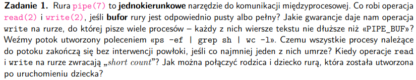
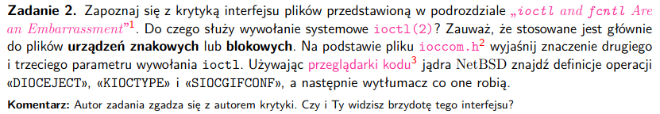
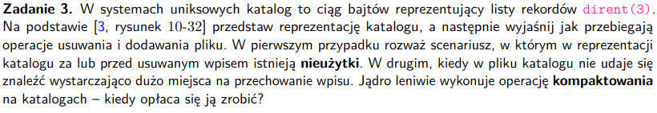
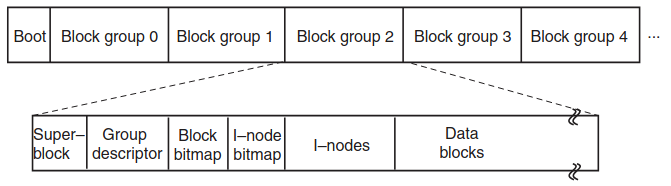
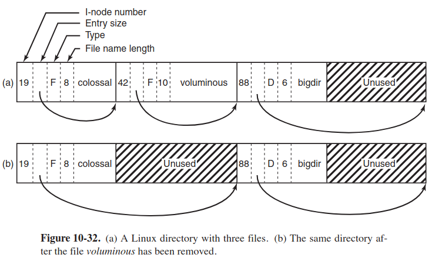
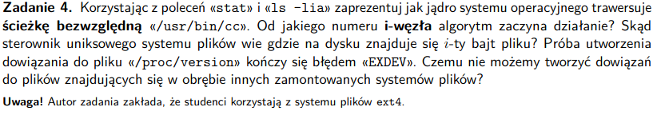
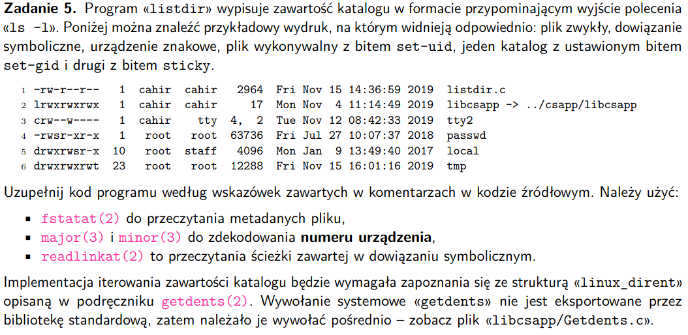
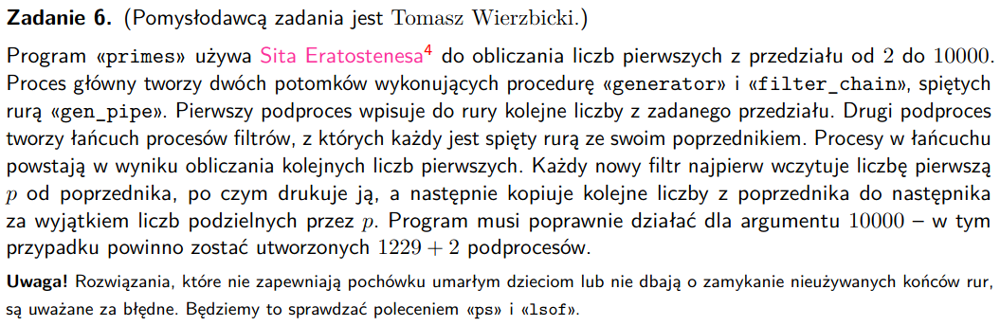

# zadanie 1


### Pojęcia
- jednokierunkowe - tzn ma jeden koniec z deskryptorem pliku pozwalającym na zapis (zapis jest buforowany przez jądro), i drugi koniec z deskryptorem pliku pozwalającym na odczyt

- bufor - tymczasowy blok pamięci zajmowany przez dane w trakcie ich przesyłania gdzieś dalej

### Pytania
#### Co robi *read(2)* i *write(2)*, gdy bufor jest pusty lub peły?
- pusty - odczyt (read) zablokuje proces
- pełny - zapis (write) zablokuje proces

#### Jakie gwarancje daje *write(2)* na rurze, do której pisze wiele procesów, ale teksty są nie dłuższe niż PIPE_BUF?
- zapis jest atomowy, czyli dzieje się w jednym kroku, więc na pewno nie będzie sytuacji, że kilka procesów jednocześnie nam zapisze

#### Pytania do potoku ```ps -ef | grep sh | wc -l``` -> zliczanie linii z wydruku wszystkich procesów zawierających w stringu sh
Czemu kończą się bez interwencji powłoki?
- read - zamknięty koniec do zapisu, to read opróżni bufor rury i dostaje EOF i się sam skończy
- write - zamknięty koniec do odczytu, to write dostaje SIGPIPE i się kończy
- bo są to niezależne procesy (utworzone przez fork), które same siebie kończą, powłoka na nie nie czeka
- oprócz tego są w tej samej grupie, więc jkbc powłoka może się ich pozbyć na raz

Co jeśli jeden z procesów umrze?

```
terminal 1
echo $$ -> PID basha
find / | wc -l

terminal 2
pstree -p [PID]
kill -SIGKILL [PID]
```
- jak jeden z procesów umrze to cały pipeline się kończy

#### Czemu zakończą się bez interwencji powłoki jak co najmniej jeden umrze?
- jeśli zabijemy któryś proces to zamyka on odpowiednio swoje końce, co powoduje dla read i write
odpowiednio dostają odpowiednio EOF i SIGPIPE, które zakończą pozostałe procesy
- wywoła to taki efekt domina

#### Kiedy read i write w rurze zwracają *short count*
- read - gdy bufor w rurze, do opróżnienia był mniejszy niż zarequestowaliśmy
- write - w bufrze mamy mniej miejsca niż chcemy zapisać

#### Jak połączyć rodzica i dziecko rurą, która została stworzona po uruchomieniu dziecka?
- zwykłe rury mogą być użyte między procesami spokrewnionymi, tylko jeśli wspólny przodek utorzy rurę
- korzystając z FIFO można połączyć rurą procesy niespokrewnione
- odpowiadając na pytanie można to zrobić w ten sposób, że zrobimy normalnie dziecko, a potem zrobimy między nim a rodzicem FIFO
- można też skorzystać z UNIX domain socket

# zadanie 2


```
int ioctl(int d, unsigned long request, ...);
... - argument wariadyczny - może to być wskaźnik na strukturę danych, liczba, flaga itp
```

### Pojęcia
- plik urządzenia odnosi się do urządzenia w systemie, w jądrze każde urządzenie ma swój 
sterownik urządzenia - to on służy do komunikacji z systemem, do obsługi operacji I/O, jest to jakiś kod który łączy się z hardwarem
- niektóre urządzenia są rzeczywiste - myszka, dysk, klawiatura, wirtualne - jądro dostarcza (przez sterownik)
jakieś API do obsługi, podobne do tego, które mamy w przypadku urządzeń rzeczywistych
- pliki urządzeń są w katalogu /dev/
- urządzenia znakowe - obsługują dane na poziomie znaków, np terminale, klawiatura, strumieć szeregowy I/O znak po znaku
- urządzenia blokowe - obsuługują dane blok po bloku - zazwyczaj wielokrotność, teraz raczej 4KB - wielkość strony pamięci, np dyski

### Pytania
#### Do czego służy wywołanie systemowe ioctl(2)
- do manipulowania parametrami urządzeń plików specjalnych,
     wiele cech 'znakowych plików specjalnych', np terminali można kontrolować za pomocą requestów *ioctl(2)*
- wykorzystujemy do specyficznych działań dla urządzeń I/O oraz innych, których nie można wywołać zwykłymi syscall'ami

#### Znaczenie drugiego i trzeciego parametru *ioctl(2*)
```
man ioctl
```
- pierwszy argument - **d** - file descriptor
- drugi argument - **requests**
    - zależny od urządzenia kod rządania
    - jest to maska bitowa
    - najniższy bajt ma polecenie
    - najwyższe 3 bity kodują in/out status dla parametru, czy może inout
    - obok najwyższych bitów przechowujemy wielkość parametrów trzeciego? - Parameter Length?
    ```
        *   31   29 28                     16 15            8 7             0
        *	+---------------------------------------------------------------+
        *	| I/O | Parameter Length        | Command Group | Command       |
        *	+---------------------------------------------------------------+
    ```
- trzeci argument - zwykle ```char *argp``` - wskaźnik na pamięć, np wskaźnik na jakąś konfugurację urządzenia

### Przeglądarka kodu
```
#define DIOCEJECT	_IOW('d', 112, int)	/* eject removable disk */
#define	KIOCTYPE	_IOR('k', 9, int)	/* get keyboard type */
#define	SIOCGIFCONF	_IOWR('i', 38, struct ifconf)	/* get ifnet list */ -> interfejsy jądra do zarządzania sieciami
```

```C
int set_keyboard_type(int fd, unsigned int kb_type) {
    return ioctl(fd, KIOCSTYPE, kb_type);
}
```

Średni interfejs, bo mamy de facto jedną funkcję od zbyt dużej ilości rzeczy, mało praktyczne.

# zadanie 3



- abstrakcja dla plików i katalogów na najniższym poziomie jest taka sama, to wyższe warstwy dodają jakąś
hierarchię

- pliki na dysku rozmieszczone są następująco:



- boot - jak uruchomić system
- superblock - layout systemu pliku oraz liczbę i-node, liczbę bloków dysku, początek listy pustych bloków
- group desciptor - lokalizacja bitmap, liczba bloków , i-node'ów w grupie, liczba katalogów w grupie
- bitmapy - chcemy wiedzieć które bloki i które i-node'y są wolne
- i-node'y - długości 128bajtów, opisuje jeden plik, zawiera dane zwracane przez ```stat``` (stat bierze dane z i-node),
zawiera też informacje, która umożliwi zlokalizowanie bloków, które przetrzymują dane plików na dysku
- data blocks - wszystkie pliki i katalogi są tam trzymane, jak plik jest większy niż jeden blok dane są rozparcelowane po całym dysku


### Pojęcia
- nieużytki - fragmenty katalogu na dysku nie przechowujące żadnych danych, spowodowane jest to np usunięciem jakiegoś
pliku
- kompaktowania - zmniejszamy rozmiar katalogu, 'nieużytki' są uklepywane, robimy ją jak jest dużo nieużytków


### Reprezentacja katalogu


Pola po kolei:
- Numer i-node, 19 dla pliku colossal, 42 dla voluminous i 88 dla bigdir
- potem mamy wielkość pliku i strzałka wskazuje gdzie zaczyna się kolejny rekord
- specyfikujemy typ pliku
- potem specyfikujemy wielkośc nazwy pliku w bajtach
- nazwa pliku, mamy padding zaokrąglający do 32-bitów

- pliki mogą mieć nazwy do 255 znaków
- każdy katalog składa się z pewnej ilości bloków
- rekordy dla katalogów i plików są nieposortowane, znajdują się blok za blokiem, czyli jak rekord nie zajmuje całego
bloku mamy nieużywaną pamięć

- katalogi są przeszukiwane liniowo, zatem może to zajmować dość długo, stąd ostatnio używane katalogi są 'cachowane'
#### Operacje usuwania
- jak usuniemy plik, to przestawiamy wskaźnik końca poprzedniego pliku na koniec usuniętego, efektywnie
dodajemy padding do nazwy pliku poprzedniego
- jak usuniemy *voluminous* to zwiększy nam się rozmiar poprzedniego pliku, będziemy sięgać do następnego zapisanego
rekordu, nieużywane bajty stają się paddingiem

#### Operacje dodawania
- przeglądamy katalog, żeby zobaczyć czy plik w nim się znajduje, jak nie ma miejsca na jego dodanie
dokonujemy kompaktowania

# zadanie 4


### Pojęcia
- ścieżka bezwzględna - ścieżka do pliku uwzględanijąca wszystkie przejścia od root'a
- i-node (i-węzeł) - identyfikator pliku, np dla root'a i-node = 2, zawiera też informacje,
które umożliwiają zlokalizowanie bloków, które przetrzymują dane plików na dysku

```
cd
stat .
ls -lia
```

#### Od jakiego numeru i węzła algorytm zaczyna działanie
- zaczynamy od 2
```
Device: 805h/2053d	Inode: 2           Links: 20
```
#### Skąd sterownik systemu plików wie, gdzie jest i-ty bajt pliku
- wie to ze struktury i-node, przechowującej dane o blokach przetrzymujących plik

#### Próba utworzenia dowiązania do pliku
- linkowanie -umożliwiamy plikowi występowanie w więcej niż jednym katalogu
- hard link - liczba połączeń w i-node, mówiąca o liczbie rekordów w katalogu, zawierających dany plik
- symbolic link - zamiast mieć dwie nazwy wskazujące na jedną strukturę danych i-node, możemy mieć
nazwę, która prowadzi do małego pliku, nazwyjącego inny plik, jak chcemy użyć linka otwieramy ten mały plik, pobieramy
stamtąd link i używamy tego linka

- proc to system plików nieistniejący na dysku, gdy są odczytywane system wyciąga dane z procesu
i robi konkretny plik
```
ln -s /proc/version version_link -> soft link
ln /proc/version version_link -> hard link
```

- dowiązanie symboliczne sprawia, że będziemy musieli przejść jeszcze raz wskazywaną przez dowiązanie ścieżką
- kiedyś liczba dowiązań symbolicznych była ograniczona przez 5, linux zwiększe to do 256, ma ograniczenie,
bo może to iść rekurencyjnie i się może nigdy nie skończyć, co sprawia, że jądro może się zawiesić

#### Czemu mamy ten błąd?

Jest to spowodowane tym, że chcemy podłączać plik z systemu plików ```/proc``` do innego systemu plików - ```ext4```,
nieprawidłowo by nam się wtedy ustawił licznik linków w ```i-node```, bo on z kolei mówi liczbie podpiętych plików
w jednym systemie plików

#### Czemu nie możemy tworzyć dowiązań między różnymi zamontowanymi systemami plików?

- jak odłączymy jakiś system plików musielibyśmy dla każdego pliku pilnować żeby
posprawdzać czy był on podłączony do jakiegoś innego systemu, drog i długo

# zadanie 5


# zadanie 6
