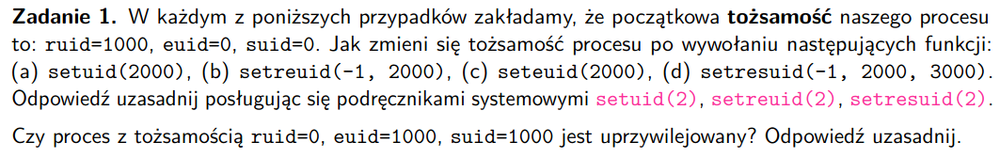
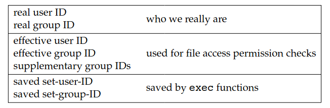
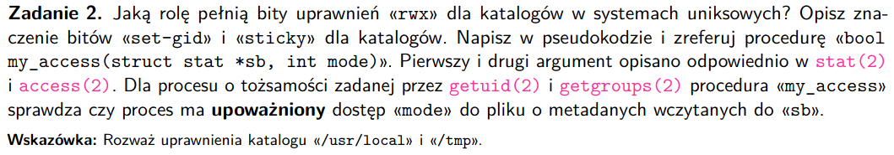

# zadanie 1


### Pojęcia
- tożsamość procesu - zbiór kredencjałów, jednoznacznie określający upoważnienia procesów,
mamy po prostu jakieś id'ki, które mówią jakie uprawnienia ma proces
### Typy uid
- każdy proces ma związany z nim identyfikator użytkownika (uid) oraz identyfikator grupy (gid)


### Polecenia
Zakładamy, że:

ruid=1000 - (real user ID - dostaje od rodzica dostajemy z rekordów w /etc/passwd) 
euid=0 - (effective user ID - to co jest faktycznie sprawdzane przy sprawdzaniu uprawnień (np syscalle jakieś))
- 0 oznacza ID roota, proces uprzywilejowany
- zazwyczaj ruid i euid są takie same, można to zmienić syscall'em albo set-userID/set-groupID
- program set-user-ID, set-group-ID - ustawia euid procesu na tą samą wartość, jaką ma właściciel pliku wykonywalnego dla programu
- plik wykonywalne ma oprócz uid i gid jeszcze dwa bity zgody: set-user-ID oraz set-group-ID
- jądro systemu zmienia uprawnienia na podstawie programu set-userID
suid=0 - (saved-user-ID) - używane s programami set-user-ID oraz set-group-ID - przetrzymuje kopie uprawnień procesu po wykonaniu set-user-ID oraz set-group-ID (niezależnie czy effective user ID się zmienił, czy nie)

```
ruid=1000, euid=0, suid=0
```
int setuid(uid_t uid);
(a) setuid(2000)
- setuid - ustawia euid procesu wołającego
- jak wołający program ma euid=0 (root) ustawia wszystkie
związane z procesem uid na 'uid' (oprócz tego program nie może wtedy odzyskać root'a)
- jak nie jest to root (euid != 0), to po prostu nastąpi zmiana

- zatem w naszym przypadku euid ustawimy na 2000 i nie będzie można już wrócić do root'a
```
ruid=2000, euid=2000, suid=2000 (kopiowane jest to uid w przypadku tego programu)
```

int setreuid(uid_t ruid, uid_t euid);
(b) setreuid(-1, 2000)
- ustawia real i effective uid procesu wołającego
- -1 na ruid albo euid oznacza, to, że ten uid pozostaje niezmieniony
- nieuprawniony proces może tylko zmienić euid na ruid, euid albo suid
- jak ruid != -1, albo euid != poprzedniego ruid, suid jest ustawiony na nowy suid

- zatem w naszym przypadku:
```
ruid=1000, euid=2000, suid=2000 (znowu jest kopiowane)
```
int seteuid(uid_t euid);
(c) seteuid(2000)
- ustawia euid procesu wywołującego
- nieuprzywilejowane procesy mogą tylko ustawć euid na ruid,euid albo suid
- lepsze niż setuid, bo root może wrócić do swoich przywilejów

- zatem w naszym przypadku:
```
ruid=1000, euid=2000, suid=0 (nie zmienia się, bo chcemy dać możliwość root'owi na przywrócenie przywilejów)
```

int setresuid(uid_t ruid, uid_t euid, uid_t suid);
(d) setresuid(-1, 2000, 3000)
- ustawia ruid, euid, suid procesu wywołującego
- proces nieuprzywilejowany może ustawić każdy z ruid, euid, suid procesu do jednego z: ruid, euid, suid podanego w arg funkcji
- proces uprzywilejowany może ustawić ruid, euid, suid na dowolną wartość
- -1 oznacza brak zmiany
- bez względu na zmianę ruid, euid, suid UID systemu plików jest ustawione na aktulaną (po zmianie albo jej braku) wartość euid

- zatem w naszym przypadku:
```
ruid=1000, euid=2000, suid=3000
```

#### Czy proces z tożsamością ruid=0, euid=1000, suid=1000 jest uprzywilejowany?
Nie jest, bo przywileje zależą i są przyznawane w zależności od euid.
- proces był uruchomiony przez root
- teraz ma takie przywileje jak użytkownik uid 1000

# zadanie 2
