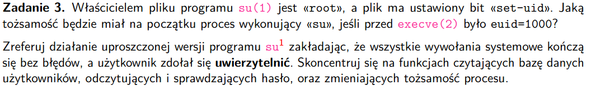
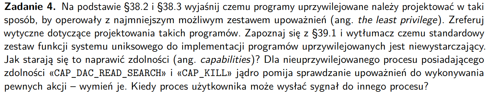
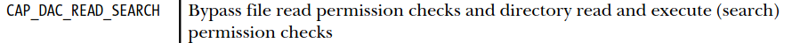
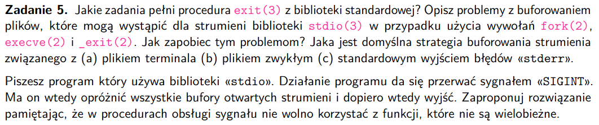
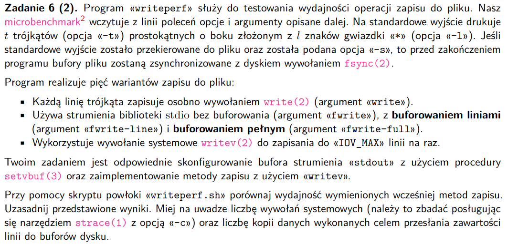
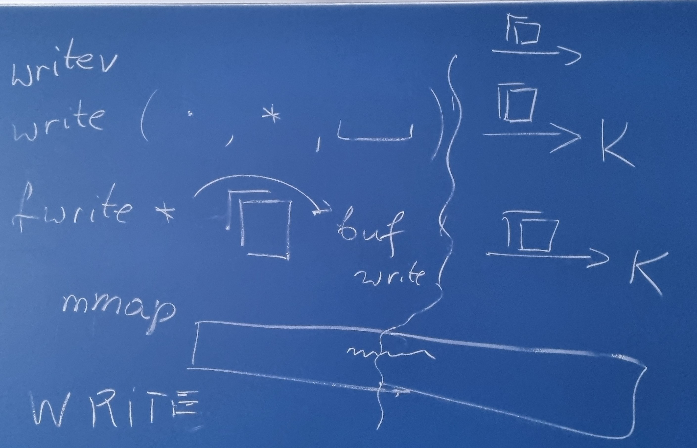
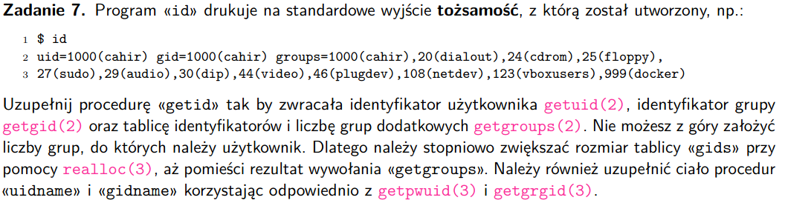

# zadanie 1


### Pojęcia
- tożsamość procesu - zbiór kredencjałów, jednoznacznie określający upoważnienia procesów,
mamy po prostu jakieś id'ki, które mówią jakie uprawnienia ma proces
### Typy uid
- każdy proces ma związany z nim identyfikator użytkownika (uid) oraz identyfikator grupy (gid)


### Polecenia
Zakładamy, że:

ruid=1000 - (real user ID - dostaje od rodzica dostajemy z rekordów w /etc/passwd) 

euid=0 - (effective user ID - to co jest faktycznie sprawdzane przy sprawdzaniu uprawnień (np syscalle jakieś))

suid=0 - (saved user ID) - używane przy exec, żeby potem przywrócić procesowi przywileje
- 0 oznacza ID roota, proces uprzywilejowany
- zazwyczaj ruid i euid są takie same, można to zmienić syscall'em albo set-userID/set-groupID
- program set-user-ID, set-group-ID - ustawia euid procesu wołającego na daną wartość
- plik wykonywalny ma oprócz uid i gid jeszcze dwa bity zgody: set-user-ID oraz set-group-ID
- jądro systemu zmienia uprawnienia na podstawie programu set-userID
suid=0 - (saved-user-ID) - używane z programami set-user-ID oraz set-group-ID - przetrzymuje kopie uprawnień procesu po wykonaniu set-user-ID oraz set-group-ID (niezależnie czy effective user ID się zmienił, czy nie)

```
ruid=1000, euid=0, suid=0
```
int setuid(uid_t uid);

(a) setuid(2000)
- setuid - ustawia euid procesu wołającego
- jak wołający program ma euid=0 (root) ustawia wszystkie
związane z procesem uid na 'uid' (oprócz tego program nie może wtedy odzyskać root'a)
- jak nie jest to root (euid != 0), to po prostu nastąpi zmiana

- zatem w naszym przypadku euid ustawimy na 2000 i nie będzie można już wrócić do root'a, zmienimy suid
```
ruid=2000, euid=2000, suid=2000 (suid też się zmienia)
```

int setreuid(uid_t ruid, uid_t euid);

(b) setreuid(-1, 2000)
- ustawia real i effective uid procesu wołającego
- -1 na ruid albo euid oznacza, to, że ten uid pozostaje niezmieniony
- nieuprawniony proces może tylko zmienić euid na ruid, euid albo suid
- jak ruid != -1, albo euid != poprzedniego ruid, suid jest ustawiony na nowy suid

- zatem w naszym przypadku:
```
ruid=1000, euid=2000, suid=2000 (znowu jest kopiowane)
```
int seteuid(uid_t euid);

(c) seteuid(2000)
- ustawia euid procesu wywołującego
- nieuprzywilejowane procesy mogą tylko ustawć euid na ruid,euid albo suid
- lepsze niż setuid, bo root może wrócić do swoich przywilejów

- zatem w naszym przypadku:
```
ruid=1000, euid=2000, suid=0 (nie zmienia się, bo chcemy dać możliwość root'owi na przywrócenie przywilejów)
```

int setresuid(uid_t ruid, uid_t euid, uid_t suid);
(d) setresuid(-1, 2000, 3000)
- ustawia ruid, euid, suid procesu wywołującego
- proces nieuprzywilejowany może ustawić każdy z ruid, euid, suid procesu do jednego z: ruid, euid, suid podanego w arg funkcji
- proces uprzywilejowany może ustawić ruid, euid, suid na dowolną wartość
- -1 oznacza brak zmiany
- bez względu na zmianę ruid, euid, suid UID systemu plików jest ustawione na aktulaną (po zmianie albo jej braku) wartość euid

- zatem w naszym przypadku:
```
ruid=1000, euid=2000, suid=3000
```

#### Czy proces z tożsamością ruid=0, euid=1000, suid=1000 jest uprzywilejowany?
Nie jest, bo przywileje zależą i są przyznawane w zależności od euid.
- proces był uruchomiony przez root
- teraz ma takie przywileje jak użytkownik uid 1000

# zadanie 2


### Pojęcia
- upoważniony - czy dany proces ma konkretne pozwolenia na dostęp w dany sposób do zasobu

### Jaką rolę pełnią bity *rwx* dla unixowych katalogów
- r - można przeczytać katalog (niekoniecznie pliki w katalogu) - odczyt rekordów (dirent) - polecenie **getdirents** działa, **stat** nie
- w - można modyfikować rekordy, działają nam **create, unlink, rename** (sprawdzany jest właściciel katalogu)
- x - można wczytać metadane plików z katalogu, działa **stat**, możemy przeczytać zawartość pliku albo przejść do podkatalogów

### Znaczenie **set-gid** i **sticky** dla katalogów
- sticky - (restricted deletion flag) - uruchomienie bitu oznacza, że nieuprzywilejowany proces może zrobić:
unlink, rmdir, rename w katalogu tylko jak  ma *write permission* i jest właścicielem pliku w katalogu, albo jest właścicielem katalogu - **przydatne do umożliwienia różnym użytkownikom dodawania/usuwania swoich plików/katalogów w katalogu dla wielu użytkowników** -> jest np uruchomiony na katalogu /tmp - oznaczamy przez t (uruchomiony) i T (wyłączony)


- set-gid - ustawienie tego bitu oznacza, że każdy nowo utworzony plik w danym katalogu dostanie
gid od katalogu, a nie od użytkownika, który go stworzył, **przydaje się do robienia katalogu z plikami od wielu użytkowników**
```
drwxrwxr-x
drwxrwsr-x -> zapalony set-gid
```

### Funkcja bool my_access(struct stat *sb, int mode)
- struct stat sb - wskaźnik na:
```C
struct stat {
    dev_t     st_dev;     /* Device ID of the device containing the file */
    ino_t     st_ino;     /* Inode number */
    mode_t    st_mode;    /* File type and mode (permissions) */
    nlink_t   st_nlink;   /* Number of hard links */
    uid_t     st_uid;     /* User ID of the file's owner */
    gid_t     st_gid;     /* Group ID of the file's group */
    dev_t     st_rdev;    /* Device ID (if special file) */
    struct timespec st_atim; /* Time of last access */
    struct timespec st_mtim; /* Time of last modification */
    struct timespec st_ctim; /* Time of last status change */
    off_t     st_size;    /* Size of the file in bytes (0 for directories) */
    blksize_t st_blksize; /* Optimal block size for I/O */
    blkcnt_t  st_blocks;   /* Number of blocks allocated for the file */
};
```

- int mode - jakie upoważnienia muszą zostać sprawdzone
- albo jest to maska: F_OK, albo OR z masek: R_OK, W_OK, X_OK
- F_OK sprawdza czy plik istnieje
- R_OK, W_OK, X_OK sprawdza czy plik istnieje i daje zgody read/write/execute

- getuid() - zwraca ruid procesu wołającego
- getgroups() - zwraca wszystkie grupy, do których należy proces

```C
// czy proces ma upoważniony dostęp do pliku wczytanego do sb
bool my_access(struct stat *sb, int mode) {
    // bierzemy gid i uid procesu uruchamiającego
    uid = getuid();
    gid_group = getgroups();

    if (getuid() == 0){
        return true;
    }

    // jak proces to właściciel pliku
    if uid == sb->st_uid:
        // jak chcemy odczytać, ale nie ma zgody na odczyt dla użytkownika
        if ((mode & R_OK) && !(sb->st_mode & S_IRUSR)) return false;
        if ((mode & W_OK) && !(sb->st_mode & S_IWUSR)) return false;
        if ((mode & X_OK) && !(sb->st_mode & S_IXUSR)) return false;
        return true;

    // czy proces należy do grupy pliku
    is_in_group = false
    for g in gid_group:
        if g == sb->st_gid:
            is_in_group = true
            break

    if is_in_group:
        if ((mode & R_OK) && !(sb->st_mode & S_IRGRP)) return false;
        if ((mode & W_OK) && !(sb->st_mode & S_IWGRP)) return false;
        if ((mode & X_OK) && !(sb->st_mode & S_IXGRP)) return false;
        return true;

    return false
}
```

- uprawnienia katalogów /usr/local i /tmp
```
ls -l /usr/local
drwxr-xr-x 2 root 
```

```
ls -l /tmp
drwx------ 
```

# zadanie 3


### Pojęcia
- uwierzytelnianie - proces potwierdzania tożsamości, np podanie hasła, klucza prywatnego itp.

- polecenie ```su``` umożliwia poleceniu uruchomienie z innym uid i gid

- ustawienie bitu set-uid w pliku - umożliwia wykonanie pliku z przywilejami jego właściciela,
daje tymczasowe zwiększone przywileje procesom na zadania potrzebujące zwiększonych przywilejów

### Tożsamość procesu wykonującego su
- na początku:
ruid=1000 euid=1000 suid=1000
- po execve
ruid=1000 euid=0 suid=0

### Streszczenie działania ```su```
--- su.c ---

# zadanie 4


### Dlaczego programy uprzywilejowane należy projektować tak, aby operowały z najmniejszym możliwym zestawem upoważnień?
- chcemy żeby proces miał tylko przywileje jak ich potrzbuje
- chcemy dawać mniejszy zestaw zgód, bo jakieś bug'i w programie / shakowanie programu mogłoby spowodować więcej szkód, gdyby miały więcej uprawnień


### Wytyczne projektowania takich progamów
- wyłączanie przywilejów, to po prostu przełączenie egid na rgid
- ważny jest porządek operacji, kasujemy na samym końcu przywileje dla euid, uruchamiamy też od euid (część operacji zmniejszenia uprawnień wymaga większych przywilejów)
- zmniejszamy przywileje jak tylko nie są potrzebne
- przywileje muszą być wyłączane przed zawołaniem exceve, nie chcemy, żeby zewnętrzny program miał jakieś potencjalnie za duże przywileje
- używamy setuid przez execve - nowy program ma otrzymać przywileje od programu wywołującego, nie przywileje dane na chwilę programowi wywołującemu - realizujemy to poprzez setuid(getuid()), nie zmienia nam to sgid, umożliwia to powrót do uprawnień jak będzie taka potrzeba **[zmniejszamy uprawnienia przed execve]**
- jak wyłączamy przywileje powinniśmy się upewnić, że je wyłączyliśmy
- zamykamy desktyptory plików, przed wywołaniem execve, nie chcemy by wywołany nowy program miał dostęp do tych plików
- przed użyciem powłoki wyłączamy wszelkie przywileje

### Czemu standardowy zestaw funkcji systemu uniksowego do implementacji programów uprzywilejowanych jest niewystarczający?
Mamy podział na dwie kategorie procesów:
- te z euid = 0 i pozostałe
- jak chcemy dać procesowni możliwość zrobienia akcji, która wymaga superuser'a to musimy mu dać euid=0
- sprawia to, że dajemy takiemu procesowi bardzo dużo przywilejów
- tradycyjnie ten problem był obchodzony tak, że zmienialiśmy euid procesu, ale w suid trzymaliśmy 0,
które było przywoływane w razie potrzeby

### Jak niewystarczający interfejs naprawiają 'zdolności' 'capabilities'?
- zamiast mieć jeden przywilej euid=0 do sprawdzania uprawnień w jądrze, przywileje user'a są podzielone na różne jednostki - zdolności - capabilities
- każda operacja uprzywilejowana ma swoją 'zdolność' i proces może ją podjąć tylko jak ma dany capability, **nie patrzymy się na euid**

### Jakich akcji może dopuścić się program nieuprzywilejowany ze zdolnościami *CAP_DAC_READ_SEARCH* i *CAP_KILL*



### Kiedy proces użytkownika może wysłać sygnał do innego procesu?
- musi mieć capability - CAP_KILL
- ruid/euid procesu wysyłającego sygnał musi być takie samo jak procesu odbierającego
- proces może wysłać sygnał, jeśli proces docelowy jest w tej samej grupie
- jak są w tej samej sesji to można SIGCONT na każdy proces użyć

# zadanie 5


### Zadania procedury ```exit(3)```
```
void exit(int status);
```
- procedura ze standardowej biblioteki języka C

Zadania:
- opróżnienie buforów wszystkich output stream'ów
- wszystkie strumienie są zamykane, zamykamy deskryptory plików
- zakańczanie programu
- najmniej znaczący bajt statusu jest zwracany do rodzica procesu zakańczanego

### Problemy z buforowaniem plików, dla strumieni stdio, podczas zawołania

#### fork() i execve()
- dziecko otrzymuje otrzyma też bufor rodzica, jeśli nie był on pusty, mamy dwa procesy z tym
samym buforem, podczas wypisywania pojawią się duplikaty
- kolejnym problemem jest to że możemy opróżnić bufor, w którym mogło być coś sensownego,
czyli np mamy dziecko, ono wywołuje execve, a w tym samym czasie rodzic opróżnia bufor i się okazuje że nowy program (powstały po execve) ma nagle pusty bufor (execve, problem z opróżnianiem bufora)


#### _exit(2)
- proces jest zakańczany od razu, wszystkie deskryptory są zamykane, czyli potencjalnie możemy nie skończyć buforowania, stracimy nasz bufor
- bufory oprócz tego nie są czyszczone, czyli mamy w nich jakieś śmieci

### Jak zapobiegać tym problemom?
- możemy wyłączyć buforowanie poleceniem ```setbuf(strem, NULL)```
- możemy jawnie czyścić bufory np poleceniem ```fflush(3)```
- możemy użyć ```write(2)```, ale potencjalnie będzie to długo trwało

### Domyślna strategia buforowania strumienia związanego z:
- (a) terminalem - buforowanie liniami, \n koniec bufora
- (b) plikiem zwykłym - buforowanie pełne (blokowe), opróżniamy jak się zapełni
- (c) stderr - brak buforowania, cały czas wyrzucamy

### Opróżnianie buforów programu
- SIGINT może przerwać, chcemy opróżnić wówczas wszystkie bufory i wyjść
- jak to zrobić korzystając z funkcji ze wspraciem wielobieżnym

#### Z jakich funkcji możemy korzystać w programie:

- w handlerze robimy, żeby kolejne siginty ignorować, problem jak oba przyjdą jednocześnie
- ustawić atomową flagę i sprawdzić czy sygnał przyszedł, potem można wychodzić normalnym exit'em, on elegancko zamknie desktyptory plików, wyczyści bufory
(wielobieżne - reentrand safe)
- z signal-safe:
    - _exit,write,wait,waitpid,sleep,kill,tcflush

- funkcje bezpieczne reentrand nie operują na żadnym zewnętrzym stanie, wszystko mają u siebie lokalnie

# zadanie 6


### Wyniki
```
Method: write 3.

real    0m2,038s
user    0m0,448s
sys     0m1,579s
594c417685170dd3eb60286c0f634dc9  test

Method: fwrite 4.

real    0m1,721s
user    0m0,415s
sys     0m1,303s
f2cb2963110341cc5edf88f27d58b952  test

Method: fwrite-line 5.

real    0m1,808s
user    0m0,441s
sys     0m1,358s
f2cb2963110341cc5edf88f27d58b952  test

----- 3 pierwsze powinny mieć podobną liczbę syscall'i -----

Method: fwrite-full 2., drugie miejsce pod względem syscall'i

real    0m0,515s
user    0m0,106s
sys     0m0,402s
f2cb2963110341cc5edf88f27d58b952  test

Method: writev 1., najmniej syscall'i

real    0m0,495s
user    0m0,007s
sys     0m0,488s
b112814721e80b6b25ed8946aaa0d804  test
```

### Uzasadnienie
write i writev to wezwania systemowe - zdecydowanie mniejsza część czasu w przestrzeni użytkownika
fwrite, fwrite-line, fwrite-full - ~30% czasu w przestrzeni użytkownika, to by się zgadzało, bo nie są to wezwania systemowe

- najszybsze są zapisy blokowe
1. (gather write) - writev(2)
2. (buforowanie pełne) fwrite-full

- potem mamy buforowanie liniowe
3. fwrite-line
- brak buforowania
4. fwrite
- potem wypisywanie bajt po bajcie do bufora i potem zapisanie tego kiedyś tam
5. write

### Liczba wywołań systemowych a czas wykonania
```
strace -c bash ./writeperf -t 5 -l 10 write
strace -c bash ./writeperf -t 5 -l 10 fwrite
```

```
- generalnie writev powinien mieć najmniej syscalli, potem fwrite-full,
- pozostałe powinny mieć podobną liczbę
% time     seconds  usecs/call     calls    errors syscall
------ ----------- ----------- --------- --------- ----------------
 40,74    0,000550         550         1           execve           -> write
 
 25,78    0,000132           4        30         4 newfstatat       -> fwrite
 11,52    0,000059           4        12         3 openat
 
 35,75    0,000143          28         5           mprotect         -> fwrite-line
  9,00    0,000036           3        12         3 openat
 
 19,39    0,000674         674         1           execve           -> fwrite-full
 18,27    0,000635          42        15           mmap
 14,47    0,000503          16        30         4 newfstatat
 10,87    0,000378          31        12         3 openat
 
 29,36    0,000771         771         1           execve           -> writev
 15,35    0,000403          26        15           mmap
```

### Liczba kopii danych


- wszystkie wywołania typu fwrite wykonują nadmierną pracę, bo kopiują najpierw do bufora po stronie użytkownika, a potem write, który jest pod spodem musi wykonać zapis do bufora po stronie jądra, stamtąd zostaie dopiero zapisane to na dysk

# zadanie 7
