# zadanie 1
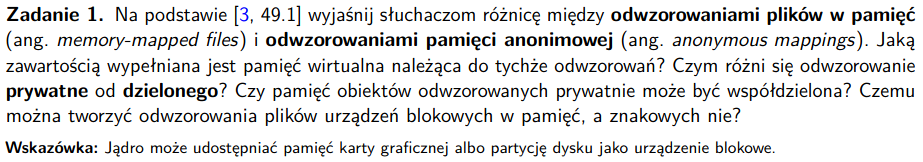

### Pojęcia

- mmap() - tworzu nowe mapowanie pamięci w przestrzeni adresów wirtualnych wołającego procesu

- odwzorowanie plików w pamięć (memory-mapped files) - mapujemy region pamięci pliku do adresów wirtualnych procesu, jak zostanie zrobione to mapowanie można się dostać do zawartości pliku robiąc operacje na zmapowanym regionie pamięci w procesie, strony zmapowane są leniwie (w razie potrzeby) załadowywane do procesu, strony zawierają dane z plików

- odwzorowanie pamięci anonimowej (anonymous mappings) - nie ma swojego pliku na dysku, strony mapowania są zainicjalizowane jako 0, tak jakby mapujemy do wirtualnego pliku z samymi 0, funkcja malloc()

- pamięć z mapowania jednego procesu, może być współdzielona z innymi procesami (oba procesy patrzą na tą samą pamięć RAM)

- może to być spowodowane: po prostu na ten sam plik patrzą, albo zrobiliśmy fork'a

- odwzorowanie prywante - flaga MAP_PRIVATE - modyfikacje do zmapowanej pamięci po stronie jednego z procesów nie jest widoczne w drugim, co więcej zmiany nie są przenoszone do pliku w pamięci fizycznej, jest to realizowane poprzez copy on write (cop), jak proces próbuje zmienić stronę w pamięci, to jądro kopiuje tą stronę (zmienia też oczywiście tablicę stron w procesie) i modyfikuje rzeczy na tej kopii, robimy to też leniwie, tylko jak mamy zapis

- odwzorowanie dzielone - flaga MAP_SHARED - wszelkie modyfikacje zmapowanej pamięci są widoczne dla wszystkich podłączonych do mapowania procesów i zmiany są oczywiście zapisywane w pamięci fizycznej pliku

- przy exec odwzorowania znikają

### Czy pamięć obiektów odwzorowanych prywatnie może być współdzielona? 
- tak i jest współdzielona, dopóki nie ma zapisu do tej pamięci, wówczas robiona jest kopia

###  Czemu można tworzyć odwzorowania plików urządzeń blokowych w pamięć, a znakowych nie?
- odwzorowywanie urządzeń znakowych byłoby bez sensu, bo musielibyśmy robić to sekwencja za sekwencją, a w przypadku bloku mamy zagwarantowaną jego wielkość, umożliwia to wówczas mapowanie konkretnego bloku w pamięci, w przypadku takich sekwencyjnych danych byłoby nie możliwe ich zaadresowanie w pamięci, zbyt różnią się długościami, tracilibyśmy sporo pamięci

# zadanie 2
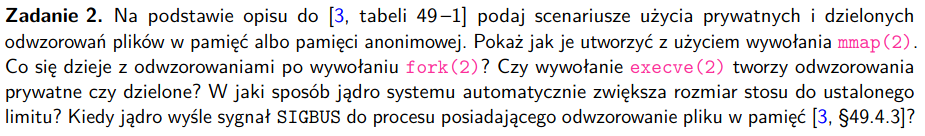

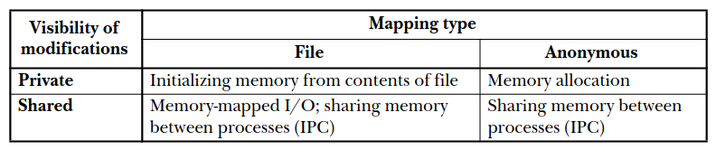

### Scenariusze użycia prywatnych i dzielonych odwzorowań plików w pamięć albo do pamięci anonimowej

- prywatne odwzorowanie w plik - zawartość mapowania jest inicjalizowane z regionu pliku, w razie potrzeby (zmiana w pamięci w jakimś procesie podłączonym do odwzorowania) używany jest copy-on-write - **np inicjalizacja segmentów text i data z danego fragmentu pliku wykonywalnego**

- prywante odwzorowanie anonimowe - każde wywołanie mmap() tworzy nowe mapowanie, niedzielone z innymi mapowaniami anonimowymi tego lub innych procesów, mimo dziedziczenia przy fork() przez dziecko mapowań rodzica, zmiany w danych nie są wodoczne przez mechanizm cop (copy-on-write) - **np malloc()**

- dzielone odwzorowanie w plik - wszystkie mapowania w procesach dzielą to ten sam fragment RAMu, każda zmiana w mapowaniu jest przenoszona do mapowanego pliku, czyli jest widoczna dla wszystkich mapoujących procesów **np może te nam umożliwić zmienianie zawartości konkretnego pliku przez operacje w procesie (alternatywa dla read() i write()), oprócz tego możemy dać niespokrewnionym procesom możliwość dzielenie jedenj pamięci (szybka komunikacja procesów)**

- dzielone odwzorowanie anonimowe - tworzy nowe mapowanie, niedzielące stron z innymi mapowaniami, rożnica między tym odwzorowaniem a prywatnym odwzorowaniem anonimowym jest taka, że strony nie są cop, czyli np po fork() rodzic i dziecko dzielą tę samą pamięć RAM, wszelkie zmiany z jednego procesu są widoczne w drugim - **np umożliwia komunikację między spokrewnionymi procesami**

Inne rzeczy:
- mapowania znikają przy exec()
- mapowania są dziedziczone przy fork()
- mapowania MAP_PRIVATE i MAP_SHARED są dziedziczone
- mapowanie jest widoczne w /proc/[PID]/maps

### Jak tworzyć mapowania przy pomocy ```mmap(2)```
- mmap - syscall, tworzy nowe mapowanie w wirtualnej przestrzeni adresowej procesu wołającego

```C
#include <sys/mman.h>

void *mmap(void *addr, size_t length, int prot, int flags, int fd, off_t offset);

// Returns starting address of mapping on success, or MAP_FAILED on error
```

- addr - gdzie w przeztrzeni adresów wirtualnych procesów ma być zlokalizowany początek odwzorowania (adres musi być podzielny przez 4096 [% 4096 = 0]) **[wiekość strony w bajtach]**, dla NULL jądro wybierze jakiś sensowny adres
- length - ile bajtów ma mieć to mapowanie %4096=0
- prot - maska bitowa - określająca zabezpieczenia na mapowanie, ORujemy maski
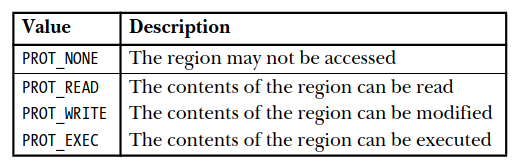
- flags - czy jest to odwzorowanie współdzielone czy prywatne (zawsze trzeba podać MAP_PRIVATE albo MAP_SHARED)

MAP_PRIVATE - zmiany w zmapowanej pamięci nie będą widoczne dla innych mapowań

MAP_SHARED - jądro daje gwarancję, że (co prawda leniwie przy zapisie) ale dane zmienione w jakimś odwzorowaniu wylądują na dysku, są też inne flagi
- fd - plik zwykły albo urządzenie blokowe, do którego wykonywane jest odwzorowanie (ignorowane w odwzorowaniach anonimowych)
- offset - adres początku odwzorowania w pliku na dysku %4096=0 (ilość bajtów oczywiście taka sama jak length)

#### Jak utworzyć odwzorowania podane wyżej
```C
// prywatne odwzorowanie w plik
char *addr = mmap(NULL, int, prot, MAP_PRIVATE, FILE, OFFSET)

// prywante odwzorowanie anonimowe
char *addr = mmap(NULL, int, prot, MAP_PRIVATE, -1, 0)

// dzielone odwzorowanie w plik
char *addr = mmap(NULL, int, prot, MAP_SHARED, FILE, OFFSET)

// dzielone odwzorowanie anonimowe
char *addr = mmap(NULL, int, prot, MAP_SHARED, -1, 0)
```


### Co się dzieje z odwzorowaniami po fork()
- dziedziczą one typ mapowania (dzielony/prywatny)
- jak mapowanie było dzielone, to wszelkie zmiany w dziecku są widoczne w rodzicu i vice versa 
- jak mapowanie było prywatne mamy mechanizm cop i zmiany w jednym odwzorowaniu nie są widoczne w drugim, dziecko widzi tylko kopię odwzorowania ojca z momentu wykonania fork()

### Czy exec() tworzy odwzorowania prywatne czy dzielone?
- exec() czyści wszystkie odwzorowania - stara przestrzeń adresowa procesu jest zamieniana na nową
- tworzy odwzorowania prywatne, ponieważ chcemy wyizolować uruchomiony program od istniejących odwzorowań

### Jak jądro SO automatycznie zwiększa rozmiar stosu do ustalonego limitu?
- w argumencie z flagami możemy dodać flagę MAP_GROWSDOWN - jak mapowanie dotknie 'guard' strony jest ono rozszerzane o kolejną stronę, tak robimy aż dojdziemy do końca stack'a (RLIMIT_STACK), wtedy otrzymamy SIGSEGV

### Kiedy jądro wyśle SIGBUS do procesu mającego odwzorowanie pliku w pamięć?
- przez zaookrąglanie do rozmiaru strony pojawia się problem, jak to zaokrąglenie sięgnie do regionu, przekraczającego limit, dostaniemy SIGSEGV, powoduje to koniec procesu

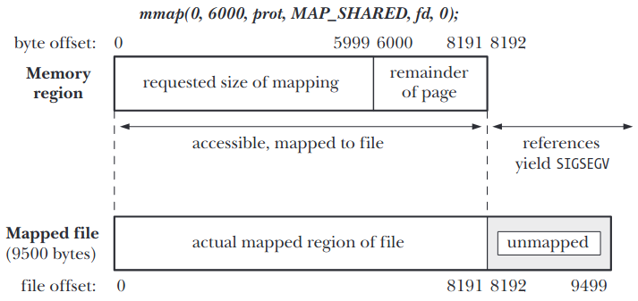
*
**SIGBUS tutaj dopiero**
- drugim problemem jest to gdy sam plik jest krótszy niż strona, wtedy zaokrąglenie tworzy nam mapowanie większe niż plik jest w rzeczywistości, takie wartości zmapowane są zainicjowane do 0, to mapowanie będzie dzielone z innymi porcesami, jak length będzie dostatecznie duży, zmiany do tych bajtów nie są zapisywane do pliku

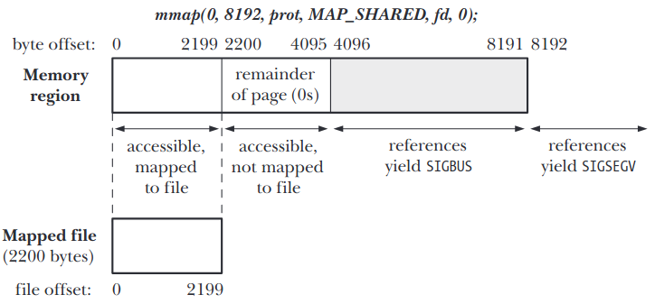

- kiedy mapowanie zawiera strony poza zaokrąglonymi stronami (na rys. bajty od 4096 w prawo), wtedy dostęp do tych stron wygeneruje sygnał SIGBUS (ostrzeżenie dla procesu że **nie ma regionu z pliku, który mapuje się do tej pamięci**), operacje poza mapowaniem też generują SIGSEGV

# zadanie 3
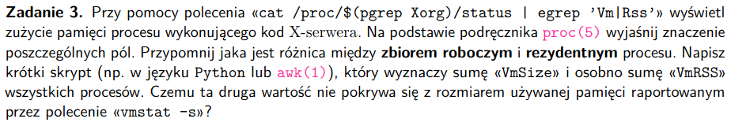

```
cat /proc/$(pgrep Xorg)/status | egrep 'Vm|Rss'
```
```
VmPeak:	 2059648 kB -> najwyższa wartość wielkości pamięci wirtualnej
VmSize:	 1995404 kB -> obecna wartość wielkości pamięci wirtualnej
VmLck:	       0 kB -> wielkość pamięci zablokowanej przez proces (ta nie może zostać przepisana z RAMu na dysk)
VmPin:	       0 kB -> strony, których nie można przesunąć, bo coś z procesu potrzebuje dostępu do RAMu
VmHWM:	  155016 kB -> wielkość rezydenta procesu (wartość niedokładna)
VmRSS:	  137320 kB -> wielkość zbioru rezydenta (RssAnon + RssFile + RssShmem) (wartość niedokładna)
RssAnon:	   73364 kB -> wielkość pamięci anonimowej rezydenta
RssFile:	   19948 kB -> wielkość odwzorowań do plików rezydenta
RssShmem:	   44008 kB -> wielkość dzielonej pamięci
VmData:	  184684 kB -> rozmiar data (wartość niedokładna, te dwa poniżej też)
VmStk:	     132 kB -> stack
VmExe:	    1696 kB -> text
VmLib:	  140264 kB -> wielkość kodu z biblioteki współdzielonej
VmPTE:	     944 kB -> wielość tablicy stron
VmSwap:	       0 kB -> wielkość danych, które przenieśliśmy z RAM na dysk (swapped-out memory)
```

```
man 5 proc
```

- proc to rodzaj systemu plików dla procesów

### Różnice między zbiorem roboczym i rezydentnym
- zbiór rezydentny - strony z procesu, które faktycznie są w pamięci RAM

- nieużywane strony znajdują się na dysku w 'swap area', w przypadku braku obecności danej strony mamy page fault i pobieramy ją z dysku, może być mniejszy niż zbiór roboczy przez zapisywanie rzadko używanych stron na dysk

- zbiór roboczy - zbiór stron programu, które są używane przez proces w danym okresie czasu, zmienia się w trakcie wykonywania programu, zawiera strony ostatnio używane przez proces

### Skrypt i brak pokrywania się
```
zad3.py

VmSize sum:  11040604064
VmRSS sum:  13009472
```

```
vmstat -s

     16256520 K total memory
      7434400 K used memory --- to jest nasza suma ---
      7042916 K active memory
      6273604 K inactive memory
       623508 K free memory
       606172 K buffer memory
      7592440 K swap cache
            0 K total swap
            0 K used swap
            0 K free swap
     15263167 non-nice user cpu ticks
        62402 nice user cpu ticks
      5300401 system cpu ticks
    237481672 idle cpu ticks
       580730 IO-wait cpu ticks
            0 IRQ cpu ticks
       129644 softirq cpu ticks
            0 stolen cpu ticks
     15013664 pages paged in
    111837868 pages paged out
            0 pages swapped in
            0 pages swapped out
   1293518077 interrupts
   1443451391 CPU context switches
   1727888266 boot time
       851099 forks
```

- to co wyliczył skrypt jest prawie 2x większe, active memory w vmstat -s
- jest to spowodowane tym, że zbiory pamięci rezydencyjnej nie muszą być rozłączne między procesami,
nie uwzględniamy dzielenia pamięci

# zadanie 4
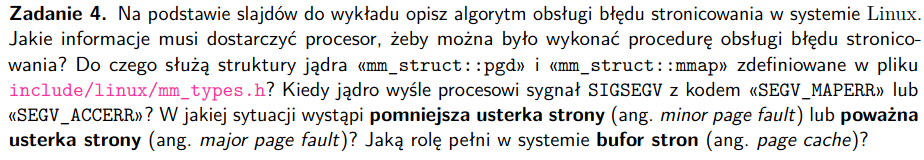


### Opis algorytmu obsługi błędów strony
- występują np jak potrzebna jest jakaś pamięć, której nie pobraliśmy, np w sekcji data

Normalna obsługa:
- alokujemy nową ramkę
- robimy kopiowanie zawartości, jak było cop
- aktualizujemy tablicę stron
- dodajemy mapowanie do TLB, ewentualnie czyszcząc TLB
- powrót do instrukcji wywołującej page fault

---- jak u nas ----

1. Mamy błąd strony
2. Jądro przegląda vm_are_struct, chodzimy po segmentach
* jądro ma dostęp do (dostarcza to CPU)
    * fault_addr - jaki adres wywołał błąd strony
    * fault_pc - jaka strona to wywołała
    * fault_size - ile bajtów ktoś chciał ściągnąć
    * fault_prot - jakie były uprawnienia przy robieniu dostępu do strony
3. Jak uprawnienia danej strony (vm_prot) zgadzają się z fault_prot, np próbowaliśmy zrobić odczyt, można robić odczyty, wtedy mamy normalny błąd strony jądro naprawia (zastosujemy normalną obsługę, to co wyżej)
4. Czasem algorytm może zamiast obsłużyć page fault wyrzucić błąd
- SIGSEGV
    1. jądro nie znalazło odwzorowania adresu fault_addr
    2. fault_addr należy do jakiegoś segmentu, ale uprawnienia się nie zgadzają

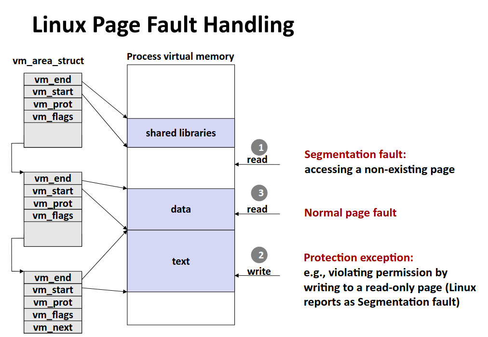


### Do czego służą mm_struct::pgd i mm_struct::mmap
pgd:
- jest to tablica stron najwyższego poziomu
- każdy z vm_area_struct ma swój obiekt wspierający - plik z którego są sprowadzane strony danego segmentu

mmap:
- wskaźnik na segmenty typu vm_area_struct

Czy to jest tak, że vm_area_struct to jest po prostu taka 'konfuguracja' dla działań na stronach z danego regionu pamięci wirtualnej? Natomiast same strony są możliwe do odczytu poprzez PGD?

- każdy proces ma swoją przestrzeń adresową i tablicę stron ją opisującą
- jak dwa procesy chcą wykorzystywać tą samę pamięć fizyczną RAM, wtedy następuje mapowanie


### Kiedy jądro wyśle procesowi SIGSEGV
- z kodem SEGV_MAPPER - podczas przeszukiwania vm_area_struct (listy segmentów tego typu) jądro nie odnalazło adresu podanego do niego przez CPU w fault_addr
- z kodem SEGVACCER - jądro znalazło adres, ale fault_prot nie daje dostatecznych uprawnień na odczytanie strony z zabezpieczeniami vm_prot


### Usterki stron
- większość programów robi dużo referencji do małej liczby stron
- aby zwiększyć szybkość cachujemy mapowanie z przestrzeni wirtualnej do fizycznej w TLB, nie trzeba
wówczas przechodzić przez tablicę stron (Translation Lookaside Buffer), jest w środku MMU

- soft miss - strona jest w pamięci RAM, nie ma jej w TLB
- hard miss - strona jest poza pamięcią RAM, trzeba ściągnąć stronę z dysku

- page table walk - przeglądanie mapowań w tablicy stron
- **pomniejsza ustarka strony** - minor page fault - page walk nie znalazł danej strony w tablicy stron procesu, ale strona została załadowana przez inny proces do RAMu, mapujemy stronę w tablicy stron procesu, mogło być też tak, że dana strona była jeszcze w buforze stron
- **poważna usterka strony** - strona nie jest w tablicy stron procesu ani nie ma jej w RAMie, musimy ją ściągnąć z dysku

- jak w ogóle mamy niepoprawny adres to robimy segmentation fault i proces umiera

### Rola bufora stron
- bufor stron - page cache - cachowanie stron w nieużywanych regionach RAMu, żeby było szybciej niż pobierać z dysku, jak modyfikujemy jakąś stronę jest ona umieszczana w page cache z bitem dirty, system leniwie zapisuje te strony na dysk, strony czyste od razu można umieścić na dysku

# zadanie 5
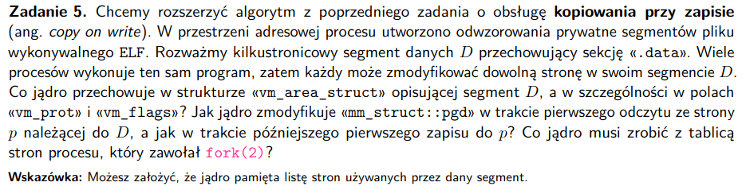

### Pojęcia
- kopiowanie przy zapisie - copy on write - kiedy mamy odwzorowanie prywatne, a konieczna jest modyfikacja strony mamy mechanizm copy on write, polega on na stworzeniu kopii danej strony w pamięci fizycznej i modyfikacji tej skopiowanej strony

### Co jądro przechowuje w vm_area_struct
* vm_end - pierwszy bajt po ostatnim najwyższym adresie
* vm_start - najniższy adres
* vm_prot - uprawnienia read/write dla tego regionu pamięci wirtualnej (wszystkich stron z regionu)
* vm_flags - określają czy ten region pamięci wirtualnej (wszystkie strony z tego regionu) jest dzielony czy 
prywantny (shared or private)
* vm_mm - wskaźnik na strukturę mm_struct
* vm_next - wskaźnik na kolejną strukturę vm_area_struct

### Read i write strony przy cop

#### Jak jądro zmodyfikuje mm_struct::pgd przy pierwszym odczycie strony p z należącej do segmentu D, przechowującego sekcję .data
- read spowoduje page-fault i do PTE, które jest widoczne poprzez pgd, zostanie zapisany wskaźnik na stronę p

### Jak zostanie zmodyfikowane mm_struct::pgd przy operacji zapisu do p
- dostajemy page-fault od CPU, bo w danym regionie mamy tylko write
- następnie jądro obsługuje wyjątek i widzi, że strona miała ustawione COP
- jądro tworzy kopię strony
- nowa strona jest mapowana w przestrzenie adresowej procesu
- wstawiamy nowy rekord do pgd z flagami read/write
- kopiujemy stronę pod nowy adres

### Co jądro robi z tablicą stron procesu, który zawołał fork(2)?
- jest robiona kopia mm_struct (chociaż nie zawsze), vm_area_struct (to na pewno musi skopiować), opcjonalnie kopiuje tablicę stron
- **w oryginalnym procesie wszystkie strony w tablicy stron z segmentów prywantnych, z uprawnieniami read/write muszą się zmienieć na read only**
- wszystkie segmenty z obszaru vm_ares_struct oznaczamy jako COP, więć w razie potrzeby dalej można zapisywać coś do tych stron, przez read only (poprzedni punkt) uzyskamy to, że nie mamy duplikatów tych samych danych między rodzicem i dzieckiem

# zadanie 6
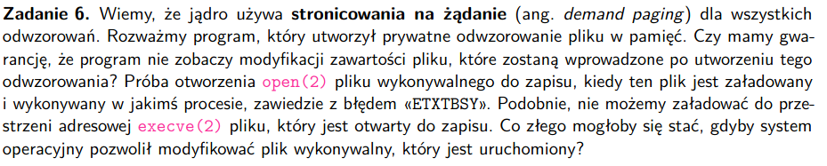

### Pojęcia
- stronicowanie na żądanie - demand paging - na samym początku procesy są rozpoczynane bez żadnych stron w pamięci, jak CPU próbuje pobrać pierwszą stronę to dostaje page-fault, kernel wtedy pobierze nam tą stronę, **pobieramy więc strony tylko jak są potrzebne**

- mamy program z prywatnym odwzorowaniem pliku w pamięć

### Czy mamy gwarancję, że program nie zobaczy modyfikacji tego pliku wprowadzonych po utworzeniu odwzorowania
- mamy stronicowanie na żądanie, więc między mapowaniem a zapisem do RAM mogła pojawić się zmiana w pliku, którą potem zauważymy, strony mogły jeszcze nie zostać załadowane
- zanim ściągniemy dane, inny proces też mógłby zapisać coś do tego pliku, stąd brak gwarancji
- **jak mamy odwzorowanie pliku w pamięć nie powininniśmy do niego pisać**

### Co się może stać jak SO pozwoliłoby na modyfikację uruchomionego pliku wykonywalnego?
- no np możnaby wtedy wrzucić jakiś program który robiłby cokolwiek, po prostu podmieniająć plik wykonywalny
- np możemy mieć program przeglądający pliki, z uprawnieniami root, a my zapiszemy sobie w tym pliku program, który usuwa wszystkie pliki

# zadanie 7
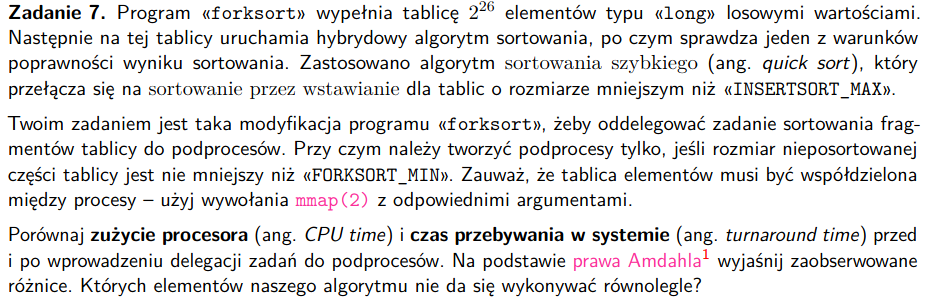

### Rodzaje czasów
- zużycie procesora - CPU time - aktywny czas działania procesu
- czas przebywania w systemie - turnaround time - zawiera wszystkie opóźnienia, jest to czas od rozpoczęcia do zakończenia procesu

### Bez podprocesu
```
real    0m9,548s
user    0m9,142s
sys     0m0,394s
```

### Z podprocesem
```
real    0m5,058s
user    0m12,205s
sys     0m1,143s
```

### Prawo Amdahla
- jeśli danych obliczeń nie da się urównoleglić, to niezależnie od liczby dodatkowych procesorów nie zwiększa się szybkość obliczeń
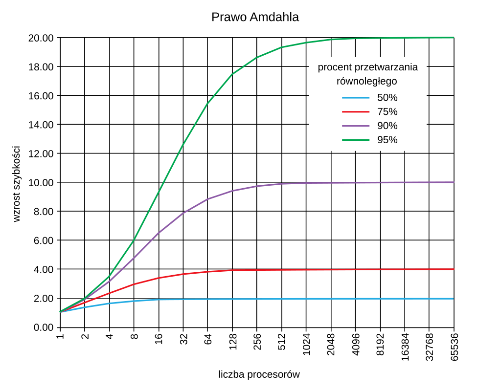


### Czego się u nas nie da urównoleglić
- swap elementów
- insert sort można ale się nie opłaca
- partition nie urównoleglimy

# zadanie 8
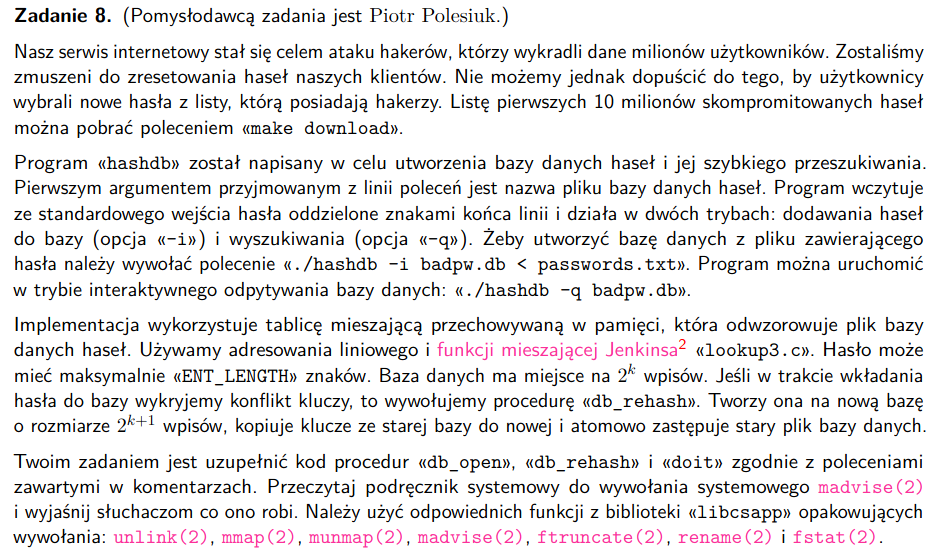