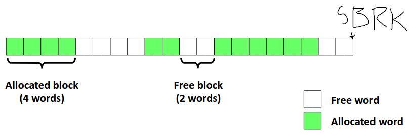
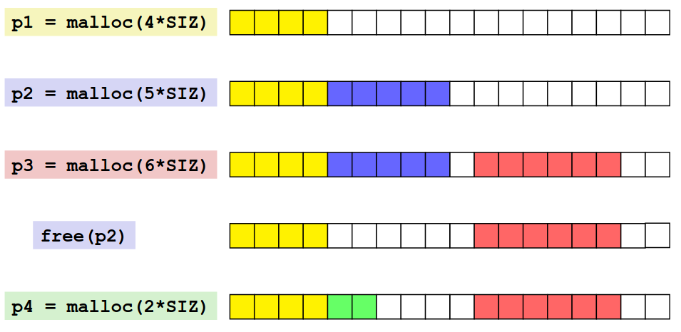
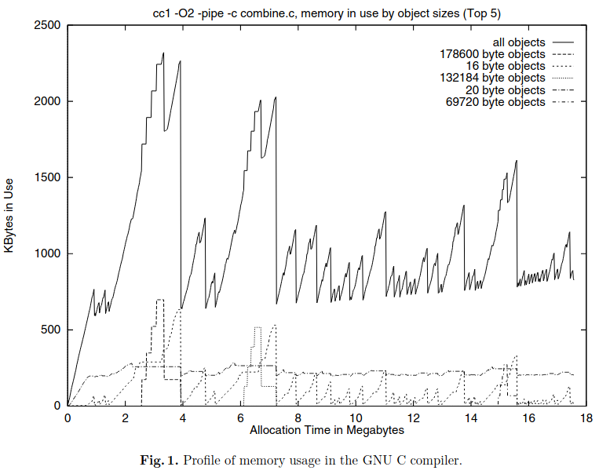
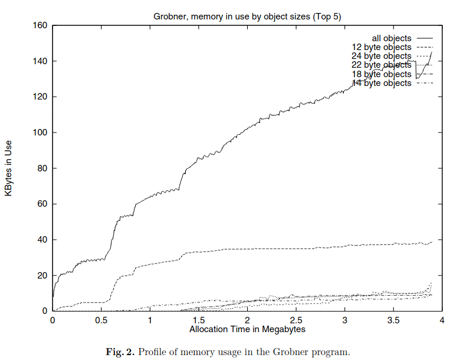
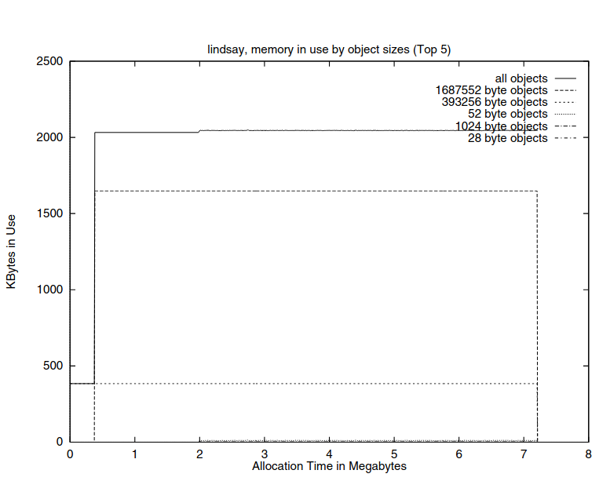
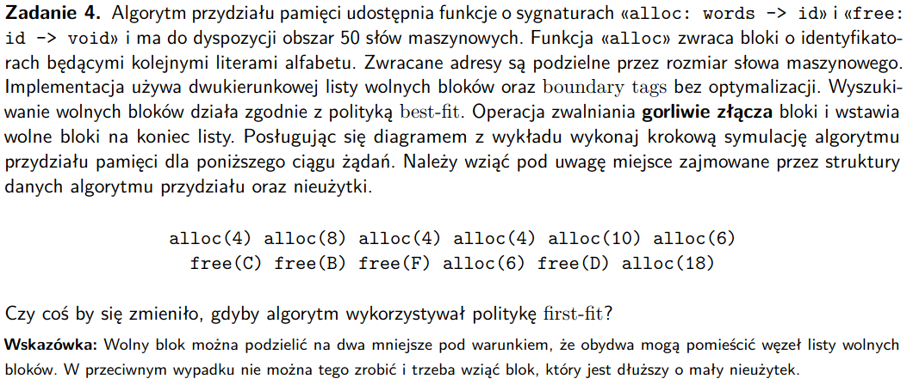
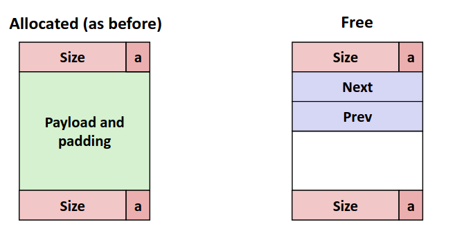
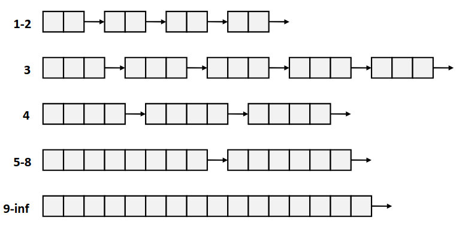
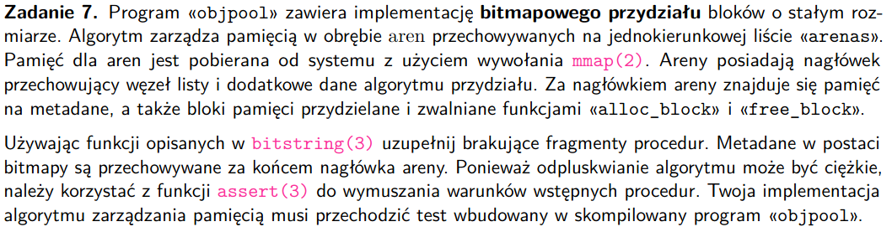

# zadanie 1


- sbrk(2) - rozszerza przestrzeń danych procesu, przesuwając program break
- mmap(2) - tworzy nowy mapowanie wirtualnej przestrzeni adresowej do pamięci fizycznej 
- munmap(2) - usuwa mapowania do określonego zakresu adresów

### Wady stosowania ```sbrk(2)``` do zarządzania rozmiarem sterty przez ```malloc(3)```
- mamy sporą fragmentację danych, ponieważ bloki są wyrównywane do 8 bajtów (dwóch słów), za każdym razem jak brakuje części miejsca rozszerzamy pamięć sbrk(2) zamiast ją gęściej upakować
- czyli jak mamy szereg małych alokacji i potem przychodzi duża, to przesuniemy brk bardzo mocno, mimo, że jest miejsce

- malloc - jak brakuje miejsca przesuwamy brk
- free - zwalniamy daną pamięć, ale brk zostaje na swoim miejscu, bo jeszcze inne bloki są zaalokowane, żeby przesunąć
brk musielibyśmy zwolnić pamięć z tyłu sterty


### Jak problemy ```sbrk(2)``` rozwiązuje ```mmap``` i ```munmap```
- malloc - jak wiemy, które regiony pamięci są wolne to możemy po prostu tam podpiąć pamięć z procesu, mapując ją w to miejsce,
jak np mamy dużo małych alokacji możemy je po prostu pomapować do wielu niezależnych regionów pamięci, 
nie mamy też problemów z alokowaniem większych stron, po prostu wrzucimy je w wolne miejsca
- mmap jest thread safe, w przeciwnieństwie do sbrk
- free - używając munmap możemy po prostu zwolnić pamięć z danego regionu, a nie jak w przypadku sbrk tylko z tyłu
- sporą wadą jest to, że mmap bierze całą stronę (4KiB), więc jak chcemy alokować mniejszą pamięć to robimy dość nieekonomicznie
- dla małych alokacji sbrk() jest lepsze

### Kiedy procedura *free* może zwrócić pamięć do jądra?
- mamy stałe:

M_TRIM_THRESHOLD - minimalna ilość bajtów wolnych na górze sterty do tego aby sbrk skróciło stertę, wtedy ta pamięć jest zwracana
do jądra

M_MMAP_THRESHOLD - określa nam kiedy alokacja będzie robiona mmap (od jakiej wielkości) - możemy tą pamięć potem zwolnić munmap'em
i jądro odzyska tą pamięć po jego zakończeniu z sukcesem

- jak kończy się program, to cała pamięć zwracana jest do jądra

# zadanie 2


### Pojęcia
Fragmentacja wewnętrzna - w danym zaalokowanym bloku pamięci mamy pustą pamięć, blok trzyma mniej danych niż wynikałoby
to z jego wielkości
- spowodowana przez utrzymywanie struktury sterty, przez jakiś padding na dane, jakieś polityki implemenacyjne
- łatwa do określenia, ponieważ zależy od już zrealizowanych alokacji

Fragmentacja zewnętrzna - występuje jak mamy wystarczająco miejsca w stercie pod względem pamięci, ale nie ma odpowiednio
dużego wolnego bloku, na ten który chcemy zaalokować
- trudna do zmierzenia, bo zależy od tego co zostanie zaalokowane

kompaktowanie (coalescing) - jeśli w momencie free zwolnimy jakiś blok i ten blok będzie miał za i/lub przed sobą wolny blok 
to aby zapobiec fragmentacji zewnętrznej chcielibyśmy go scalić, żeby dla przyszłych alokacji było dostatecznie dużo
wolnego miejsca, były dostatecznie duże wolne bloki

### Czemu algorytm *malloc* nie może stosować kompaktowania
(sklejanie zaalokowanych bloków pamięci)
- w trakcie kompaktowania łączymy bloki pamięci ze sobą, mogły być do tych bloków jakieś wskaźniki, co spowodowałoby,
że musielibyśmy zaaktualizować wszystkie te wskaźniki w programie na początek zaalokowanego bloku, potencjalnie dużo pracy

### Dwie główne przyczyny fragmentacji zewnętrznej
1. Odzizolowane, niezsynchronizowane zwalnianie bloków pamięci (mamy ciągły blok i zwalniamy coś z jego środka, nic tam potem nie wstawimy)
2. Alokowanie zależne od czasu, zwalnianie dużych bloków i alokowanie też dużych bloków o innej wielkości, albo zwalnianie małych i alokowanie dużych,
takie alokacje zależne od miejsca w programie

# zadanie 3


### Opowieść o trzech wzorcach przydziału pamięci w programach
- ramp - rośnie powoli przez całą długość programu i nagle spada na końcu, potrzebowaliśmy przez dłuższy etap
jakiejś większej struktury
- peak - szybko rośnie, spada przed końcem, zbudowaliśmy krótkożyjące duże struktury
- plateau - cały czas używamy mniej więcej tyle samo pamięci








### Na podst ```Exploiting ordering and size dependencies``` opisać związek między czasem życia bloku a jego rozmiarem
- generalnie chcielibymy umieszczać podobnie długo żyjące zaalokowane bloki obok siebie, jest to trudne, mamy jakieś
proste pomysły
1. Obiekty zaalokowane w mniej więcej tym samym czasie w podobnym czasie ppb umrą
2. obiekty o różnych typach służą do różnych celów, więc ppb umrą w różnych momentach,
różne typy odpowidają ppb różnym rozmiarom, zatem chcemy unikać ich przeplatania, żeby krótko żyjące nie były obok długo żyjących
**zatem chcemy, aby obiekty zaalokowane w tym samym czasie były obok siebie oraz żeby obiekty o tym samym rozmiarze 
też w tym dopasowaniu były obok siebie** 

### Opisać różnice między politykami znajdowania wolnych bloków:
- metod *fit* używamy do znajdowania wolnych bloków pamięci, do których można wrzucić nasze dane
- first-fit - idziemy po stercie od początku i znajdujemy pierwszy żądanej wielkości blok, zanim zaalokujemy w nim
dane, to robimy split na tym bloku, część dla danych, część dla wolnej pamięci -  O(n)
- next-fit - tak jak first-fit, ale zaczynamy od tego bloku, na którym poprzednio skończyliśmy,
    - czasem może być szybsze niż O(n)
    - możliwe że fragmentacja będzie gorsza (according to wykład)
- best-fit - przechodzimy po liście, znajdujemy blok, w którym dane się zmieszczą i zostanie najmniej nieużywanych bajtów
    - zmniejsza fragmentację
    - najwolniejsza z metod

### Słabe i mocne strony poszczególnych podejść ```fit```
- best-fit
    - 'bloki mogą być dobre, ale nie świetne', tzn wykorzystamy te dobre bloki, ale nie w całkowitej ich objętości i 
    zostawimy jakieś nieużywalne resztki z bloków
    - kiepsko sprawdza się dla dużej sterty
    - złożoność -> zaalokowane_dane/wszystkie_dane * największy_obiekt/najmniejszy_obiekt

- first-fit
    - pierwsze podzielimy bloki na początku sterty, co sprawi że będziemy mieć dużo małych luk 'drzazg' już na samy początku,
    czyli wydłużymy następujące potem alokacje

- next-fit
    - mamy pointer mówiący gdzie zaczynamy poszukiwania i krąży on przez całą stertę, to może się zdarzyć,
    że różne fazy programu poprzeplatają się nam w pamięci, co zwiększy potencjalnie fragmentacje, jak 
    te alokacje umierają w różnym czasie
    - można drzewem zooptymalizować


- o tych trzech algorytmach zakładamy, przechodzenie sekwencyjne, czyli mamy pole do optymalizacji np drzewami

**według artykułu next-fit spowodował większą fragmentację niż best-fit albo address-ordered first fit,
 LIFO jest jeszcze gorsze od addres-ordered**


 # zadanie 4
 

https://docs.google.com/spreadsheets/d/1uyjgb6bH-ulIfl17TnnVD74vvnZxsY1GByH-m1w7pEw/edit?usp=sharing

### Jak to ogólnie wygląda
 

### Jak wyglądają bloki zaalokowane i niezaalokowane


 - gorliwe złączanie zwalnianych bloków - złączamy od razu jak możemy, wszystkie dostępne bloki

 - skoro wolny blok można podzielić na dwa mniejsze pod warunkiem, że obydwa mogą pomieścić węzeł listy wolnych
 bloków, to oznacza to, że pusty blok musi być co najmniej wielkości 4 słów, musimy trzymać wielkość bloku w dwóch słowach,
 oprócz tego musimy trzymać wskaźniki na kolejny i poprzedni element

 # zadanie 5


### Kubełki z wolnymi blokami


- w przypadku zwolnienia pamięci blok jest wrzucany do konkretnej grupy bloków
- jak alokujemy używamy bloku o konkretnej wielkości

- łączy nam bloki jakąś logiką, a nie fizycznie

- simple segregated storage - jak zabraknie bloku o danej wielkości, robimy sbrk i dorzucamy trochę bloków o
danej wielkości do listy

- nie potrzeba żadnych header'ów dla zaalokowanych obiektów
- dużą wadą jest to że jak zrobimy sporo bloków o danej wielkości, potem je zwolnimy, to nie będziemy
w stanie ich wykorzystać ponownie dla innego rozmiaru bloku, w konsekwencji będziemy mieli sporo nieużytków

### Pojęcia
- algorytm kubełkowy - segregated-fit - wariant kubełkowego przechowywania wolnej pamięci, gdzie wolne bloki
są zoorganizowane w kubełki z określoną wielkością bloku
- węzeł strażnik - węzeł, którego używamy jako końca i początku listy więzanej żeby wiedzieć bez bawienia się w NULL,
czy węzeł jest pierwszy czy ostatni
- leniwe złączanie - złączamy wolne bloki dopiero jak musimy to faktycznie zrobić

### Porównanie listy wolnych bloków ze strategią best-fit
#### lista wolnych bloków z best-fit
- mamy listę z wolnych bloków, zoorganizowaną w listę wiązaną (albo psedowiązaną)
- każdy blok ma: rozmiar bloku i/lub wskaźnik na następny/poprzedni blok
- jak chcemy zaalokować pamięć o rozmierze X to przeszukujemy całą stertę i znajdujemy blok, który generuje najmniejszą fragmentację
- jak chcemy zwolnić pamięć to ją zwalniamy i przepinamy wskaźniki tak, by zwolniony region był albo na końcu albo na początku listy

#### strategia kubełkowa
- mamy listę list z blokami wolnej pamięci o różnych rozmiarach
- jak chcemy zaalokować pamięć rozmiaru X to szukamy bloku o co najmniej tym rozmiarze, robi się nam taki trochę best-fit
- jak zwalniamy pamięć, to scalamy ją z jakąś wolną pamięcią, oddajemy ten nowy blok do danej listy bloków


### Co robi malloc jak nie ma wolnego bloku o danym rozmiarze
- jak nie ma bloku o danym rozmiarze szuka bloku o większym rozmiarze i dzieli go tworząc żądany rozmiar - O(logn)
- jak nie możemy znaleźć bloku o większym rozmiarze, robimy sbrk(), pobieramy stronę z pamięci bierzemy z niej jeden blok, którego nam brakuje

### Gdzie przechowywać węzeł strażnik - sentinel node
- w liście, między pierwszym a ostatnim blokiem
- nam może być pierwszym elementem w liście, może być na początku lub na końcu

### Leniwe złączanie
- leniwe złączanie ma sens, jak tworzymy dużo małych obiektów na chwilę i nie chcemy ponosić kosztów ich scalania 
cały czas, jak mamy dużą fragmentację to wtedy dobrze jest używać leniwego złączania, żeby nie ponosić zbyt dużych kosztów
- **zakładamy, że konkretne bloki pamięci będą za chwilę znowu użyte i nie opłaca się ich łączyć**
- jeśli nie złączyliśmy jakiś bloków, to nie mogą być one wykorzystane dla jakiś alokacji i przez to użyjemy 
bloków o większym rozmiarze, które sprawdzą się potencjalnie gorzej
- takie podejście wpływa też na to co gdzie trzymamy z tego samego co wyżej powodu

# zadanie 6


### Scenariusz
Rozważ następujący scenariusz: program poprosił o blok długości n (zamiast n + 1), po czym wpisał tam n
znaków i zakończył ciąg zerem.
- wtedy przez przypadek zakończymy wcześniej naszą niejawną listę, bo ustaliliśmy że 0 oznacza jej koniec,
skróci nam się zaalokowana pamięć
- aby wykryć błąd można zrobić jakiegoś if'a który sprawdzi w trakcie zapisu, czy to gdzie wpisujemy nie
ma jakiejś lczby tj. czy nie jest początkiem bloku

### Pytania
• jak wygląda struktura danych przechowująca informację o zajętych i wolnych blokach?
niejawna lista jednokierunkowa
• jak przebiegają operacje «alloc» i «free»?
tak jak kod
• jaka jest pesymistyczna złożoność czasowa powyższych operacji?
O(n)
• jaki jest narzut (ang. overhead) pamięciowy metadanych (tj. ile bitów lub na jeden blok)?
przetrzymujemy rozmiar w postacie 8 bitowego int'a, i tylko rozmiaru używamy
• jaki jest maksymalny rozmiar nieużytków (ang. waste)?
jeżeli alokowalibyśmy po 1 znaku to pojawiłoby się bardzo dużo nieużytków
(case z 'free block is to large')
• czy w danym przypadku fragmentacja wewnętrzna lub zewnętrzna jest istotnym problemem?
raczej zewnętrzna, bo wewnątrz nie musimy dbać o żadne wyrównania

# zadanie 7


- bitmapowy przydział bloków - mamy bitmapę, która wskazuje nam na bloki wolne i zajęte, odpowiednio mająz zapalone
i zgaszone bity

# zadanie 8

