# zadanie 1
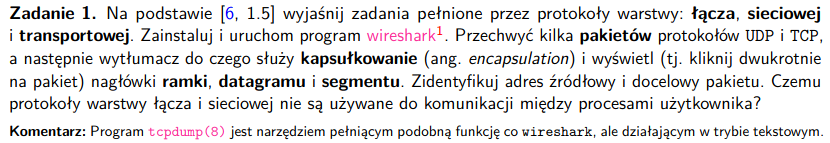

### Pojęcia
- pakiety - standardowa jednostka przesyłanych danych w protokole internetowym, składająca się z nagłówków warstw i payload'u, właściwych danych

- kapsułkowanie (encapsulation) - proces nadawania nagłówków przez warstwy pakietom z warstw wyższych,
owijamy informacje z wyższych warstw nowywmi informacjami, koniecznymi do prawidłowego przesłania danych,
służy do umożliwienia przesłania danych z jasno oddzielonymi metadanymi dla ich łatwiejszego odczytania w konkretnych warstwach

- nagłówki ramki - nagłówek dawany datagramowi z warstwy sieciowej gdy przechodzi przez warstę łączną, tworzy nam się ramka z warstyw łącznej

- nagłówki datagramu - nagłówek dawany segmentowi z warstwy transportowej, zawiera informacje  adresach systemowych źródła i odbiorcy

- nagłówki segmentu - metadane potrzebne warstwie transportowej odbiorcy do odebrania wiadomości i np dostarczenia jej do konkretnej aplikacji, zawiera też bity błędów, które mogły się przydarzyć  w trakcie transportu

- kapsułkowanie może być bardzo skomplikowane, np dla dużej wiadomości możemy mieć podział na małe segmenty transportowe, które jeszcze są podzielone na różne datagramy z warstwy sieciowej

### Zadania pełnione przez protokoły warstwy: łącznej, sieciowej i transportowej
- warstwy pozwalają nam na łatwiejszą kontrolę nad strukturą, zmieniając jakąś warstwę, ale
przy tym pilunjąc aby przyjmowała określone dane i zwracała określone dane możemy ją dowolnie w środku modyfikować

- service model - jakie usługi oferuje dana warstwa do warstwy powyżej

- stos protokołów internetowych składa się z warstw: physical, link, network, transport i application layers

- **warstwa aplikacyjna** - warstwa z sieciowymi aplikacjami, np protokół HTTP (request i transport dokumentów sieciowych), SMTP - transfer e-maili, FTP - transfer plików między dwoma systemami, DNS (protokół do tłumaczenia adresów na numeryczne)

- **warstwa transportowa** - transportuje wiadomości z warstwy aplikacyjnej pomiędzy endpointami, **segment** jest tylko w TCP, bo to jest przekazywanie strumieniowe - pakiet warstwy transportowej - TCP
    - TCP - gwarantujemy dostawę, pilnujemy sender/receiver speed matching, dzieli wiadomości na krótsze, żeby łatwiej było je przesłać

- **warstwa sieciowa** - przenosi pakiety z warstwy sieciowej **(datagramy)** z jednego hosta do drugiego - 
TCP albo UDP w źródle daje segment z warstwy transportowej i adres docelowy, a warstwa sieciowa przekaże go do warstwy transportowej odbiorcy, zawiera protokół IP, umożliwiający komunikację z innymi sieciami **transport międzysieciowy**

- **warstwa łączna** - przekazuje datagramy z warstwy sieciowej, do kolejnej warstwy sieciowej, de facto umożliwia przesyłanie informacji w tej samej sieci - Ethernet, WiFi, jakieś kablowe rzeczy, pakiety warstwy łącznej to **frame**, generalnie rola to **transport wewnątrzsieciowy**,


- **warstwa fizyczne** - jak przekazujemy bity z ramki z jednej sieci do drugiej, różne kable itp.

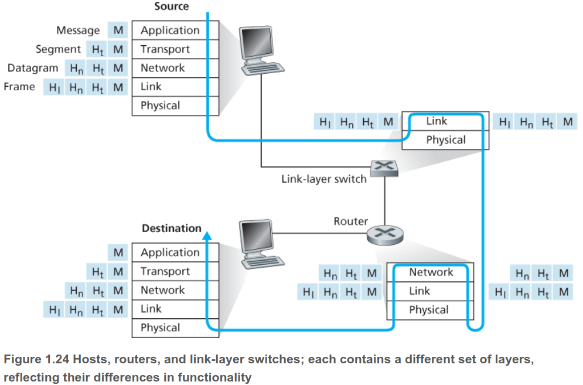

### Zabawa tcpdump

```
sudo tcpdump -XX -i any -c5 -nn tcp
```
- nagłówki ramki, datagramu, segmentu
```
13:25:11.686272 wlp2s0 In  IP 142.250.180.74.443 > 192.168.69.152.42414: Flags [P.], seq 3544141089:3544141245, ack 1510925696, win 892, options [nop,nop,TS val 2206796664 ecr 4185332936], length 156
	0x0000:  0800 0000 0000 0003 0001 0006 966c bf93  .............l.. ---- headery ----
	0x0010:  c70d 0000 4500 00d0 7f1b 0000 7506 7c87  ....E.......u.|.
	0x0020:  8efa b44a c0a8 4598 01bb a5ae d33f 4d21  ...J..E......?M!
	0x0030:  5a0e e580 8018 037c 7276 0000 0101 080a  Z......|rv......
	0x0040:  8389 0b78 f977 1cc8 1703 0300 511f a6df  ...x.w......Q...
	0x0050:  a92b 9737 6550 5837 a91c 5b13 00cc dd4b  .+.7ePX7..[....K
	0x0060:  0016 19cc 4216 d2f5 ddfe 6af9 bd7a 49cd  ....B.....j..zI.
	0x0070:  cd1a fa3c 56b9 b1da 0dd5 bd4d 1fb5 73ac  ...<V......M..s.
	0x0080:  658c 4a8d f9ff 9596 b1c7 b448 9fc4 de8f  e.J........H....
	0x0090:  cf1b 4096 74a8 8005 b9dd 079d 36cd 1703  ..@.t.......6...
	0x00a0:  0300 1a20 e557 8da1 9c18 e075 e6d4 cd3f  .....W.....u...?
	0x00b0:  730c 42cd e3b7 80c0 93ef cd95 5d17 0303  s.B.........]...
	0x00c0:  0022 30ae f545 4c5d 95f2 8c9e ee5c 1fb7  ."0..EL].....\..
	0x00d0:  65a8 bf45 f519 2220 e8ae 7d36 457d 4d3b  e..E.."...}6E}M;
	0x00e0:  c547 f89c 
```

- proces źródłowy: 142.250.180.74.443
- proces docelowy: 192.168.69.152.42414

### Czemu protokoły warstwy łącza i sieciowej nie są używane do komunikacji między procesami użytkownika?
- **odpowiedź: łączna i sieciowa - komunikacja między maszynami, górne warstwy, nie ma potrzeby, żeby one pomagały w komunikowaniu na tym samym systemie**

# zadanie 2
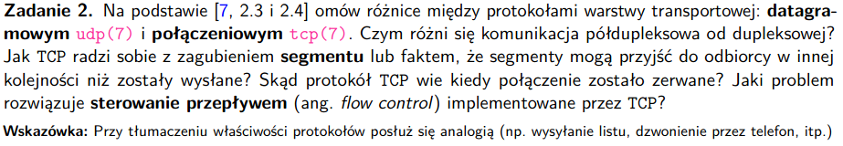

### Pojęcia
- protokół datagramowy utp - aplikacja zapisuje wiadomość na socketa UDP, potem mamy enkapsulację w datagram UDP, potem kolejną enkapsulację w IP datagram, potem jest wysyłane - **datagram - dane + header z warstwy transportowej i sieciowej**

- protokół połączeniowy - to co powyżej + umożliwia ponowne wysyłanie, ma dynamiczny RTT (round trip time) do optymalizacji czasów oczekiwania na potwierdzenia no i ma indeksy na wysyłanych wiadomościach

- sterowanie przepływem - zmniejszanie i zwiększanie wielkości bufora do zapisu w odbiorcy

### Różnice między protokołami warstwy transportowej datagramowym udp(7) i połączeniowym tcp(7)
#### Cechy datagramowego udp(7)
- nie mamy gwarancji, że wiadomość dojdzie (reliability) - można doimplementować jakieś potwierdzanie, jak koniecznie chcemy używać udp
- nie mamy gwarancji, że wiadomości przyjdą w dobrej kolejności
- nie mamy gwarancji, że datagramy przyjdą tylko raz
- każdy datagram udp ma jakąś długość, która jest przekazywana odbiorcy wraz z danymi
- jest to usługa 'connectionless' - nie ma żadnej relacji między UDP client a server, z jednego socketa możemy wysłać dane do serwera i od razu z tego samego socketa do innego serwera, serwer też na jednym socketcie może odbierać wiadomości od wielu klientów
- przez to że nie ma control-flow możemy odbiorce 'zalać' wiadomościami, nie będzie w stanie ich wszystkich odczytać

#### Cechy połączeniowego tcp(7)
- ustalone połączenie z konkretnym serwerem, nie mamy już podejścia connectionless
- mamy reliability - jak coś wysyłamy to czekamy na potwierdzenie
- mamy indeksy dla wysyłanych danych, więc pozbywamy się problemów z przychodzeniem pakietów nie po kolei oraz z duplikatami pakietów
- dane są przekazywane w formie strumienia bajtów, nie mamy żadnych konkretnych wielkości
- mamy control flow

### Czym różnią się komunikacja półdupleksowa od dupleksowej?
- full-duplex - dupleksowa - aplikacja może odbierać i wysyłaś dane w obie strony w każdym momencie
- half-duplex - półdupleksowa - też można przekazywać w obie strony, ale mamy jeden kanał, czyli jedna ze stron musi go zwolić, żeby druga mogła coś wysłać/odebrać

### Jak TCP radzi sobie ze zgubieniem segmentu (realiability), opóźnieniem przyjścia segmentu (inną kolejnością)?
- jak coś wysyłamy to czekamy na potwierdzenie, jak nie przyjdzie, to
wysyła jeszcze raz, czekając dłużej
- jak segmenty przyjdą w innej kolejności, to TCP jest w stanie odtworzyć ich kolejność na podstawie indeksów, które są dawane wiadomościom

### Skąd TCP wie, że połączenie zostało zerwane?
- jak kilka razy nie dostanie potwierdzenia, to się podda i zerwie połączenie (ok 4-10min prób)
- więc będzie wiedział o zerwaniu po prostu z braku odpowiedzi

### Jaki problem rozwiązuje sterowanie przepływem obsługiwane przez TCP?
- TCP mówi drugiej stronie ile dokładnie bajtów zaakceptuje w konkretnym momencie (advertised window),
odbiorca gwarantuje że tyle bajtów zawsze może przyjąć
- w zależności od potrzeb możemy rozszerzyć to okno, dzieje się tak gdy obiorca odczytuje dane z bufora
- sterowanie przepływem umożliwia optymalizowanie przekazywania danych, np gdy bufor TCP odbiorcy jest pełny i aplikacja u odbiorcy musi go zczytać możemy ustawić okno na 0 i umożliwi nam to 'zablokowanie' przekazywania danych

# zadanie 3
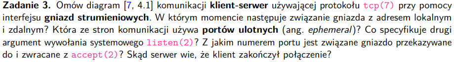


### Pojęcia
- komunikacja klient-serwer - klient wysyła request do serwera, serwer go przetwarza i wysyła odpowieź

- gniazda strumieniowe - gniazda umożliwiające dupleksową komunikację między klientem a serwerem, używające protokół TCP
- port - 16 bitowy int identyfikujący proces
- porty ulotne - ephemeral - port przyznawany automatycznie przez jądro klienta, kiedy klient robi connection request
- port znany - well-known port - port związany z jakąś usługą serwera, np 80 to serwery webowe

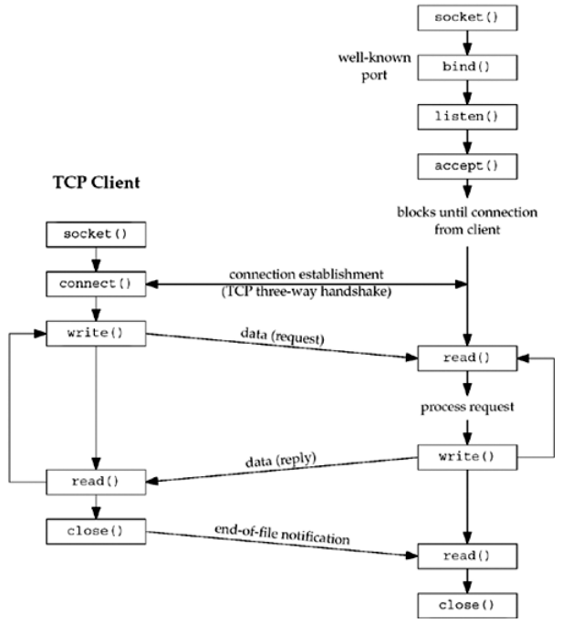

### Wywołanie systemowe socket
- to tutaj specyfikujemy rodzaj protokołu - TCP i IPv4, UDP IPv6 itp.

### W którym momencie następuje związanie gniazda z adresem lokalnym i zdalnym?
- gniazdo wiążemy z adresem lokalnym wołając bind() [serwer]
- gniazdo związuje się z adresem zdalnym przy wywołaniu connect() [klient]
### Która strona używa portów ulotnych
- klient
### Oczym mówi drugi argument wywołania systemowego ```listen(2)```
- listen jest wołane przez serwer
- mówi jądru serwera, że powinno zaakceptować połączenie do tego gniazda
- **drugi argument mówi o maksymalnej liczbie połączeń, które jądro może zakolejkować do tego gniazda**
- wyróżniamy dwie kolejki:
    - incomplete - jeszcze nie podłączoną (w trakcie podłączania)
    - completed - już podłączone
- tu chyba chodzi sumę długości kolejek
### Z jakim numerem portu związane jest gniazdo przekazywane do i zwracane z ```accept(2)```
- accept jest wywoływane przez serwer
- zwraca kolejne udane połączenie z kolejki ukończonych połączeń (zwraca gnazdo połączenia z konkretnym klientem)

- gniazdo przekazywane jest związane z adresem portu klienta przekazywanym przy okazji wywołania connect() przez klienta

### Skąd serwer wie, że klient zakończył połączenie
- jak klient zamknie swoją stronę połączenia wysyłane jest powiadomienie o końcu pliku - EOF
- wówczas serwer zamyka swój koniec połączenia i albo zakańcza prace, albo czeka na kolejne połączenia

# zadanie 4
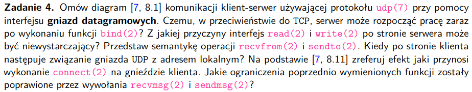

### Pojęcia
- gniazda datagramowe - gniazdo oparte o protokół UDP 

- po co UDP - no np DNS jest zrobiony tym protokołem

### Diagram
- klient nie tworzy połączenia z serwerem, wysyła tylko do niego datagramy funkcją sendto
- serwer nic nie akceptuje, woła tylko recvfrom i czeka na spłynięcie wszystkich danych

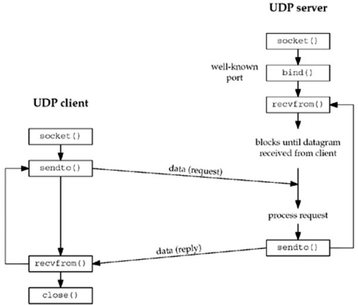

### Czemu serwer udp może rozpocząć pracę zaraz po bind(2) (w tcp mieliśmy jeszcze listen i accept)
- nie trzeba nasłuchiwać na zmiany, bo mamy połączenie 'connectionless', nie trzeba też wyciągać go z żadnej struktury (accept), bo nie zależy nam na kolejności bo protokół jest unreliable

### Sematyka operacji ``` recvfrom(2)``` i  ```sendto(2)```
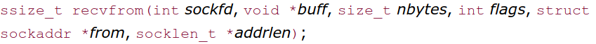

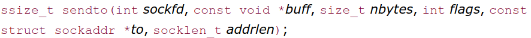

- pierwsze 3 argumenty symetryczne do read/write

- flagi jakieś konfiguracje sposobu wysyłania pakietów

- argument *to* sendto
- struktura zawierająca adres protokołu - adres IP, numer portu, gdzie dane mają zostać wysłane
- addrlen - rozmiar tej struktury (w sendto to zwykły int, w revvfrom to wskaźnik na int, bo pewnie po stronie serwera chcielibyśmy przekazać rozmiar taki, jak sobie wyliczyliśmy po stronie serwera)

- argument *from* recvfrom
- mamy struktuę, która mówi nam kto wysłał datagram, potrzebujemy ją żeby odesłać odpowiedź to konkretnego klienta


### Czemu interfejs read i write po stronie serwera może być niewystarczający
- chcemy mieć możliwość przekazywania numeru portu, adresu IP itp, więc potrzebujemy miejsca na wskaźnik na jakąś strukturę je przechowującą


### Kiedy po stronie klienta następuje połączenie gniazda UDP z adresem lokalnym
- przy zawołaniu bind(), przed sendto()

### Efekt ```connect(2)``` na gnieździe klienta
- przy connect jądro zapisuje też adres IP i port drugiej strony i wraca do procesu wołającego (taki setpeername - nazywamy drugą stronę komunikacji)
- robi nam connected UTP
    - jak UTP jest connected, to nie możemy już w sendto wybierać adresu IP i portu, bo to już wybrał nam connect
    - możemy używać write albo sendmsg
    - możemy użyć recvmsg do znalezienia wysyłającego równieśnika datagram
    - mamy sensowną obługę błędów asynchronicznych dla podpiętych gniazd UDP
    - jak mamy connect to gniazdo może się wymieniać informacjami tylko z jednym rówieśnikiem

### Jakie ograniczenia ```recvfrom(2)``` i  ```sendto(2)``` naprawia nam ```recvmsg(2)``` i  ```sendmsg(2)```
- nie musimy pamiętać tej struktury *to* i *from*
- mają strukturę 
```
struct msghdr {
    void *msg_name; /* protocol address */
    socklen_t msg_namelen; /* size of protocol address */
    struct iovec *msg_iov; /* scatter/gather array */
    int msg_iovlen; /* # elements in msg_iov */
    void *msg_control; /* ancillary data (cmsghdr struct) */
    socklen_t msg_controllen; /* length of ancillary data */
    int msg_flags; /* flags returned by recvmsg() */
};
```

- umożliwiającą rozdysponowanie buforów input/output (msg_iov, msg_iovlen), czylki dużą paczkę danych można porozkładać na mniejsze i wysłać w jednym poleceniu

- mamy większą kotrolę nad wiadomościami przesyłanymi, dzięki flagom do recvmsg

- mamy komunikaty kontrolne:
    - jak był błąd, to mamy ich komunikaty
    - np serwer nieosiągalny, dostaniemy szczegóły, skąd przyszedł błąd itp

# zadanie 5
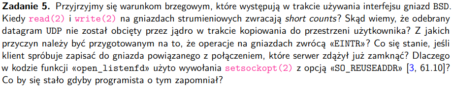

### Kiedy read i write na gniazdach strumieniowych zwracają *short counts*
- kiedy gniazdo odczytało/zapisało mniej niż zostało zarequestowane
- read - kiedy przerwaliśmy połączenie, odczytaliśmy mniej, dostaniemy EOF wcześniej
- write jak zapiszemy więcej niż mogliśmy zapisać w buforze
- jak mamy short count, to chcielibyśmy jeszcze raz zawołać odpowiednio read lub write żeby dokończyć odczyt/zapis

### Skąd wiemy, że odebrany datagram UDP nie został obcięty przez jądro w trakcie kopiowania do przestrzeni użytkownika?
- ```MSG_TRUNC``` - mamy flagę, którą jak ustawimy, to zwróci nam jakiej wielkość właściwej wiadomości

###  Z jakich przyczyn należy być przygotowanym na to, że operacje na gniazdach zwrócą «EINTR»? 
- kiedy przyjdzie sygnał i przerwie wysyłanie, zapisywanie danych 
- np w kontekście read/write mamy EINTR przy short count, i wtedy musimy napisać jakąś logikę ponawiającą read/write
- EINTR pojawia się też dla wolnych procesów, bo mogą być przerwane, więc dla nich też potrzebna jest jakaś logika

### Co się stanie, jeśli klient spróbuje zapisać do gniazda powiązanego z połączeniem, które serwer zdążył już zamknąć?
- proces po stronie klienta dostanie sygnał SIGPIPE
- ustawi się też errno ECONNERESET i ENOTCONN

###  Dlaczego w kodzie funkcji «open_listenfd» użyto wywołania setsockopt(2) z opcją «SO_REUSEADDR» 
- open_listenfd - otwiera socket (socekt()), konfuguruje porty (bind()), czeka na requesty (listen())
- chcielibymy unikać EADDRINUSE - błąd mówiący o tym, że chcemy się podłączyć do portu powiązanego z jakimś TCP
    - serwer się zamkną, albo został zabity sygnałem i nie zdążyliśmy po nim posprzątać
    - serwer zrobił proces dziecko, którę łączy się z klientem, serwer zginął, ale dziecko dalej obługuje klienta, ale port rodzica nie jest już dostępny, więc de facto klient nie jest już podłączony do TCP
- **ignorujemy oczekiwanie na zwolnienie gniazda**

#### Wyjaśnienie
- jak mamy połączenie z socketem tworzy nam się tupla
{ local-IP-address, local-port, foreign-IP-address, foreign-port }
- specyfikacja TCP mówi nam, że ta tupla musi być unikalna
- linux daje nam jeszcze większe wymaganie: local-port nie może być reużywany
- opcja SO_REUSEADDR likwiduje wymaganie, żeby local-port był nieużywany
- jak ta opcja jest włączona to możemy podłączać gniazdo do portu lokalnego, nawet jak inny TCP jest do niego podłączony (rozwiązuje nam te dylematy z początku paragrafu, bo łatwiej będzie przepinać klienta do innego serwera TCP)
### Co by się stało jak by programista o tym zapomniał?
- debugowanie byłoby uciążliwe, bo co chwilę mielibyśmy błędy o używaniu adresu, o którym myśliliśmy że już jest wolny

# zadanie 6
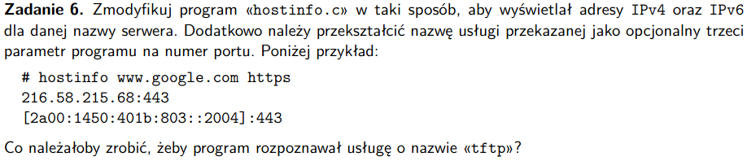

- usługa tftp - trivial file transfer protocol - pozwala na przeniesienie/otrzymanie pliku z jednego hosta do drugiego

- usługa tftp jest dostępna na porcie 69, więc pewnie podałbym 'tftp' jako argunt programu (wartość numeryczna jest brana na podstawie stringa w getaddrinfo)

# zadanie 7
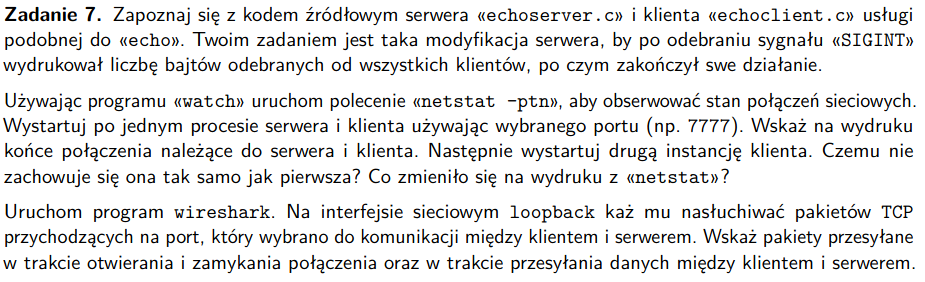

# zadanie 8
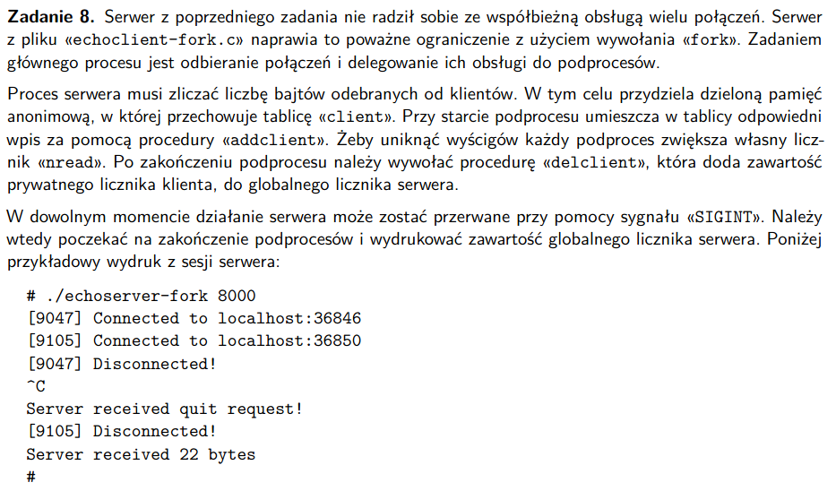